# MobileCropNet 학습 데이터 생성: 온디바이스 이미지 크롭핑을 위한 후보 중심, Teacher 라우팅, 정책 인식 라벨 팩토리

## 초록

MobileCropNet의 학습 데이터 생성 문제는 원본 이미지에서 하나의 정답 crop box를 찾는 전처리 문제가 아니다. 실제 제품형 이미지 크롭핑에서는 동일 이미지라도 목표 aspect ratio, 인물/객체/장면 구조, 텍스트와 copy-space, 안전한 잘림 여부, 그리고 “잘라야 하는가”라는 정책 판단에 따라 정답이 달라진다. 따라서 MobileCropNet은 단일 좌표 회귀만으로 학습되기 어렵고, 후보 생성, 후보 간 순위 학습, baseline 대비 정책 판단, subject-aware supervision, explanation-safe pseudo-label을 동시에 필요로 한다.

본 리포트는 MobileCropNet v4 학습 데이터 생성 체계를 논문/기술보고서 형식으로 재구성한 마스터 문서다. 핵심 방법은 `source corpus -> curation -> C1~C7 perception precompute -> routing/guidance -> candidate bank -> teacher scoring -> label conversion -> student training contract -> benchmark feedback`로 이어지는 라벨 팩토리다. 이 팩토리는 raw teacher score를 직접 전역 회귀값으로 쓰지 않고, 이미지 내부 순위, pairwise/listwise 선호, decision target, safety/reject state, checklist/why-tag explanation, subject-box supervision으로 변환한다.

현재 가장 강하게 물질화된 학습 자산은 SSTK main factory의 `conditional-DETR batch 48,766`, `pairwise 151,049`, `listwise 48,766` 라인과, GAIC T6/public distillation 라인의 corrected/product-AR label이다. teacher ceiling에서는 `production_final_hybrid`가 equal-4 public benchmark 기준 raw mean `0.882696`, z-score `1.148158`로 가장 균형적이며, student shortlist에서는 `SSTK public / subjectprior_route_proposal_v1 / balanced_288`가 현시점 최선 후보다. 그러나 final shortlist `19/19` 모두 `route_collapse_flag=true`이고 final hard gate를 통과한 모델은 없다. 따라서 현재 병목은 새로운 teacher 발견이 아니라 student가 teacher의 subject, route, policy, explanation 구조를 no-prior runtime 안에서 내부화하는 문제다.

## 1. 서론

이미지 크롭핑을 단순한 bbox 회귀 문제로 보면 MobileCropNet의 데이터 생성 체계는 과도하게 복잡해 보인다. 하지만 제품 환경의 cropper는 하나의 이미지에 대해 여러 질문을 동시에 풀어야 한다. 어떤 aspect ratio로 잘라야 하는가, 인물의 얼굴과 관절을 보존해야 하는가, 다중 객체를 모두 남겨야 하는가, 텍스트나 copy-space를 자르면 안 되는가, 원본을 유지하는 것이 더 나은가, 아니면 최소한만 자르는 것이 나은가 같은 질문이 모두 crop의 의미를 바꾼다.

MobileCropNet이 학습해야 하는 것은 좌표 하나가 아니라 의사결정 절차다. 모델은 먼저 가능한 crop 후보를 충분히 확보해야 하고, 그 후보 안에서 상대적 선호를 배워야 하며, baseline full image나 minimal crop보다 실제 crop action이 나은지 판단해야 한다. 또한 그 판단의 이유가 subject 보존인지, composition인지, safety/reject인지, target-AR 정합인지 구분할 수 있어야 한다.

이 때문에 학습 데이터 생성은 모델 앞단의 단순 전처리가 아니라 모델 정의의 일부다. 어떤 candidate bank를 만들고, 어떤 teacher score를 어떤 safety rule로 변환하며, 어떤 sidecar supervision을 보존하느냐가 student의 가능한 행동 공간과 실패 양상을 결정한다. 본 문서는 이 관점에서 MobileCropNet 학습 데이터 생성 체계를 “데이터 팩토리”로 설명한다.

본 문서는 학습 데이터 생성 체계의 방법론을 중심으로 정리한 기술보고서다. 코드 경로, 실행 로그, artifact path는 본문 가독성을 위해 대부분 부록으로 이동했지만, 실제 구현 증거는 부록 C-E의 산출물 색인, 코드 경로 색인, 재현 명령과 `MobileCropNet v4.0` 구현 마스터 문서에 연결되어 있다. 본문에서 최신 구현 상태를 언급하는 목적은 상태 나열이 아니라 방법론적 의미, 평가 기준, 한계를 명확히 하는 것이다.

### 1.1 AI Application Specialist 평가표 대응 요약

본 학습 데이터 생성 문서는 평가표의 `AI 기술/지식이해`, `AI App 개발`, `AI Governance`, `과제 정의`, `평가 및 성과` 항목에 직접 대응한다. `프로그래밍 & 툴활용` 항목은 기존 부록에 분산되어 있었으므로, 본 개정에서는 데이터 팩토리 구현, 사내 AI 도구 활용, 검증 자동화를 별도 항목으로 명시한다.

| 평가 항목 | 본 문서의 대응 내용 | 근거 섹션/산출물 |
| --- | --- | --- |
| AI 기술/지식이해, AI 모델링 | crop 문제를 단일 bbox 회귀가 아니라 candidate, ranking, policy, route, subject, explanation 결합 문제로 정의하고, GAIC/FCDB/CPC/GNMC/SSTK의 supervision 의미를 분리한다. | 2-3장, 8-9장, 13.4장 |
| 프로그래밍 & 툴활용 | Python/PyTorch 기반 데이터 변환, JSONL/sidecar contract, label factory runner, figure/report builder, pytest와 manifest 검증을 사용한다. Cline SR은 코드 탐색, 구현 보조, 로그 분석, 재현 명령 정리에 활용했다. | 1.2장, 부록 C-E |
| AI App 개발 및 On-Device 활용 | 학습 데이터 생성 단계부터 no-prior runtime student가 사용할 수 있는 Product-AR task, decision/action target, subject-box/checklist/rationale target으로 변환한다. | 9-12장, 15장 |
| AI Governance | source별 역할, image-level split, safe conversion, reject/fatal demotion, provenance, 생성 이미지 비증거 원칙을 관리한다. | 1.3장, 4.3장, 8.1장, 15장 |
| 과제 정의 | 제품형 이미지 크롭에서 target AR, 인물/객체/장면, 텍스트, copy-space, keep/minimal/crop action이 결합되는 현업 문제를 정의한다. | 1장, 6-7장 |
| 평가 및 성과 | factory 규모, teacher ceiling, student shortlist, route collapse, subject-box blocker를 정량/정성으로 해석하고 다음 개선 방향을 제시한다. | 13-18장 |

### 1.2 AI 프로그래밍 및 사내 Tool 활용

본 과제의 학습 데이터 생성은 문서 초안이 아니라 실행 가능한 데이터 파이프라인으로 구현되어 있다. curation 단계는 `src/filter_sstk_dataset.py`, `src/scripts/prepare_gaic_curated_dataset.py`에서 수행하고, candidate/subject-support 생성은 `src/generate_candidates.py`, `src/subject_region.py`가 담당한다. teacher scoring과 label conversion은 `src/score_teacher.py`, `src/scripts/build_finalscore_training_data.py`, `src/scripts/export_gaic_ranker_training_labels.py`, `src/scripts/convert_t6_score_labels_to_mobilecropnet_v4_batch.py`, `src/scripts/build_mobilecropnet_v4_product_ar_score_labels.py`로 분리되어 있다. 최종 student contract는 `src/mobilecropnet_v4/data.py`, `src/mobilecropnet_v4/model.py`, `src/scripts/train_mobilecropnet_v4.py`와 연결된다.

데이터 포맷은 단일 JSONL 파일에 의존하지 않는다. batch JSONL은 image-targetAR task와 candidate slot을 보존하고, pairwise/listwise/checklist/regression sidecar는 같은 `(image_id, target_ar, candidate_id)` key로 결합된다. 각 변환 단계는 `conversion_summary.json`, `label_generation_manifest.json`, `qa_summary.json`, `leaderboard.json` 같은 machine-readable artifact를 남기며, downstream 평가는 free-form log가 아니라 이 artifact를 읽어 재개할 수 있다.

구현 과정에서는 사내 AI 개발 보조 도구인 `Cline SR`을 활용했다. 활용 범위는 대규모 코드베이스 탐색, 데이터 계약 추적, 실행 스크립트 작성 보조, 오류 로그 분석, 테스트 범위 확인, 보고서와 산출물 경로 연결 정리다. 최종 설계와 성능 판단은 Cline SR 출력 자체가 아니라, 프로젝트 Python interpreter로 실행한 스크립트, pytest, JSON manifest, checkpoint, 정량/정성 artifact를 기준으로 확정했다.

실험 운영은 로컬 PC, 사내 원격 CPU 서버, MLP GPU workload를 목적에 맞게 분리한다. 단순 재현 검증과 보고서 생성은 로컬에서 수행하고, 대량 label conversion이나 report build는 원격 CPU를 사용하며, VLM teacher 또는 대형 모델 학습/평가는 bounded GPU workload에서 수행한다. 장기 작업은 launch/poll/collect 패턴을 따르고, `status.json`, `train_status.json`, `metrics.json`, `summary.json`, checkpoint가 없는 partial run은 release evidence에서 제외한다.

### 1.3 AI Governance 및 데이터 사용 적합성

본 factory는 데이터 source별 사용 목적을 분리한다. SSTK 계열 데이터는 제품형 pseudo-label factory와 policy/rationale supervision의 중심 source이고, GAIC/FCDB/CPC/GNMC 등 public benchmark 계열은 public crop quality 비교, teacher ceiling 산정, ranking distillation 검증 목적으로 사용한다. public benchmark의 MOS나 preference는 제품 정책 truth로 직접 사용하지 않고, image-local rank, pairwise/listwise target, safe conversion을 거친 보조 supervision으로만 사용한다.

| Governance 항목 | 적용 방식 |
| --- | --- |
| 데이터 출처와 사용 범위 | SSTK, GAIC, FCDB, CPC, GNMC 등 source별 목적과 산출물 경로를 manifest에 기록한다. |
| 법적/권한 확인 | 사내에서 접근 권한이 있는 데이터와 공개 benchmark의 사용 범위를 분리하고, 최종 제출/공유 전 source별 권한과 라이선스 확인 대상으로 둔다. |
| train/test leakage 방지 | candidate row split이 아니라 image-level deterministic split을 사용하고, Product-AR task 확장에서도 동일 image가 train/test에 동시에 들어가지 않도록 관리한다. |
| 인물/텍스트 안전 | face/joint/text cut, headroom/lookroom, copy-space/text cutoff를 reject tag, checklist, risk label로 관리한다. |
| public score 오용 방지 | raw MOS/public score를 global truth로 사용하지 않고, unsafe cap, fatal demotion, contradiction audit을 적용한다. |
| 생성 산출물 사용 | 개념도나 보고서 보조 그림은 실험 evidence로 사용하지 않으며, 성능/좌표/leaderboard는 JSON artifact와 실제 crop/overlay를 source of truth로 사용한다. |
| 감사 가능성 | `label_generation_manifest.json`, `conversion_summary.json`, `qa_summary.json`, `train_status.json`, `release_gate_manifest.json`을 durable path에 저장한다. |

이 원칙은 높은 public score가 제품적으로 안전한 crop을 의미한다는 오해를 막기 위한 장치다. 예를 들어 public cropper 또는 GAIC MOS가 높더라도 얼굴, 관절, 텍스트를 자르거나 SSTK product policy와 충돌하는 후보는 positive로 승격하지 않는다. 반대로 제품형 policy label은 public benchmark score를 대체하는 절대 truth가 아니므로, teacher ceiling과 student deployment evaluation은 별도로 유지한다.

### 1.4 현업성과와 기대효과

MobileCropNet 데이터 팩토리의 현업성과는 단일 모델 점수보다 제품형 crop 개발 프로세스를 자동화했다는 점에 있다. 기존 static cropper나 단일 bbox label 방식은 좋은 crop이 왜 좋은지, 어떤 경우 잘라서는 안 되는지, 어느 route에서 실패했는지 추적하기 어렵다. 본 factory는 candidate provenance, safe/reject state, decision action, subject support, checklist/why-tag를 함께 남겨 모델 학습뿐 아니라 검수와 실패 분석에도 사용할 수 있는 데이터 자산을 만든다.

| 현업성과 관점 | 구체적 기여 |
| --- | --- |
| 제품 품질 개선 | target AR, subject 보존, 인물 안전, 텍스트/copy-space, keep/minimal/crop action을 동시에 고려하는 학습 데이터 contract를 제공한다. |
| 제품 차별화 | crop box만이 아니라 route, subject-box, risk, checklist, why-tag를 함께 학습해 설명 가능한 cropper로 확장할 수 있다. |
| 업무 효율화 | curation, candidate generation, teacher scoring, label conversion, benchmark, qualitative pack, release gate를 반복 실행 가능한 스크립트와 artifact로 자동화한다. |
| 품질 게이트 | raw public score가 높은 후보라도 safety/reject와 product policy를 통과하지 못하면 positive로 쓰지 않는 보수적 gate를 제공한다. |
| 후속 제품화 기반 | no-prior runtime student가 사용할 target-AR task와 action/subject/explanation target을 제공해 온디바이스 모델 학습으로 연결된다. |

현재 strict release gate를 통과한 student checkpoint는 없지만, 이는 데이터 팩토리의 기여가 없다는 뜻이 아니다. 오히려 route collapse, subject-box calibration, action consistency 같은 제품 실패 요인을 숨기지 않고 드러내므로, 다음 실험이 단순 teacher sweep이 아니라 student internalization 문제를 해결해야 함을 명확히 한다.

## 2. 배경과 관련 연구

기존 이미지 크롭핑 연구는 크게 네 흐름으로 나눌 수 있다. 첫째는 좋은 crop box의 좌표를 직접 예측하는 좌표 회귀 계열이다. 이 방식은 추론이 간단하지만, 하나의 이미지에 복수의 타당한 crop이 존재하는 상황과 target-AR별 행동 차이를 표현하기 어렵다. 둘째는 후보 crop 집합을 만들고 그 위에서 순위화를 수행하는 후보 순위화 계열이다. 이 흐름은 MobileCropNet과 가장 가깝지만, 제품형 정책 판단이나 explanation-safe conversion까지 포함하는 경우는 드물다.

셋째는 GAIC/GAICD처럼 crop 후보에 MOS를 부여하는 benchmark 계열이다. 절대 점수는 teacher 학습과 public comparison에 유용하지만, raw MOS를 그대로 student regression target으로 쓰면 이미지 난이도와 후보 분포 차이가 섞인다. 넷째는 VLM 또는 instruction-conditioned cropping 계열이다. 이는 의도와 의미 지시를 잘 다룰 수 있지만, 온디바이스 지연시간, deterministic candidate contract, safety/reject rule, 대규모 라벨 물질화 측면에서 별도 변환 계층이 필요하다.

MobileCropNet 데이터 팩토리는 이 흐름을 모두 일부 수용하지만, 어떤 하나에도 그대로 의존하지 않는다. 핵심 차이는 crop quality를 `candidate availability`, `ranking`, `policy`, `explanation`, `subject localization`으로 분해하고, 각 축을 별도 label로 물질화한다는 점이다.

| 방법/데이터셋 | supervision 유형 | 무엇을 가르치는가 | 가르치기 어려운 것 | MobileCropNet factory의 보완 |
| --- | --- | --- | --- | --- |
| 좌표 회귀 cropper | 단일 bbox 또는 sparse GT | 빠른 단일 crop 좌표 | 다중 해, target-AR별 policy, keep/minimal decision | candidate bank와 decision target으로 문제를 분해 |
| 후보 순위화 모델 | 후보 간 선호 또는 top-k ranking | 같은 이미지 내부 상대 선호 | safety/reject 출처, subject mode, explanation | checklist, why-tag, reject state를 sidecar로 보존 |
| GAIC/GAICD | 후보별 MOS | public MOS benchmark, score 보정 | product policy, keep_full/minimal_crop, route-aware behavior | T6/public score를 safe rank/listwise label로 변환 |
| FCDB/CPC/SACD | pairwise/listwise 선호 | ranking supervision | 온디바이스 product action, subject-box target | pairwise sidecar와 Product-AR contract로 통합 |
| GNMC | AR별 GT bbox | fixed-AR geometry 정합 | score semantics와 policy decision | target-AR candidate와 direct eval로 흡수 |
| VLM/instruction cropping | 의미 의도, 자연어 조건 | 고수준 intent와 scene interpretation | bounded runtime, deterministic full-corpus label | multimode/query label과 teacher-side pseudo-label로 제한적 통합 |
| Subject-aware composition 연구 | face, pose, gaze, subject placement | portrait/object-specific framing | 전체 product benchmark와 safety contract | C3/C6/C7, route policy, portrait-specific checklist로 반영 |

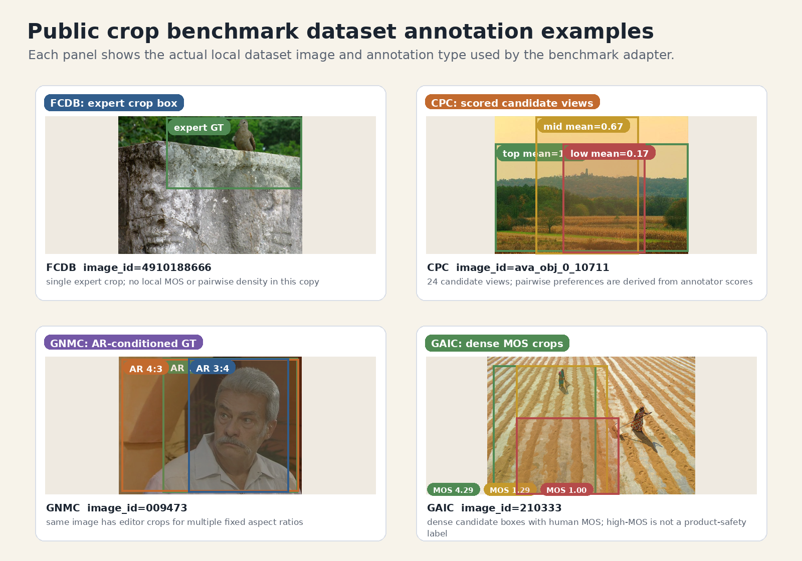

*그림 2-1. FCDB, CPC, GNMC, GAIC는 모두 crop benchmark지만 annotation의 의미가 서로 다르다.*

그림 2-1은 public dataset을 하나의 “정답 crop” 묶음으로 합치면 안 되는 이유를 보여 준다. FCDB의 local copy는 단일 expert crop box 중심이므로 expert geometry를 빠르게 검증하는 데 유용하지만, 후보 간 점수 밀도나 pairwise preference를 직접 제공하지 않는다. CPC는 여러 candidate view와 annotator score를 제공하므로 pairwise/listwise 학습에 적합하지만, 점수는 image-local preference로 해석해야 하며 product action이나 safety label은 없다. GNMC는 같은 이미지에 대해 여러 fixed aspect ratio의 editor crop을 제공하므로 target-AR 정합 평가에 강하지만, score semantics와 keep/minimal/crop decision은 제공하지 않는다. GAIC는 dense candidate box와 MOS를 제공해 aesthetic ranker 학습에 강하지만, 높은 MOS가 text 보존, face/joint safety, route policy까지 만족한다는 뜻은 아니다.

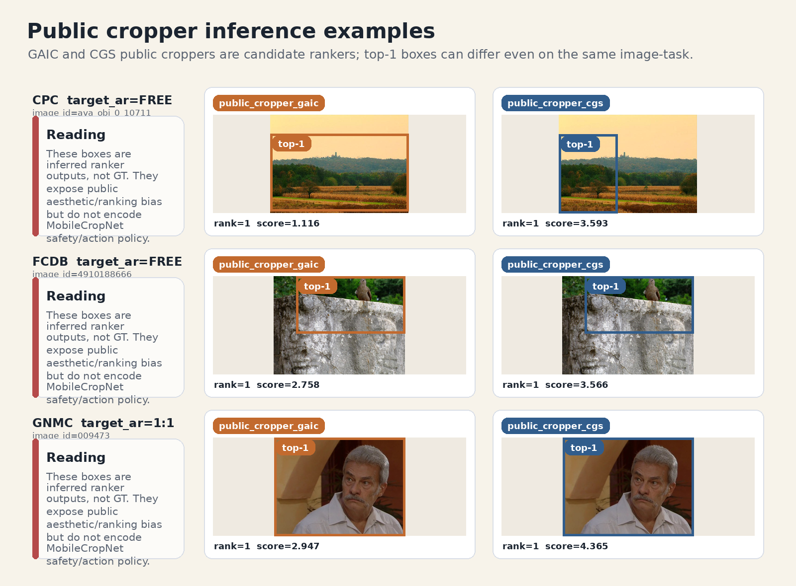

*그림 2-2. GAIC/CGS public cropper는 같은 후보 집합에서도 서로 다른 top-1 crop을 선택할 수 있는 candidate ranker다.*

그림 2-2의 public cropper 결과는 related work의 한계를 더 직접적으로 드러낸다. `public_cropper_gaic`는 GAIC 계열 MOS ranking bias를 강하게 반영하고, `public_cropper_cgs`는 composition graph 계열의 candidate ranking bias를 반영한다. 두 방법 모두 public benchmark rank signal로는 유용하지만, 결과 box는 inferred ranker output일 뿐이며 MobileCropNet의 route, action, checklist, reject, provenance contract를 포함하지 않는다. 따라서 public cropper score는 teacher lineage의 한 branch로 가져오되, safety-aware conversion과 image-local normalization을 거친 뒤에만 student supervision으로 써야 한다.

이 비교에서 중요한 결론은 “좋은 crop”이라는 label이 단일 타입이 아니라는 점이다. MobileCropNet의 label factory는 외부 dataset을 그대로 합치는 것이 아니라, 각 dataset과 teacher가 잘 가르치는 축을 분리해 student contract 안으로 번역한다.

이 번역 과정에서 가장 자주 발생하는 오류는 dataset의 지표를 제품 정책으로 오해하는 것이다. GAIC MOS가 높다는 것은 해당 benchmark 후보군 안에서 심미적으로 좋은 crop을 고르는 능력이 있다는 뜻이지, 텍스트 보존, 인물 관절 보존, 원본 유지 정책, route별 checklist까지 해결했다는 뜻은 아니다. 반대로 SSTK의 route/checklist label은 제품 행동을 풍부하게 설명하지만, public MOS ranking에서 항상 최적의 scalar teacher는 아니다. 따라서 본 factory는 dataset을 계층화한다. public benchmark는 ranking ceiling과 distillation signal을 제공하고, SSTK는 product policy와 explanation contract를 제공하며, multimode는 future intent-conditioned supervision을 제공한다.

## 3. 문제 정식화

이미지 $I$와 목표 aspect ratio $r$가 주어졌다고 하자. factory는 먼저 후보 집합 $\mathcal{C}(I,r)$를 만든다. 각 후보 $c_i \in \mathcal{C}$는 normalized box, source/provenance, target-AR compatibility, subject coverage, teacher score, safety/reject state, explanation payload를 가진다. 학습 label의 목표는 단일 정답 box $c^*$만 저장하는 것이 아니라, 후보 집합 내부의 ranking, baseline 대비 policy, route-conditioned behavior, explanation target을 함께 저장하는 것이다.

전체 실패는 다음처럼 분해한다.

$$ \mathcal{E}_{total} \approx \mathcal{E}_{candidate} + \mathcal{E}_{ranking} + \mathcal{E}_{policy} + \mathcal{E}_{explain} $$

$\mathcal{E}_{candidate}$는 좋은 후보가 bank에 없는 실패다. $\mathcal{E}_{ranking}$은 좋은 후보가 있지만 순위가 뒤집히는 실패다. $\mathcal{E}_{policy}$는 좋은 후보를 찾았더라도 baseline보다 잘라야 할지 판단을 잘못하는 실패다. $\mathcal{E}_{explain}$은 crop은 그럴듯하지만 route, checklist, why-tag, safety 판단이 잘못되어 제품 sign-off에 실패하는 경우다.

teacher의 ranking score는 aesthetic, subject, composition, optional external teacher score를 통합한다. 여기서 score는 전역 절대 점수가 아니라 같은 image-targetAR 후보 집합 안에서 후보를 정렬하기 위한 local utility다.

$$ S_{rank}(c_i)=\frac{w_A A(c_i)+w_S S(c_i)+w_C C(c_i)+w_T T(c_i)}{w_A+w_S+w_C+w_T} $$

각 항의 직관은 다음과 같다. $A(c_i)$는 crop 자체의 심미성이다. 노출, 색 조화, blur, subject가 보기 좋게 보이는 정도, GAIC-style MOS prior가 여기에 들어간다. $S(c_i)$는 주피사체 보존이다. support box 또는 support map이 crop 안에 충분히 들어오고, subject scale이 너무 작거나 과도하게 잘리지 않을수록 높다. $C(c_i)$는 구도다. subject 중심이나 eye-line이 3분할 선 근처에 있거나, object/product가 중앙과 대칭 margin을 잘 만족하거나, horizon/context가 안정적이면 높아진다. $T(c_i)$는 선택 항목이며, UCTR stage3, public GAIC/CGS cropper, T6 같은 외부 ranker의 image-local score를 안전하게 정규화한 값이다.

composition score는 하나의 규칙이 아니라 route-dependent rule bank다. portrait에서는 eye-line과 headroom/lookroom이 중요하고, object/product에서는 centeredness와 margin symmetry가 중요하며, scene에서는 horizon과 context continuity가 중요하다.

$$ C(c_i)=\max(R_{third}(c_i),R_{center}(c_i))+\eta_hR_{horizon}(c_i)+\eta_mR_{margin}(c_i)+\eta_xR_{context}(c_i) $$

subject score는 support 영역의 보존율을 중심으로 직관화할 수 있다.

$$ S(c_i)=\alpha\,\frac{|c_i\cap B_{support}|}{|B_{support}|}+\beta\,R_{scale}(c_i)+\gamma\,R_{boundary}(c_i) $$

safety/reject state는 ranking score의 하위 항이 아니라 gate다. 즉 aesthetic이나 external score가 높아도 fatal face cut, joint cut, text cutoff, unsafe crop, explanation contradiction이 있으면 positive가 될 수 없다. 실제 conversion에서는 unsafe candidate의 score를 cap하거나 demote한다.

$$ \tilde{S}_{rank}(c_i)=(1-R_i)S_{rank}(c_i)+R_i\min(S_{rank}(c_i),\tau_{unsafe}) $$

explanation payload는 score 이후에 붙는 설명문이 아니라 score 분해의 audit trace다. 예를 들어 $S(c_i)$가 낮으면 `subject_coverage=poor`, $C(c_i)$가 낮으면 `headroom_tight`, `lookroom_excessive`, `horizon_cut` 같은 checklist가 활성화될 수 있다. $R_i=1$인 후보는 `reject_tags`, `risk_target`, `why_tags`를 통해 “왜 높은 외부 score에도 positive가 아닌지”를 student와 reviewer에게 남긴다.

policy score는 rank score에 area prior와 safety penalty를 더해 action 결정용으로 재해석한다.

$$ S_{policy}(c_i)=S_{rank}(c_i)+\lambda_{area}\log(\mathrm{area}(c_i))-P_{safety}(c_i) $$

baseline 대비 개선량은 decision target의 중심이다.

$$ \Delta=S_{policy}(c_{best})-S_{policy}(c_{baseline}) $$

image-local rank target은 global score regression 대신 사용되는 기본 정규화다.

$$ y^{rank}_i=\frac{\mathrm{rank}(c_i)}{|\mathcal{C}|-1} $$

listwise target은 동일 task 안에서 soft distribution으로 만든다.

$$ p_i=\frac{\exp(S_{rank}(c_i)/\tau)}{\sum_j \exp(S_{rank}(c_j)/\tau)} $$

pairwise preference는 positive 후보 $c_i$가 negative 후보 $c_j$보다 높아야 한다는 형태로 표현된다.

$$ \mathcal{L}_{pair}(i,j)=\log(1+\exp(-(s_i-s_j))) $$

decision target은 discrete action과 continuous improvement를 함께 담는다.

$$ y_{decision}=b(d)+0.15\cdot\operatorname{clip}(\Delta/3,-1,1) $$

여기서 $b(\mathrm{keep\_full})=0$, $b(\mathrm{minimal\_crop})=0.5$, $b(\mathrm{crop})=1$이다. 이 scalar는 decision class와 baseline 대비 개선 정도를 동시에 전달한다.

이 정식화에서 subject mode는 category label이 아니라 policy prior다. 동일한 `people` category라도 단일 인물 portrait, group portrait, face crop, object-like person crop은 서로 다른 후보 생성과 checklist를 요구한다. safety/reject state는 external teacher score보다 우선한다. 즉 외부 ranker가 높은 점수를 준 후보라도 face cut, joint cut, text cutoff, fatal crop이면 positive로 승격될 수 없다.

## 4. 원천 코퍼스와 선별

### 4.1 SSTK 코퍼스

SSTK는 제품형 데이터 팩토리의 중심 원천 코퍼스다. 원본 stock 이미지 메타데이터, 학습 메타데이터, 이미지 경로, tag/category 정보, aesthetic score, 중복/type 정보가 결합되어 선별 pool을 만든다. 이 코퍼스는 public benchmark처럼 정제된 GT를 제공하지 않는다. 대신 route, decision, checklist, reject tag, provenance를 함께 보존할 수 있는 제품 지향 pseudo-label factory의 기반이다.

SSTK 선별의 첫 hard gate는 품질과 메타데이터 완전성이다. 현재 구현은 aesthetic score, duplicate 여부, `Photo` type, train metadata join 가능성을 우선 본다. aesthetic score는 center/pad 계열 중 큰 값을 사용한다.

$$ a_i=\max(a_i^{center},a_i^{pad}) $$

category mapping은 tag rule만으로 끝나지 않는다. seed word rule과 sentence embedding 기반 유사도를 섞어 `people`, object, scene, texture/copy-space 계열을 나누고, people은 다시 single/multi/ambiguous로 세분화한다. 이후 rare tag 기반 long-tail 가중치를 둔다.

$$ w_i^{LT}=\frac{1}{\sqrt{f_{rarest}(i)}} $$

category별 percentile cut과 stratified weighted sampling은 top aesthetic image만 남기는 편향을 막는다. 이 단계의 목적은 평균적으로 예쁜 이미지를 고르는 것이 아니라, 이후 route/candidate/scoring이 다양한 장면 구조를 보도록 하는 것이다.

현재 repo에서 직접 재현 가능한 SSTK 물질화 라인은 `Full_10000`이다. 로컬 이미지 디렉터리에는 `10,000`장이 있으며, category summary도 `12`개 super-category 합계 `10,000`장으로 닫힌다. 단, 이 값은 현재 repo snapshot에 materialized된 curated corpus 기준이다. upstream Shutterstock raw pool 전체 크기는 이 repo 안에 완전한 입력 artifact로 보존되어 있지 않으므로, 본 문서에서는 “raw pool 전체”와 “Full_10000 curated/materialized corpus”를 분리해 해석한다.

| Super-category | 이미지 수 | avg center A | avg pad A | avg W | avg H |
| --- | ---: | ---: | ---: | ---: | ---: |
| architecture_exterior | 836 | 5.622 | 5.639 | 962.3 | 747.1 |
| product_object | 834 | 5.466 | 5.481 | 962.5 | 749.8 |
| animals | 833 | 5.610 | 5.591 | 962.2 | 755.3 |
| documents_text | 833 | 5.422 | 5.419 | 996.0 | 729.2 |
| food | 833 | 5.652 | 5.701 | 944.0 | 768.9 |
| indoor_interior | 833 | 5.521 | 5.566 | 959.9 | 758.7 |
| landscape_nature | 833 | 5.670 | 5.663 | 965.0 | 736.0 |
| other_ambiguous | 833 | 5.554 | 5.548 | 948.0 | 758.9 |
| people_multi | 833 | 5.684 | 5.619 | 933.0 | 774.3 |
| people_single | 833 | 5.706 | 5.651 | 910.0 | 802.5 |
| sports | 833 | 5.714 | 5.671 | 939.2 | 771.6 |
| transportation | 833 | 5.489 | 5.499 | 1007.2 | 719.7 |

이 분포는 거의 균등한 category-balanced curation을 의도한다. 다만 category는 metadata/tag 기반 상위 prior이고, downstream route는 C2/C3/C5/C7 인식 결과를 다시 반영해 달라진다. 실제 image-level subject-mode 분포는 `portrait_single 3,100`, `object_single 3,034`, `background_texture_copyspace 1,199`, `object_multi 1,092`, `scene_general 878`, `portrait_group 697`이다.

현재 SSTK filtering의 한계도 명확하다. metadata와 tag 기반 balancing은 subject composition을 완전히 보장하지 않는다. 일부 route는 downstream에서 여전히 collapse하며, portrait-sensitive checklist의 recall도 충분하지 않다. 따라서 선별은 최종 정답이 아니라 downstream perception/routing이 실패를 보정할 기회를 만드는 첫 단계다.

### 4.2 GAIC 코퍼스

GAIC는 SSTK와 성격이 다르다. GAIC는 image-only benchmark와 dense candidate MOS가 중심이며, SSTK처럼 product metadata, route, decision, explanation을 기본 제공하지 않는다. 따라서 GAIC를 SSTK처럼 category-balanced product corpus로 다시 선별하지 않는다. 대신 official split을 유지하고, pseudo filtered root와 annotation merge를 통해 SSTK runner가 읽을 수 있는 형태로 변환한다.

GAIC의 역할은 두 가지다. 첫째, teacher와 student의 public MOS/ranking 성능을 측정하는 benchmark다. 둘째, T6/public ranker score를 MobileCropNet student contract로 distill하는 source다. 이때 GAIC raw candidate score는 그대로 전역 회귀 target이 되지 않고, image-local rank, safe positive, pairwise/listwise sidecar로 변환된다.

SSTK와 GAIC의 차이를 유지하는 것은 중요하다. SSTK는 product behavior를 넓게 가르치고, GAIC는 public crop aesthetic/ranking의 강한 signal을 제공한다. 두 corpus를 무리하게 같은 의미로 해석하면, GAIC score가 product safety를 덮어쓰거나 SSTK route semantics가 public benchmark score로 축소되는 문제가 생긴다.

### 4.3 Split 관리와 재현성

학습 데이터 생성에서 split 관리는 부록이 아니라 방법론의 일부다. candidate 수가 image마다 다르고, batch/listwise/pairwise sidecar가 분리되어 있으며, teacher branch가 여러 개이기 때문에 image-level split이 깨지면 train/test leakage가 쉽게 발생한다. 따라서 split은 candidate row 단위가 아니라 image id와 seed를 기준으로 deterministic하게 관리해야 한다.

이 원칙은 세 가지 이유로 중요하다. 첫째, 같은 image의 positive와 negative가 서로 다른 split으로 흩어지면 pairwise/listwise 평가가 과대평가된다. 둘째, Product-AR는 image-targetAR task를 여러 개 만들기 때문에 target AR별 row split만 보면 같은 이미지가 train과 test에 동시에 나타날 수 있다. 셋째, teacher branch별 label을 비교하려면 split policy가 동일해야 branch 성능 차이를 teacher 차이로 해석할 수 있다.

재현성 측면에서 각 run은 summary JSON, conversion summary, label generation manifest, leaderboard summary를 남긴다. 본문에서 수치를 해석할 때는 문서 설명보다 이러한 durable artifact를 우선한다. 단, durable artifact가 smoke인지 full materialization인지도 함께 기록해야 한다.

## 5. 인식 사전 계산 스택 C1-C7

인식 사전 계산은 단순 feature cache가 아니다. C1~C7은 routing, guidance, candidate generation, scoring, label repair의 공통 관측 기반이다. 각 stage는 downstream label의 일부로 직접 또는 간접 반영된다.

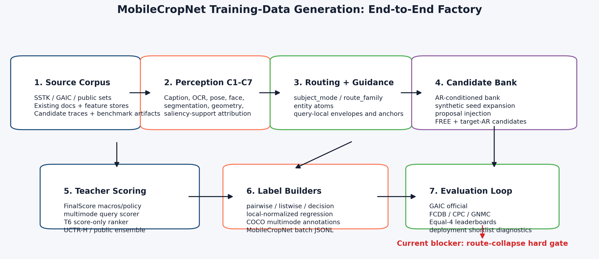

*그림 5-0. 학습 데이터 생성 파이프라인 개요.*

### 5.1 C1: 캡션, 텍스트 정렬, 의미 문맥

C1은 이미지의 high-level semantic context를 만든다. 입력은 image와 metadata/caption 후보이며, 출력은 caption, text alignment signal, scene/object/person semantic hint다. 이 정보는 route가 `scene_general`, `object_single`, `portrait_*`, `text_document`, `background_texture_copyspace` 중 어디로 기울어야 하는지에 영향을 준다.

C1이 방지하는 대표 실패는 visual detector만으로는 알기 어려운 semantic role의 손실이다. 예를 들어 작은 객체가 단순 배경인지 핵심 subject인지, 이미지 안의 empty space가 copy-space인지 그냥 빈 배경인지 판단할 때 caption context가 중요하다. downstream에서는 route snapshot, guidance spec, explanation payload에 간접적으로 반영된다.

### 5.2 C2: 객체 검출과 세그멘테이션

C2는 object boxes, segmentation-like region, dominant foreground candidates를 만든다. 입력은 image이며, 출력은 object 후보, bbox, area, confidence, overlap structure다. candidate generation은 이 정보를 seed로 사용하고, subject preservation score는 crop이 dominant object를 얼마나 포함하는지 계산한다.

C2는 candidate failure를 직접 줄인다. 좋은 crop은 subject를 포함해야 하는데, subject 후보 자체가 없으면 ranking stage는 복구할 수 없다. C2가 약하면 object crop은 scene crop처럼 넓어지고, portrait/group은 object_single로 붕괴하기 쉽다.

### 5.3 C3: 자세, 얼굴, 인물, 시선

C3는 인물 중심 crop의 핵심 stage다. 입력은 image와 detected person/face 후보이며, 출력은 face box, pose/keypoint, gaze/head-pose cue, person grouping clue다. 이 stage는 `portrait_single`, `portrait_group`, `face`, gaze-aware crop, headroom/lookroom/joint-cut checklist에 직접 영향을 준다.

C3가 없으면 인물 crop은 bbox center와 object coverage 중심으로 퇴화한다. 그러나 portrait composition에서 핵심 anchor는 단순 bbox center가 아니라 눈선, 얼굴, torso, pelvis, gaze direction, support line의 조합이다. downstream label에서는 subject_box_target, checklist labels, why-tags, portrait-sensitive hard reject로 나타난다.

### 5.4 C4: OCR, 텍스트, Copy-Space

C4는 OCR/text region과 text preservation risk를 만든다. 입력은 image이고, 출력은 text boxes, text density, text-cut risk, copy-space 관련 cue다. 이 stage는 `text_document` 또는 copy-space 성격의 route에 직접 기여하고, candidate scoring에서는 text cutoff와 copy-space preservation을 본다.

C4가 약하면 텍스트가 있는 이미지를 일반 object/scene으로 처리해 중요한 문구를 자르거나, 반대로 빈 여백을 불필요하게 subject로 오해할 수 있다. downstream에서는 reject tag, checklist, risk target, overflow/ignored candidate audit에 반영된다.

### 5.5 C5: 기하, 수평선, 대칭, 구성 prior

C5는 horizon, symmetry, roll, object layout, rule-of-thirds, centrality, context margin 같은 composition feature를 만든다. 입력은 image와 C2/C3/C4의 region 후보이며, 출력은 crop scoring에 사용할 geometry feature다.

C5는 subject coverage만으로 설명되지 않는 crop 품질을 다룬다. 풍경에서는 horizon이 잘리는지, 제품 이미지에서는 symmetry가 깨지는지, 인물 이미지에서는 headroom과 lookroom이 과도하게 좁은지 등을 판단한다. downstream에서는 `C_macro`, detail score, checklist score, ranking target에 반영된다.

### 5.6 C6: 인물 특화 보정

C6는 C3에서 얻은 person/face/gaze cue를 crop policy에 더 직접 연결한다. 특히 portrait/headroom/lookroom, face cut, joint cut, gaze direction, group framing이 중요하다. 출력은 portrait-specific placement와 safety cue다.

C6가 부족하면 route는 사람을 감지하더라도 generic object crop으로 변하고, rationale head는 `subject_scale_too_loose` 같은 일반 tag로 평탄화된다. Product-AR head audit에서 확인된 portrait-sensitive AUX recall failure는 이 축이 student에 충분히 내재화되지 않았음을 보여 준다.

### 5.7 C7: Saliency-Support와 Subject-Support 귀속

C7은 단순 bbox가 설명하지 못하는 support map과 subject-support context를 만든다. 입력은 image, detected objects, saliency/semantic support이며, 출력은 support bbox, centroid, distributed attention, foreground/background support mode다.

C7의 목적은 “무엇을 남겨야 하는가”를 region coverage보다 풍부하게 설명하는 것이다. 예를 들어 풍경, texture, copy-space, 다중 객체, 분산 attention scene에서는 dominant bbox 하나만으로 좋은 crop을 정의할 수 없다. C7은 candidate seed, route confidence, support-aware scoring, 정성 contact sheet 해석에 사용된다.

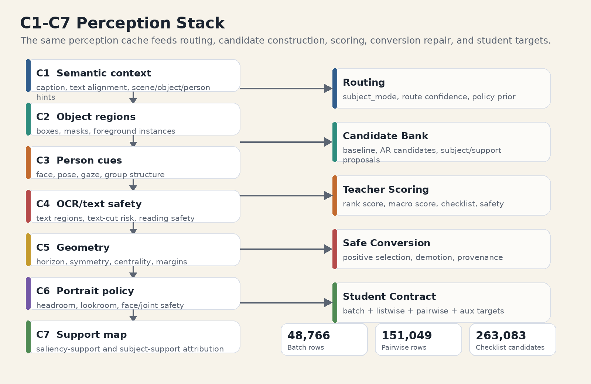

*그림 5-1. C1-C7 인식 사전 계산 스택은 routing, candidate bank, teacher scoring, safe conversion, student contract를 동시에 지지한다.*

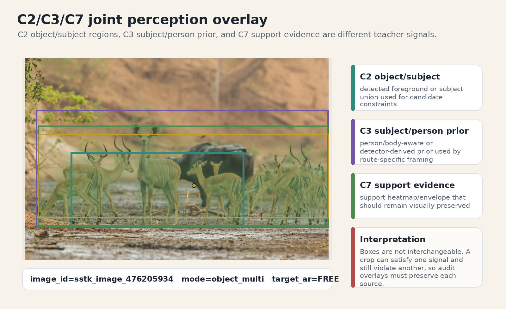

*그림 5-2. C2 object/subject region, C3 subject/person prior, C7 support evidence는 같은 crop task에서 서로 다른 teacher signal로 검토해야 한다.*

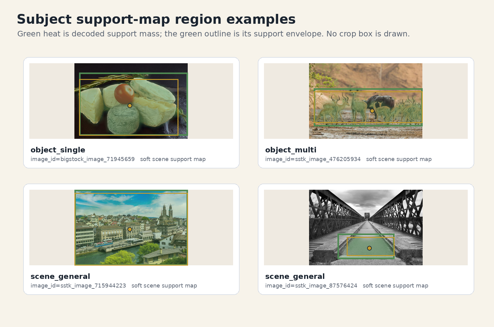

*그림 5-3. Support-map 예시는 winner 또는 baseline crop box 없이 teacher가 보존하려는 주피사체/근거 영역 자체를 heatmap과 envelope로 보여 준다.*

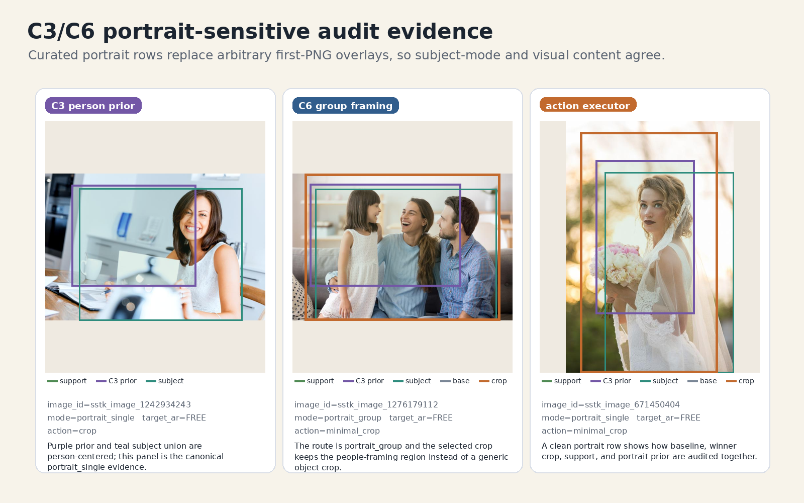

*그림 5-4. 대표 개별 overlay 기준으로 C3/C6 인물 신호는 headroom, lookroom, group framing, subject-box 오류를 정성 audit에서 직접 드러낸다.*

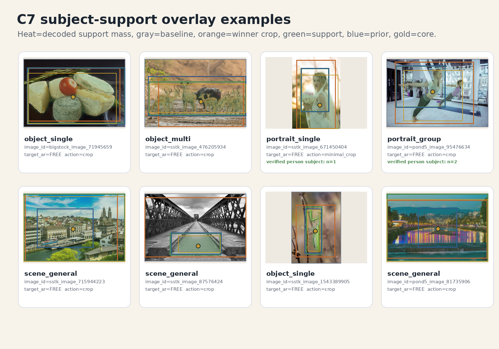

*그림 5-5. C7 subject-support overlay는 decoded support mass, support envelope, subject prior, 최종 crop 선택이 어떤 공간 관계를 갖는지 보여 준다. portrait_single/portrait_group 패널은 실제 사람이 존재하고 person subject로 판단된 검수 샘플만 사용한다.*

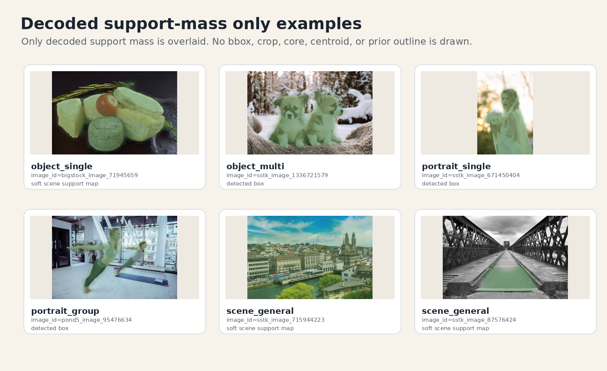

*그림 5-5b. Decoded support mass만 원본 이미지 위에 표시하여 bbox, crop, prior, core outline 없이 teacher support 분포 자체를 확인한다.*

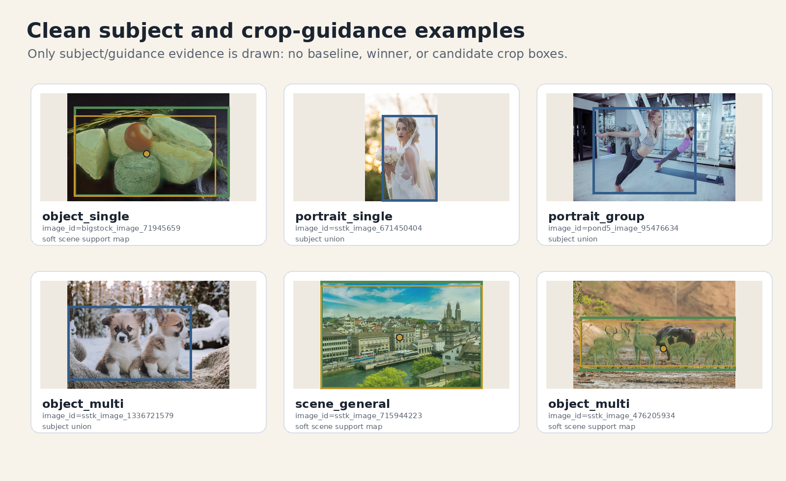

*그림 5-6. 피사체 영역과 crop guidance만 확인해야 할 때는 baseline, winner, candidate crop box를 제거하고 검수된 subject union 또는 support-map envelope/core만 표시한다. portrait_group 패널은 여러 사람이 피사체인 경우를 별도로 보여 준다.*

이 일곱 Figure는 C-stage 설명을 구현 경로 목록이 아니라 label semantics 관점으로 묶는다. 특히 C2/C3/C7 overlay는 object/subject, subject/person prior, support-map이 서로 같은 box가 아닐 수 있음을 강조한다. C7의 support evidence는 crop box 자체가 아니라 “보존해야 할 시각적 근거”를 근사하므로, subject-box target과 동일시하면 안 된다. Student가 no-prior runtime에서 학습해야 하는 것은 teacher support를 입력으로 받는 동작이 아니라, 이미지 feature만으로 이 support 구조를 내재화하는 동작이다.

다음 표는 C-stage별 downstream 사용을 요약한다.

| Stage | 주요 표현 | 주요 downstream 효과 | 대표적으로 방지하는 실패 | student에 노출되는 label |
| --- | --- | --- | --- | --- |
| C1 | caption, semantic context | route prior, scene/object 구분 | semantic subject를 배경으로 오해 | route, why-tag |
| C2 | object box, segmentation region | subject seed, coverage score | subject 없는 candidate bank | subject_box, candidate source |
| C3 | face, pose, gaze, person group | portrait route, headroom/lookroom | 얼굴/관절 cut, gaze-side cut | checklist, route, risk |
| C4 | OCR/text region | text safety, copy-space policy | text cutoff, designed space loss | reject tag, risk target |
| C5 | horizon, symmetry, layout | composition score | horizon/roll/symmetry failure | macro/detail score |
| C6 | person-specific refinement | portrait-sensitive scoring | bbox-center portrait failure | checklist applicability |
| C7 | saliency/support context | support-aware 후보와 audit | 분산 subject 손실 | support/subject supervision |

## 6. 라우팅, 피사체 모드, 구성 정책

Routing은 category classification이 아니라 policy prior다. `subject_mode`는 이미지가 어떤 종류의 crop 규칙을 요구하는지 알려주는 soft control signal이다. 같은 `people` category 안에서도 `portrait_single`은 눈선과 headroom이 중요하고, `portrait_group`은 여러 인물의 공동 envelope와 group balance가 중요하다. `object_single`은 subject scale과 centeredness가 중요하고, `object_multi`는 여러 객체를 동시에 보존해야 한다. `scene_general`은 context, horizon, symmetry가 중요하며, `background_texture_copyspace`는 여백과 texture continuity가 중요하다.

Route는 candidate generation의 seed와 scoring weight를 바꾼다. portrait route에서는 face/pose/gaze 기반 local expansion이 필요하고, object route에서는 detected object bbox와 context margin이 중요하다. scene route에서는 subject coverage보다 horizon/symmetry/context가 더 중요해진다. 따라서 route가 틀리면 candidate bank부터 잘못 만들어지고, 좋은 ranking head가 있어도 최종 crop이 무너진다.

최신 student evaluation에서 route collapse는 핵심 blocker다. final shortlist `19/19`가 route-collapse hard gate를 통과하지 못했다. default winner에서도 route accuracy는 `0.3193`, route balanced accuracy는 `0.3613`, portrait single accuracy는 `0.0120`, portrait group accuracy는 `0.7174`다. Product-AR head audit은 더 구체적으로 `portrait_single -> object_single`, `portrait_group -> object_single`, `scene_general -> object_single` collapse를 보고했다.

이 failure는 단순 route head만의 문제가 아니다. route label 분포, candidate proposal 철학, route loss weight, subject-box supervision, checklist/rationale applicability, Product-AR decision diversity가 얽혀 있다. route가 무너지면 portrait-specific headroom/lookroom/face/joint 판단도 함께 약해진다. 실제 audit에서 portrait-sensitive applicability recall은 headroom `0.0173`, lookroom `0.0533`, face_cut `0.0582`, joint_cut `0.0446` 수준으로 낮았다.

| Route family | 구성 정책 | 후보 생성 영향 | Scoring 영향 | Collapse 증상 |
| --- | --- | --- | --- | --- |
| `portrait_single` | face/eye-line 중심, headroom/lookroom 보존 | face/torso/gaze-aware expansion | face cut, joint cut, gaze side penalty | object_single로 축소되어 인물 의미 상실 |
| `portrait_group` | group envelope와 인물 간 balance | multi-person union, loose context | group cut, person exclusion penalty | object_single로 축소되어 한 명 중심 crop |
| `object_single` | dominant object scale과 centeredness | object bbox + context margin | subject coverage, scale fitness | 지나치게 일반 route로 과발화 |
| `object_multi` | 여러 객체의 공존과 관계 보존 | multi-object union/proposals | object exclusion penalty | single object만 남기는 crop |
| `scene_general` | horizon/context/symmetry | wide/context candidates | horizon, symmetry, context | object_single로 축소되어 장면성 손실 |
| `background_texture_copyspace` | 여백, texture, copy-space 보존 | empty-space preserving crops | copy-space/text safety | 불필요한 subject-tight crop |

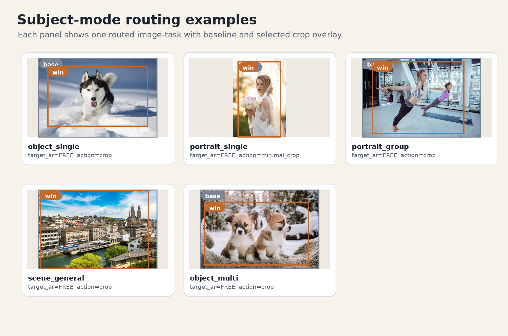

*그림 6-1. 동일한 crop task라도 subject-mode에 따라 baseline, winner crop, 보존해야 할 영역이 달라진다.*

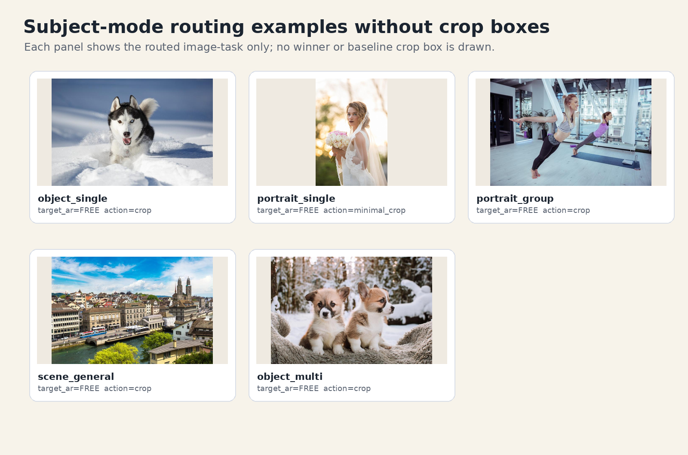

*그림 6-2. Mode별 원본 이미지만 보면 route가 crop box의 우연한 위치가 아니라 scene/subject 구조에서 유도되는 policy prior임을 확인할 수 있다.*

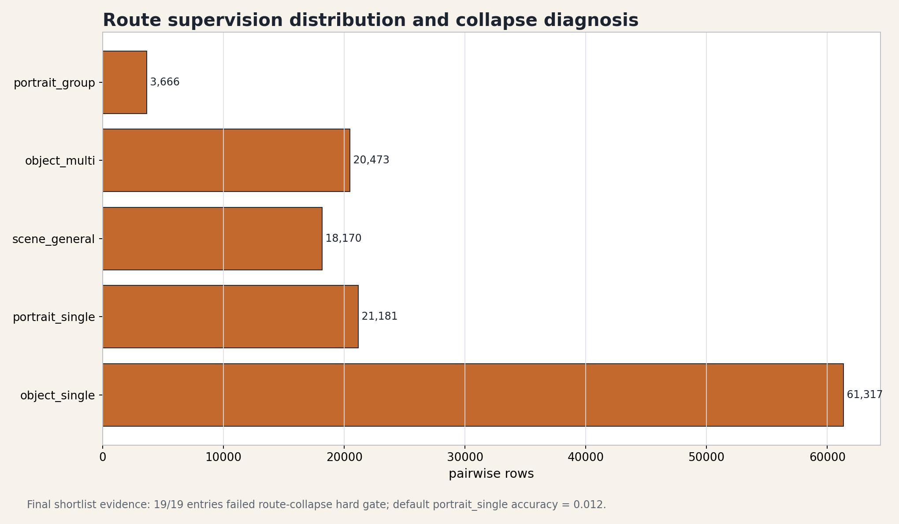

*그림 6-3. Route별 pairwise supervision 분포와 final shortlist의 route-collapse gate 실패를 함께 읽어야 한다.*

그림 6-1은 route가 crop policy와 직접 연결됨을 보여 주고, 그림 6-2는 box overlay 없이 이미지 구조만으로도 route 판단 근거가 달라져야 함을 보여 준다. 그림 6-3은 route label이 존재한다는 사실과 student가 route를 내재화했다는 사실이 다르다는 점을 보여 준다. 즉 data factory는 route supervision을 제공하지만, final student는 여전히 route-balanced sampling, hard negative, subject-aware proposal coupling이 필요한 상태다.

따라서 route는 student의 auxiliary head로만 취급하면 부족하다. route는 candidate construction, score weighting, checklist applicability, action policy를 모두 바꾸는 control variable이다. 향후 rerun에서 route-collapse를 깨려면 route loss만 키우는 것보다, route별 candidate hard negative와 subject-aware proposal을 함께 보강해야 한다.

## 7. 후보 생성

후보 생성은 student 성능의 상한을 정한다. 좋은 crop이 후보 집합에 없으면 ranking, policy, explanation head가 아무리 좋아도 정답을 선택할 수 없다. MobileCropNet factory는 직접 box를 하나 생성하지 않고, 여러 source의 candidate bank를 만든 뒤 teacher가 선택/정렬/수정할 수 있게 한다.

후보 집합은 baseline, AR-conditioned candidate, subject-aware expansion, support-map guided proposal, external teacher proposal, Product-AR group으로 구성된다.

$$ \mathcal{C}(I,r)=\mathcal{B}_{base}(I,r)\cup\mathcal{B}_{ar}(I,r)\cup\mathcal{B}_{subj}(I,r)\cup\mathcal{B}_{support}(I,r)\cup\mathcal{B}_{teacher}(I,r) $$

Baseline은 두 가지 의미를 가진다. `baseline_full`은 원본 유지 action의 기준이고, `baseline_minimal`은 target-AR만 맞춘 최소 crop의 기준이다. fixed-AR task에서는 exact target-AR compatibility가 중요하지만, FREE task에서는 aspect ratio 자체보다 subject/context preservation이 중요하다.

Candidate bank는 label export에서 `matching_targets`, `candidate_pool`, `ignored_candidates`, `overflow_candidates`로 나뉜다. `matching_targets`는 직접 positive supervision에 쓰이는 후보이고, `candidate_pool`은 안전한 negative 또는 soft positive다. `ignored_candidates`는 main loss에서 제외하지만 provenance를 보존한다. `overflow_candidates`는 unsafe/hard/audit 후보를 보존해 추후 분석과 auxiliary training에 사용할 수 있게 한다.

| 후보 역할 | main training 포함 여부 | 보존 이유 | 대표 source |
| --- | --- | --- | --- |
| `baseline_full` | 예, action reference로 사용 | 원본 유지가 최선인 경우를 학습 | runtime baseline lane |
| `baseline_minimal` | 예, action reference로 사용 | fixed AR에서 최소 crop baseline | runtime/postprocess lane |
| `matching_targets` | 예 | 직접 positive supervision | teacher가 선택한 safe candidate |
| `candidate_pool` | 예 | ranking/listwise 대비 학습 | safe negatives, soft positives |
| `ignored_candidates` | main loss에는 제외 | ambiguous/high-score leftover audit | safe-leftover repair |
| `overflow_candidates` | 보통 main loss에는 제외 | unsafe/hard 예시와 future mining | hard reject, overflow, external conflict |

현재 student proposal head와 teacher candidate philosophy 사이에는 mismatch가 있다. teacher-side candidate generation은 route와 subject/support context를 적극 사용하지만, 일부 student proposal path는 `cond_token + learned proposal query + AR constraint`에 더 가깝다. 즉 student proposal은 AR-aware generic proposal로 시작하고, teacher는 subject-conditioned proposal을 기대한다. 이 gap은 proposal target recall이 높더라도 selected crop이나 route explanation이 약해지는 원인이 될 수 있다.

**알고리즘 1. Candidate Bank 구성**

```text
입력: image I, target aspect ratio r, route state z, subject/support context h
1. baseline_full과 baseline_minimal 후보를 추가한다.
2. r에 맞는 AR-compatible grid/proposal 후보를 생성한다.
3. z가 portrait 또는 object이면 subject box와 support centroid 주변으로 확장한다.
4. z가 scene/copy-space이면 horizon, symmetry, context margin, text/copy-space region을 보존한다.
5. 사용 가능한 teacher 또는 public benchmark 후보를 주입한다.
6. box를 정규화하고 invalid geometry를 제거한 뒤 staged NMS를 적용한다.
7. candidate provenance를 보존하고 초기 role을 부여한다.
8. candidate bank를 teacher scoring과 label conversion으로 전달한다.
출력: source, role, geometry, target-AR, support metadata를 가진 candidate set C.
```

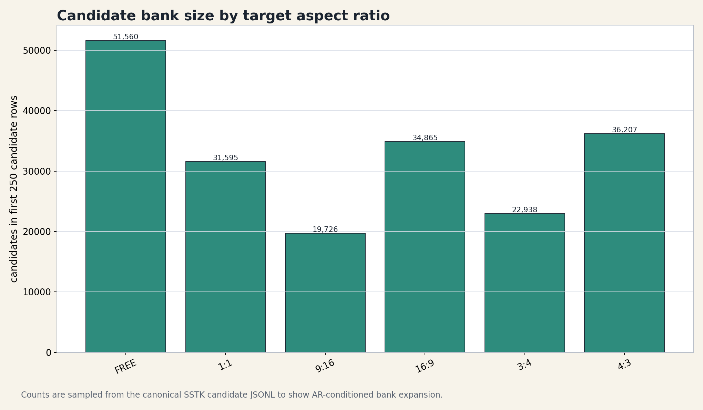

*그림 7-1. Candidate bank는 target-AR별로 확장되며, FREE와 fixed-AR task가 서로 다른 후보 분포를 만든다.*

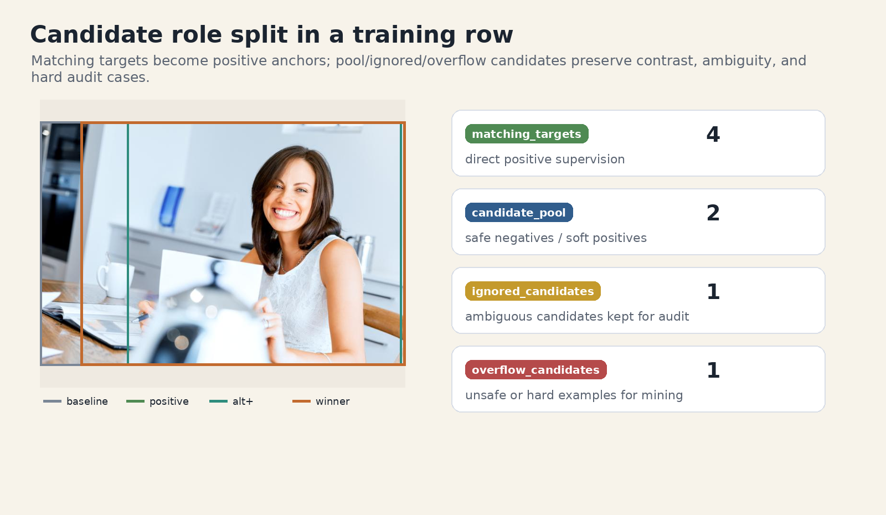

*그림 7-2. `matching_targets`, `candidate_pool`, `ignored_candidates`, `overflow_candidates`는 같은 crop 후보라도 학습상 역할을 다르게 부여한다.*

그림 7-1은 후보 생성이 단순 top-k crop enumeration이 아니라 target-AR 조건부 candidate bank 구성임을 보여 준다. 그림 7-2는 positive anchor와 negative/audit 후보를 모두 보존해야 하는 이유를 설명한다. 좋은 후보가 `matching_targets`에 없으면 ranking loss는 복구할 수 없고, unsafe 또는 ambiguous 후보가 overflow/audit로 남지 않으면 이후 failure mining도 불가능해진다.

Product-AR candidate group은 free-form GAIC 후보보다 좁다. GAIC corrected-style distillation은 image-task당 약 `86`개 후보를 보존하는 반면, Product-AR label은 image-AR task당 약 `6`개 후보에서 동작하는 경우가 많다. 이 차이는 버그가 아니다. 넓은 benchmark ranking과 제품형 AR-conditioned action이라는 서로 다른 student interface를 반영한다.

## 8. Teacher 채점과 Pseudo-Label 의미론

Teacher scoring은 단일 scalar를 부여하는 단계가 아니다. Factory는 여러 teacher lineage를 유지하고, 각각을 안전한 student supervision으로 변환한다.

SSTK T1/original score는 native product semantics, 즉 subject preservation, composition, safety, decision type, checklist, reject tags, route context를 제공한다. T6는 public MOS ranking에 강한 GAIC 학습 deep crop-aware ranker다. UCTR-H stage3는 public geometry와 GAIC ranking을 함께 학습한 unified teacher다. `public_cropper_ensemble_best`는 GAIC와 CGS public cropper score를 보통 rank-percentile normalization 후 `0.65`, `0.35` 가중치로 결합한다. `production_final_hybrid`는 단일 SSTK label scorer가 아니라 public/general geometry 강점과 GAIC ranking 강점을 결합한 routed benchmark-level policy다.

### 8.1 Ranking Score 분해와 Explanation-Safe 의미론

Teacher ranking score는 “예쁜 crop 하나”를 고르는 점수가 아니라, candidate가 제품형 crop으로 채택 가능한 이유를 분해해 기록하는 구조다. 핵심 축은 네 개다. `aesthetic`은 이미지가 보기 좋게 잘리는지, `subject`는 주피사체가 보존되는지, `composition`은 crop 내부 배치가 안정적인지, `external teacher`는 UCTR/T6/public cropper가 제공하는 외부 ranking prior가 있는지를 나타낸다.

| 항 | 직관적 의미 | 높아지는 경우 | 낮아지는 경우 | explanation 연결 |
| --- | --- | --- | --- | --- |
| aesthetic $A$ | crop 자체의 시각적 매력 | 노출/색/선명도/배경 정리가 좋고 MOS prior가 높음 | blur, 어색한 빈 공간, 시각적 중심 붕괴 | `aesthetic_low`, `low_visual_quality` |
| subject $S$ | 주피사체 보존 | support box/map이 crop 안에 충분히 들어오고 subject scale이 적절함 | 얼굴/객체 일부가 잘리거나 subject가 너무 작음 | `subject_coverage`, `subject_scale`, `face_cut`, `joint_cut` |
| composition $C$ | crop 내부 배치와 여백 | 3분할, 중앙 정렬, 대칭 margin, horizon/context rule 중 route에 맞는 규칙을 만족 | headroom/lookroom 부족, horizon cut, 불균형 margin | `headroom`, `lookroom`, `horizon_state`, `context` |
| external $T$ | 외부 teacher ranking prior | UCTR/T6/public cropper가 image-local rank에서 높게 평가 | public ranker는 높지만 product safety와 충돌 | `teacher_branch`, `score_provenance`, `contradiction` |

composition score는 “무조건 중앙에 두기”가 아니다. portrait_single에서는 얼굴/눈선이 3분할 선 근처에 있고 headroom이 적정하면 높다. product/object crop에서는 subject center가 crop center 근처에 있고 좌우/상하 margin이 안정적이면 높다. scene_general에서는 horizon이 잘리지 않고 주요 context가 남을수록 높다. 따라서 실제 구현 의미는 rule bank 중 현재 route에 맞는 규칙을 선택하거나 가중하는 방식에 가깝다.

$$ C(c_i|z)=\lambda_{third}(z)R_{third}(c_i)+\lambda_{center}(z)R_{center}(c_i)+\lambda_{horizon}(z)R_{horizon}(c_i)+\lambda_{margin}(z)R_{margin}(c_i)+\lambda_{context}(z)R_{context}(c_i) $$

subject score는 support coverage가 핵심이다. 가장 직관적인 경우는 crop이 support 영역을 거의 모두 포함하면 높고, support 영역을 가로로 자르거나 세로로 일부만 남기면 낮다. 단, 너무 넓게만 잡는 crop도 항상 좋은 것은 아니므로 scale과 boundary margin을 함께 본다.

$$ S(c_i)=\alpha\,\mathrm{coverage}(c_i,B_{support})+\beta\,\mathrm{scaleFit}(c_i,B_{support})+\gamma\,\mathrm{boundaryMargin}(c_i,B_{support}) $$

external score는 보조 ranking prior다. UCTR stage3나 public cropper score가 들어오면 후보 간 순위 신호는 강해지지만, 이 값은 SSTK의 product semantics를 지우지 않는다. 외부 점수는 반드시 image-local rank 또는 z-score로 정규화되고, hard reject 후보에는 cap이 적용된다.

$$ T_{local}(c_i)=\frac{T_{raw}(c_i)-\mu_{T,I,r}}{\sigma_{T,I,r}+\epsilon} $$

safety/reject state는 점수 구성요소가 아니라 우선순위가 더 높은 제약이다. `fatal_cut`, `text_cutoff`, `face_cut`, `joint_cut`, `unsafe_crop`, `score_explanation_conflict`가 켜지면 candidate는 높은 $A$ 또는 $T$를 갖더라도 strong positive가 될 수 없다.

$$ \tilde{S}_{rank}(c_i)=S_{rank}(c_i)-\lambda_RR_i-\lambda_FF_i-\lambda_X\mathbf{1}[\mathrm{contradiction}(c_i)] $$

explanation payload는 이 제약을 student target으로 남긴다. `checklist_labels`는 어떤 score term이 낮았는지를 구조화하고, `reject_tags`는 왜 후보가 제외되었는지를 기록하며, `why_tags`는 positive 후보가 선택된 이유를 남긴다. 따라서 good crop의 supervision은 `bbox + score`가 아니라 `bbox + local rank + safe/reject state + checklist + why-tag + provenance`의 결합이다.

### 8.2 UCTR stage3 Deep Ranker와 T1 Native Score의 차이

T1 native SSTK score와 UCTR-H stage3 deep ranker는 모두 후보 crop을 점수화하지만, 학습된 의미가 다르다. T1은 SSTK product label factory 안에서 만든 규칙/feature 기반 native scorer에 가깝다. C1-C7 evidence, subject preservation, composition feature, reject tag, checklist, route context, decision type을 함께 보며, “이 crop이 제품 정책상 안전한가”를 설명 가능한 field로 남긴다. 따라서 T1의 강점은 product semantics와 fallback 안정성이다. 반면 public benchmark ceiling은 제한적이고, FCDB/CPC/GNMC/GAIC를 동시에 최적화한 learned ranker는 아니다.

UCTR-H stage3는 이와 반대로 public crop benchmark의 원천 supervision을 통합해 학습한 crop-aware deep ranker다. 입력은 image/task 내부 candidate set이며, 각 candidate는 crop image/ROI feature, 원본 context, bbox geometry, target AR, dataset/domain embedding, source feature를 함께 가진다. 모델은 후보 하나를 독립 회귀하지 않고, 같은 image-targetAR task 안의 후보들을 상대적으로 비교해 utility를 산출한다. 이 utility는 FCDB/GNMC의 GT/editor crop IoU, CPC의 annotator preference, GAIC의 MOS/ranking을 함께 반영하도록 학습된다.

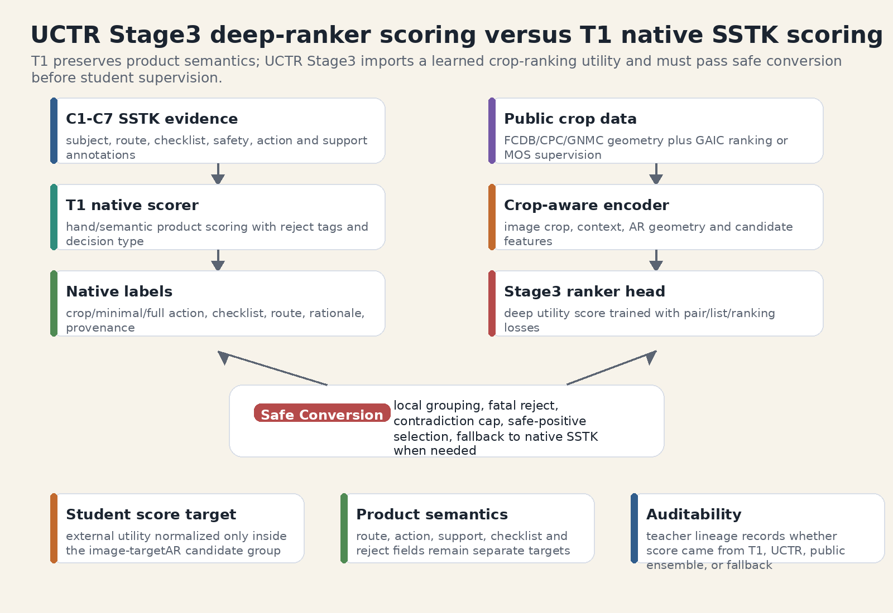

*그림 8-1. T1은 product semantics를 직접 보존하고, UCTR stage3는 crop-aware deep ranker로 외부 public utility를 학습한 뒤 safe conversion을 거쳐 student label로 들어온다.*

UCTR-H stage3의 흐름은 다음과 같이 요약된다. 먼저 public/internal 후보 warehouse에서 image별 candidate group을 구성한다. 각 후보는 crop-resize 또는 ROI feature, 전체 이미지 feature, bbox 좌표, 면적, 중심 편차, aspect ratio, target-AR token, dataset token을 가진다. Global/crop encoder가 visual feature를 만들고, geometry/domain embedding이 결합된 뒤, candidate set ranker 또는 ranking head가 후보별 utility logit을 출력한다. 학습 loss는 단일 MSE가 아니라 listwise, pairwise, regression, domain calibration의 조합이다. GAIC는 MOS 기반 listwise/pairwise signal, CPC는 weighted pairwise preference, FCDB/GNMC는 GT/editor crop에 대한 IoU band와 top-heavy ranking signal을 제공한다.

Stage3가 stage2와 다른 핵심은 GAIC/domain gate와 ranking calibration이다. Stage2는 FCDB/CPC/GNMC geometry 축이 매우 강했지만 GAIC primary가 낮아 worst-dataset gate에서 약했다. Stage3 gate128은 public geometry 강점을 거의 유지하면서 GAIC ranking을 크게 끌어올린다. Equal-4 표에서 UCTR-H stage3는 `FCDB 0.9085`, `CPC weighted 0.9135`, `GNMC 0.9173`, `GAIC primary 0.6715`, `equal4 z 0.863135`를 기록한다. 즉 단일 learned teacher로는 가장 강한 축에 속하지만, GAIC/aesthetic ranking만 보면 public cropper ensemble보다 낮다.

T1과 UCTR stage3의 차이는 student label 변환에서도 중요하다. T1 score는 product decision과 checklist를 이미 포함하므로 native fallback과 semantic audit에 적합하다. UCTR score는 public benchmark utility가 강하므로 candidate rank/listwise/pairwise target을 개선하는 데 적합하다. 그러나 UCTR score가 높다고 해서 face cut, text cut, joint cut, unsafe crop이 허용되는 것은 아니다. 따라서 UCTR stage3 branch도 `fatal reject -> contradiction check -> unsafe score cap -> best safe positive -> provenance preservation` 순서의 safe conversion을 통과해야 한다.

| 항목 | T1 native SSTK score | UCTR-H stage3 deep ranker |
| --- | --- | --- |
| 학습/구성 방식 | SSTK product feature와 규칙 기반 score semantics | public benchmark 원천 supervision 기반 learned crop ranker |
| 입력 표현 | C1-C7 evidence, route, checklist, safety, candidate geometry | image/crop visual feature, bbox geometry, target AR, dataset/domain token |
| 주요 supervision | product policy, subject preservation, reject/checklist | FCDB/GNMC IoU, CPC pairwise preference, GAIC MOS/ranking |
| 출력 의미 | product-safe native utility와 explanation field | image-local external crop utility |
| 강점 | safety/action/route semantics, fallback 안정성 | cross-dataset geometry와 learned ranking ceiling |
| 위험 | public benchmark ceiling 제한 | product safety/checklist를 직접 보장하지 않음 |
| 안전한 사용 | native baseline, fallback, semantic audit | safe-converted rank/listwise/pairwise external branch |

아래 두 시각화는 SSTK Product-AR validation split에서 `subject_mode`가 실제 이미지 의미와 맞는 전 종횡비 샘플만 contact sheet로 재검수한 뒤 선정했다. 같은 image id를 T1과 UCTR branch에 공통으로 사용했으므로, 행의 차이는 이미지 선택 차이가 아니라 teacher score/positive crop materialization 차이로 읽어야 한다. T1 그림의 score는 native `crop_utility_prob`이고, UCTR 그림은 safe-converted label score와 raw external ranker score를 함께 표시한다.

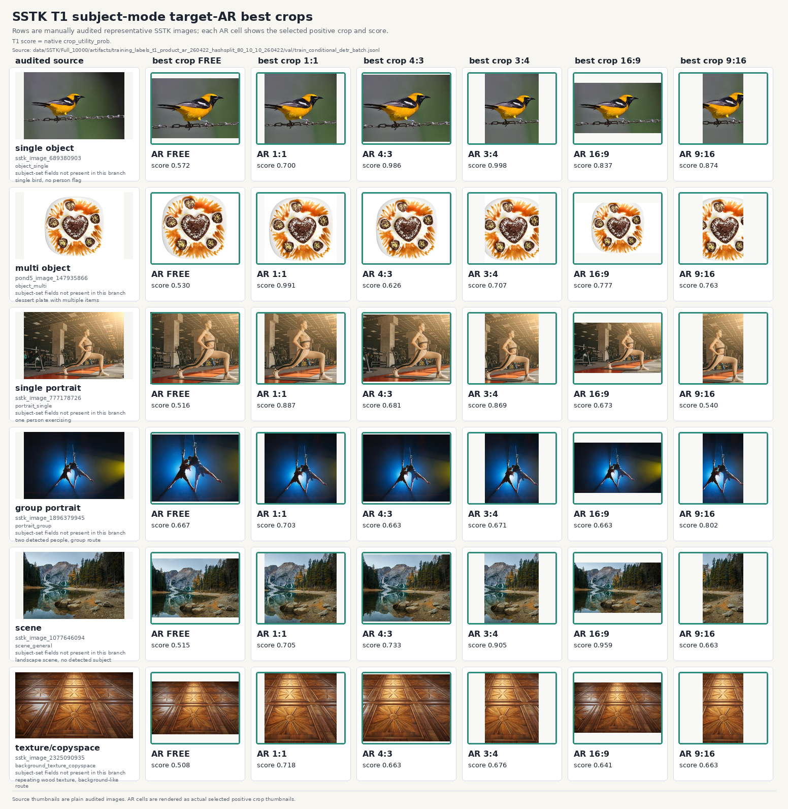

*그림 8-1a. SSTK T1 native Product-AR validation label에서 subject-mode별 검수 대표 이미지의 target-AR별 best crop과 score. `object_single`, `object_multi`, `portrait_single`, `portrait_group`, `scene_general`, `background_texture_copyspace` 모두 실제 이미지 의미와 route mode가 맞는 샘플로 선별했다.*

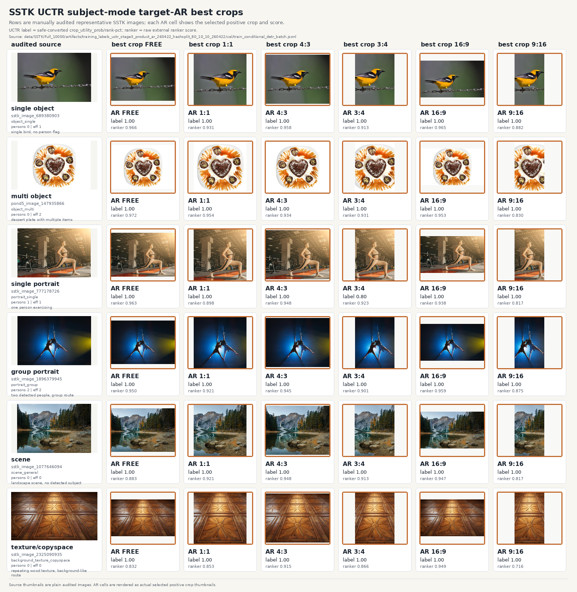

*그림 8-1b. 같은 대표 이미지에 대해 UCTR teacher Product-AR validation label이 materialize한 target-AR별 best crop. 각 칸은 safe conversion 이후의 label score와 external ranker raw score를 함께 보여 준다.*

External teacher score는 ranking field를 대체할 수 있지만 SSTK semantic safety를 지울 수는 없다. Product-AR score-label conversion에서 external score는 `score_prob`, `crop_utility_prob`, `score_rank_pct`, `crop_utility_rank_pct`, pseudo-MOS style monitoring field를 덮어쓸 수 있다. 그러나 원래 SSTK field는 별도 provenance key 아래 보존되고, hard safety/reject state는 계속 활성 상태로 남는다. `fallback_policy=sstk_positive`는 external branch가 safe positive를 만들지 못할 때 native positive를 복구한다. `unsafe_score_cap=0.05`는 unsafe high-scoring external candidate가 strong positive가 되는 것을 막는다.

이 구분은 raw external score가 explanation/safety와 자주 충돌하기 때문에 필수적이다. Public GAIC score export에서 train split contradiction rate는 약 `0.5665`, fatal rate는 약 `0.1118`이다. 단순히 “public score가 가장 높은 후보가 승리한다”는 정책을 쓰면 SSTK explanation 또는 safety semantics를 위반하는 후보가 대량 유입된다. Safe conversion은 이런 후보를 강등하거나 무시하고, distillation variant는 safety capping 이후에만 raw z-score signal을 blend할 수 있다.

따라서 pseudo-label semantics는 계층화된다.

| 계층 | 의미 | external teacher override 가능 여부 | student 사용 |
| --- | --- | --- | --- |
| Geometry | crop box, AR compatibility, baseline/proposal source | 부분적으로 가능 | proposal, ranking, direct eval |
| Rank score | image-local utility/order | conversion policy 안에서 가능 | score/listwise/pairwise loss |
| Policy decision | keep/minimal/crop action | decision contract가 유효할 때만 가능 | decision/action loss |
| Safety/reject | hard invalidity, text/face/joint cut | 불가 | risk, candidate demotion, audit |
| Explanation | checklist, why-tag, macro score | raw-score 직접 대체 불가 | rationale/aux head |
| Provenance | signal을 만든 teacher/branch | 반드시 보존 | debugging, ablation, trust |

Safe conversion은 5단계 정책으로 요약할 수 있다. 첫째, score 비교가 local하게 유지되도록 candidate를 image와 target AR 기준으로 묶는다. 둘째, positive를 선택하기 전에 fatal, contradiction, hard reject, unsafe candidate를 표시한다. 셋째, 활성 branch policy 아래에서 best safe positive를 고른다. 넷째, unsafe high-score candidate가 listwise target을 지배하지 못하도록 cap 또는 demote한다. 다섯째, downstream training이 label의 출처가 SSTK, T6, UCTR, public GAIC, CGS, fused public ensemble 중 무엇인지 audit할 수 있도록 provenance field를 방출한다.

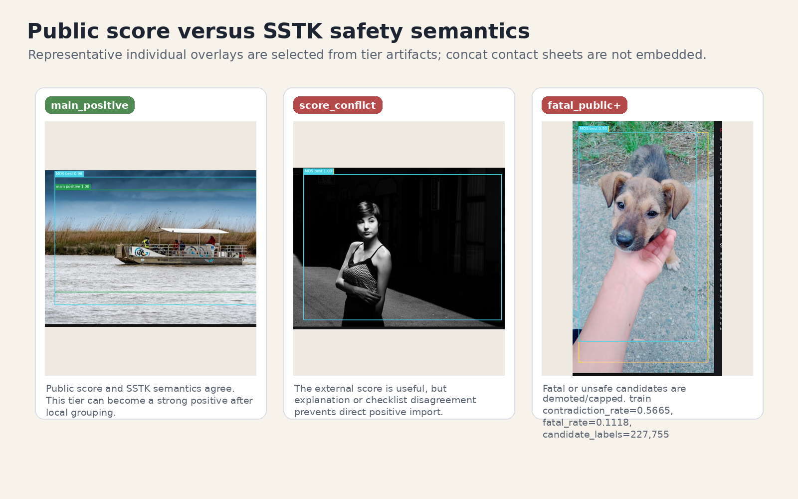

*그림 8-2. 대표 개별 overlay 기준으로 Public score positive라도 SSTK explanation/safety와 충돌하면 강한 positive로 직접 주입하지 않는다.*

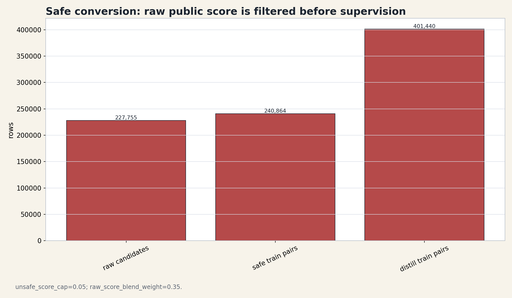

*그림 8-3. Raw public score는 candidate label로 유용하지만, unsafe cap과 safe pairwise/listwise 변환 이후에만 student supervision으로 사용된다.*

그림 8-1 계열, 그림 8-2, 그림 8-3은 pseudo-label을 단일 scalar truth로 해석하면 안 되는 이유를 보여 준다. External score는 ranking signal을 강화하지만, fatal cut, text/face/joint risk, SSTK explanation contradiction은 별도의 product safety semantics로 남아야 한다. 따라서 이 factory의 핵심은 teacher score import가 아니라 teacher score의 안전한 의미 보존 변환이다.

이 정책은 `production_final_hybrid`를 단일 Product-AR label scorer로 무비판적으로 쓰지 않는 이유를 설명한다. 이는 routed benchmark policy다. Public/general geometry와 GAIC ranking은 모두 강하지만, SSTK product label은 fatal/safety/reject/text-cut/head-cut/lookroom/subject-mode gate를 보존해야 한다. 단일 scalar teacher는 이 구조를 안전하게 대체할 수 없다.

Teacher lineage는 native product semantics에서 external benchmark strength로 확장된 뒤, 다시 safe product conversion으로 돌아오는 진화로 해석할 수 있다.

| Teacher lineage | 강점 | 단순 사용 시 위험 | 본 factory의 안전한 사용 |
| --- | --- | --- | --- |
| SSTK T1 | product semantics, checklist, decision | public benchmark ceiling이 약함 | native baseline과 fallback |
| T6 GAIC ranker | 강한 GAIC crop-aware ranking | 일부 product policy semantics를 무시 | safe rank/listwise distillation |
| UCTR-H stage3 | unified public/GAIC teacher | domain gate가 student data와 맞지 않을 수 있음 | Product-AR external scoring branch |
| public ensemble best | 강한 external public rank signal | contradiction/fatal rate가 높음 | capped auxiliary aesthetic/ranking score |
| production final hybrid | 최선의 equal-4 routed policy | 단일 student label source가 아님 | benchmark-level reference와 해석 |

## 9. Label 변환과 Student 학습 계약

Factory의 출력은 하나의 JSONL 파일이 아니다. Student training contract는 batch JSONL과 pairwise/listwise/checklist/regression sidecar를 결합한다. `MobileCropNetV4BatchDataset`은 batch record를 읽고, `(image_id, target_ar, candidate_id)` 기준으로 listwise label을 병합하며, 두 후보가 sampled candidate slot에 모두 있을 때만 explicit pairwise pair를 주입한다.

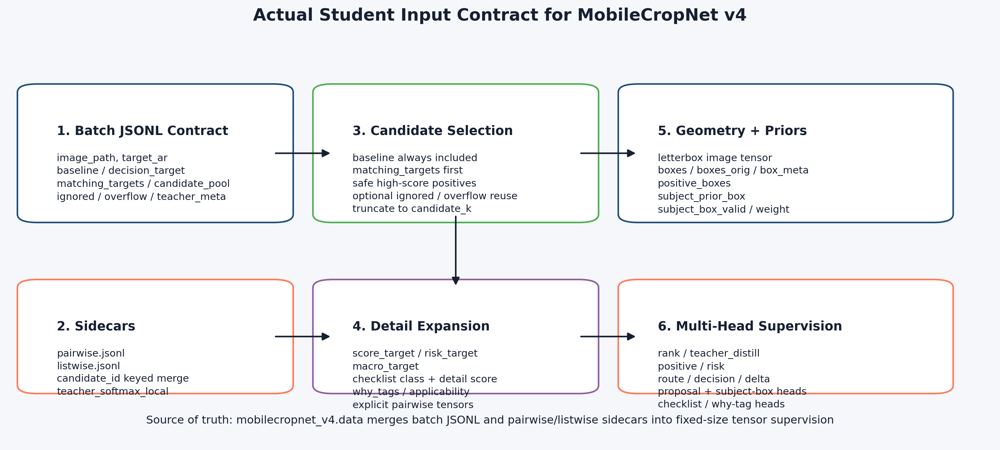

*그림 9-0. Student contract: batch row는 listwise/pairwise sidecar와 병합된다.*

Batch row는 task를 정의한다. 여기에는 image, target AR, route, decision, baseline, positive candidates, candidate pool, ignored/overflow candidates, subject prior, checklist, macro target, why-tags가 포함된다. Sidecar는 모든 label을 main batch row에 강제로 넣지 않으면서 supervision을 조밀하게 만든다.

| 원천 field | 의미 | 목표 tensor | 사용하는 loss/head | 누락 시 실패 |
| --- | --- | --- | --- | --- |
| `matching_targets` | 직접 선택된 positive candidate | positive target, score target | utility/positive/listwise | 명시적 good crop anchor가 사라짐 |
| `candidate_pool` | safe negative와 soft positive | candidate slot, pair candidate | pairwise/listwise/risk | ranking의 contrastive example이 부족해짐 |
| `ignored_candidates` | 보존하지만 main negative로 학습하지 않는 후보 | metadata/audit | optional analysis | high-score ambiguous case가 사라짐 |
| `overflow_candidates` | unsafe/hard/audit candidate | risk/audit provenance | risk/future auxiliary | unsafe case 진단이 어려워짐 |
| `decision.decision_type` | keep/minimal/crop action | decision class/scalar | decision head/action executor | model이 항상 crop하거나 항상 preserve함 |
| `score_targets` | rank/crop utility target | score tensor | utility loss | preference 없는 raw geometry만 남음 |
| `teacher_soft_target` | listwise soft distribution | probability target | listwise loss | task 내부 ordering 보정이 사라짐 |
| `pairwise` sidecar | positive-vs-negative preference | pair index/label | explicit pairwise loss | top-k ordering이 약해짐 |
| `routing.subject_mode` | policy prior | route target | route head | route collapse와 checklist applicability 오류 |
| `subject_prior_box` / `subject_box_target` | teacher subject localization | box와 valid target | subject-box head | no-prior runtime이 subject를 내재화하지 못함 |
| `macro_target` | A/S/C-style score decomposition | macro tensor | macro/rationale head | score 설명 가능성이 약해짐 |
| `checklist` | safety/composition label | class/applicability/score tensor | checklist head | face/text/joint/lookroom 실패가 숨겨짐 |
| `why_tags` | sparse rationale tag | multi-label target | why-tag head | user/deployment 진단력이 약해짐 |
| `risk_target` | unsafe/fatal/reject risk | risk tensor | risk head | unsafe high-score candidate가 살아남음 |

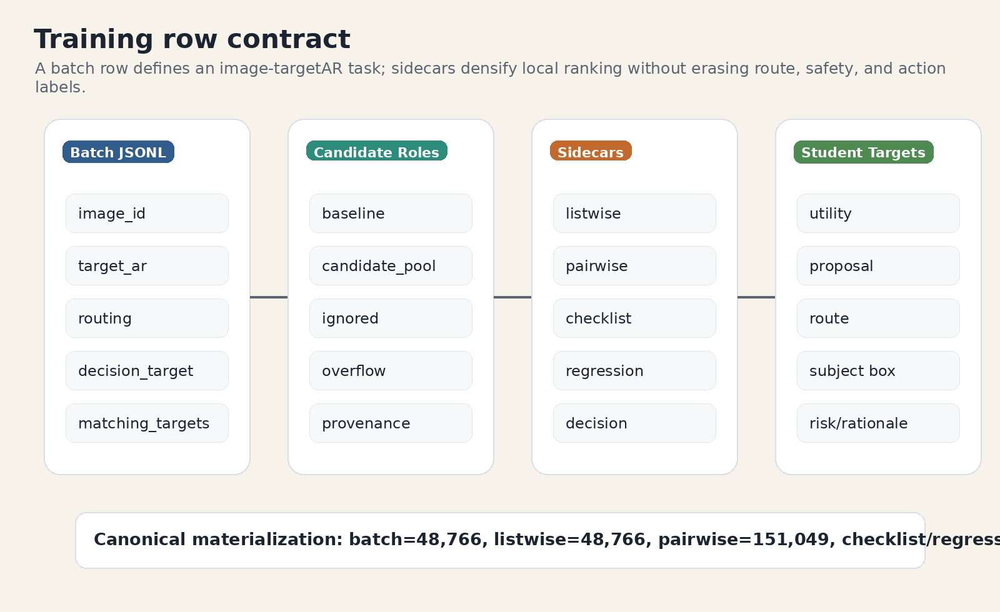

*그림 9-1. Batch JSONL, candidate role, sidecar, student target은 하나의 image-targetAR task를 중심으로 결합된다.*

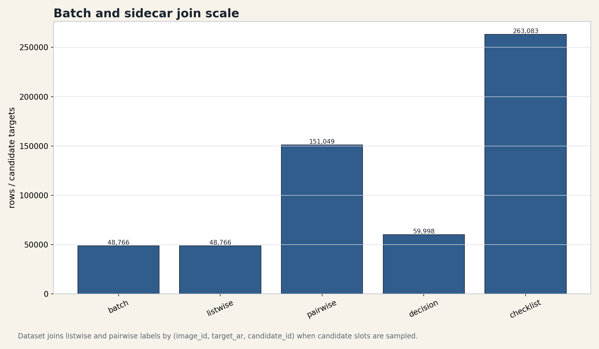

*그림 9-2. Batch row보다 pairwise/checklist supervision이 훨씬 조밀하므로, 학습 loader의 join contract가 성능과 재현성을 좌우한다.*

이 구조에서 핵심 join key는 `(image_id, target_ar, candidate_id)`이다. Pairwise label은 두 후보가 실제 sampled candidate slot 안에 있을 때만 explicit preference로 주입되어야 하며, listwise target은 image-task 내부 ordering으로 해석되어야 한다. Global MOS처럼 score를 직접 비교하면 Product-AR, GAIC corrected, SSTK native label의 의미가 섞인다.

Label conversion은 repair도 수행한다. 현재 score에서 AR result를 갱신하고, positive/baseline semantics가 충돌할 때 decision type을 고치며, safe-leftover policy를 적용하고, monotonic label split을 강제한다. 그래서 label generation은 단순 파일 형식 변환이 아니라 supervision design layer다.

결과 training contract는 세 가지 불변 조건을 가진다.

1. Ranking은 image-task 내부에서 local하다. Score는 global MOS regression target이 아니라 같은 task 후보들과의 상대값으로 의미를 가진다.
2. Policy는 rank와 분리된다. High-ranked crop이라도 safety 또는 area/action policy가 minimal crop이 낫다고 판단하면 baseline에 질 수 있다.
3. Explanation은 safety와 양립해야 한다. Candidate의 explanation이 fatal face/text/joint cut을 말하는데 strong positive가 될 수는 없다.

이 불변 조건이 깨지면 student behavior는 겉으로는 좋아 보이지만 운영상 불안정해진다. 예를 들어 all-crop decision label을 가진 Product-AR label line은 강한 geometry ranking을 학습시킬 수 있지만 decision executor는 과소 지정된다. 마찬가지로 hard reject state를 무시한 listwise target은 unsafe하지만 aesthetic한 crop에 과도하게 높은 score를 주도록 model을 가르칠 수 있다.

## 10. Product-AR Teacher 라벨 팩토리

Product-AR는 free-form GAIC ranking과 다르다. Free-form GAIC label은 public MOS ranking을 위해 넓은 candidate distribution을 보존한다. Product-AR label은 문제를 deployment에 더 가까운 image-targetAR task로 재구성한다. Candidate 수는 더 작고, exact AR이 더 중요하며, decision/action semantics의 비중이 커진다.

Product-AR factory에는 세 가지 주요 branch가 있다.

| 분기 | Teacher source | 의도한 역할 | 현재 materialization 해석 |
| --- | --- | --- | --- |
| T1 | native SSTK score semantics | baseline product semantics | SSTK Product-AR hashsplit은 train/val/test materialized, 일부 GAIC manifest는 별도 smoke/fallback |
| UCTR stage3 | unified crop teacher | 더 강한 external teacher score | root merge manifest는 1-image smoke이나 SSTK Product-AR hashsplit validation은 4,947 row materialized |
| public ensemble best | GAIC + CGS public rankers | external aesthetic/ranking distillation | SSTK public ensemble은 full materialized, GAIC local manifest는 smoke/fallback |

Public ensemble branch는 normalization 이후 fused score를 계산한다.

$$ s_{ensemble}=0.65\cdot s_{GAIC}+0.35\cdot s_{CGS} $$

이 conversion은 best safe external candidate를 선택하고, unsafe candidate를 cap하며, 필요하면 SSTK positive로 fallback한다. 현재 SSTK public ensemble Product-AR materialization은 `341,665`개 scored candidate row, `48,766`개 converted batch row, `671,635`개 pairwise row, `48,766`개 listwise row, task당 평균 `5.39`개 candidate를 포함한다. SSTK T1 Product-AR hashsplit은 train `39,002`, validation `4,947`, test `4,817` converted batch row가 확인되며, UCTR stage3 Product-AR hashsplit은 현재 local validation split `4,947` row를 확인했다. 반면 2026-04-22의 일부 GAIC official/Product-AR root manifest는 split당 1개 image group 또는 1개 converted row를 가진 fallback/smoke 동작을 보인다. 이 보고서는 root smoke manifest와 split materialization 상태를 합쳐 해석하면 안 된다.

Product-AR는 중요한 policy limitation도 드러냈다. 일부 GAIC/Product-AR label line은 `decision_type`이 사실상 `crop`으로 붕괴해 decision head supervision의 가치를 줄인다. 이는 단순 model issue가 아니라 data contract issue다. Product-action student에는 decision diversity가 필요하며, keep_full, minimal_crop, crop은 모두 의미 있는 label로 남아야 한다.

| Product-AR evidence line | Candidate/row 규모 | 해석 |
| --- | ---: | --- |
| GAIC T1 local 20260422 | split당 1 converted row, 0 pairwise | smoke/fallback 전용 |
| GAIC public ensemble local 20260422 | split당 1 converted row, 10 pairwise | CUDA path와 fusion smoke |
| SSTK T1 Product-AR hashsplit | train 39,002 / val 4,947 / test 4,817 rows | split materialized native score label line |
| SSTK UCTR stage3 root manifest | 1 converted row, 10 pairwise | 확인된 artifact의 UCTR merge smoke |
| SSTK UCTR stage3 hashsplit validation | val 4,947 rows | section 8 대표 시각화에 사용한 validation materialization |
| SSTK public ensemble full | 48,766 rows, 671,635 pairwise, 48,766 listwise | full materialized Product-AR label line |

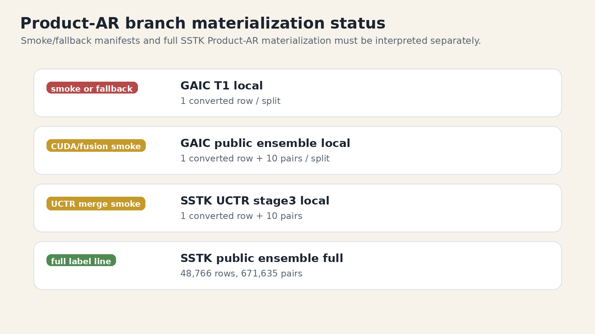

*그림 10-1. Product-AR branch는 full materialization과 smoke/fallback materialization을 분리해서 해석해야 한다.*

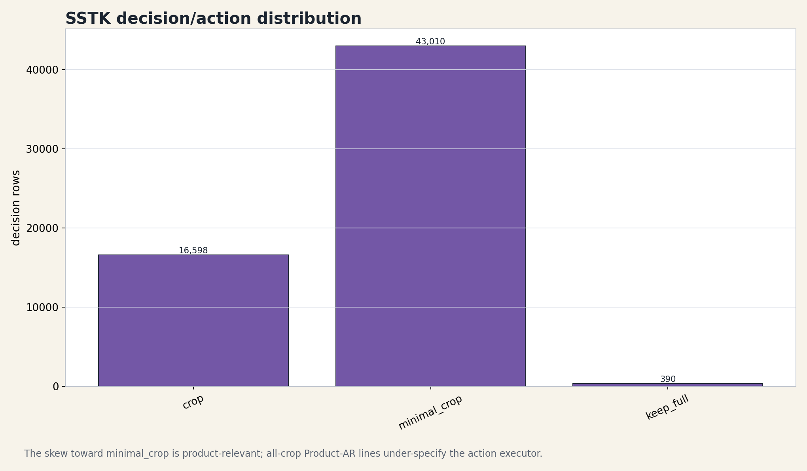

*그림 10-2. SSTK main label은 crop, minimal_crop, keep_full action을 모두 포함하지만 분포는 강하게 불균형하다.*

그림 10-1은 Product-AR 실험 상태를 과장하지 않기 위한 guardrail이다. 그림 10-2는 Product-AR conversion에서 `decision_type`이 all-crop으로 붕괴할 경우 action executor supervision이 약해지는 이유를 보여 준다. 따라서 Product-AR branch는 ranking quality뿐 아니라 decision diversity와 baseline alignment를 함께 보고해야 한다.

이 표는 의도적으로 보수적으로 작성했다. 하나의 Product-AR branch가 full이라는 사실이 모든 Product-AR branch가 full임을 뜻하지 않고, smoke manifest가 별도의 full materialized branch를 무효화하지 않는다는 흔한 보고 오류를 막기 위해서다.

## 11. Multi-Mode와 보조 Label 생성

Multi-mode label은 단일 global route가 가능한 모든 user intent를 표현할 수 없기 때문에 필요하다. 인물 이미지는 downstream 사용 목적에 따라 face crop, upper-body portrait, group-preserving crop, copy-space crop을 모두 지원할 수 있다. Multi-mode는 문제를 query lifecycle label로 바꾼다. Query를 열고, query-local candidate를 만들고, 해당 mode 아래에서 candidate를 scoring하고, 최대 하나의 strict positive를 선택하며, qualifying candidate가 없으면 no-positive 이유를 기록한다.

현재 materialized multimode artifact는 default production line이 아니라 auxiliary line이다. 이는 `200`개 image, `1,200`개 image task, `5,436`개 query, `2,674`개 positive query, `7,090`개 annotation을 포함한다. `landscape`는 positive query rate `0.885`로 비교적 쉽지만, `single_person_center`와 `single_person_rot`는 약 `0.18` 수준으로 더 어렵다.

핵심 multimode rule은 다음과 같다.

1. Global route는 hard label이 아니라 soft prior다.
2. Query에는 positive가 없을 수 있다.
3. v1은 query당 최대 하나의 strict positive만 허용한다.
4. No-positive state는 의미 있는 supervision으로 기록한다.

이 auxiliary corpus는 future intent-conditioned cropping, local repair, perturbation training, refiner head에 가치가 있다. 하지만 full-corpus materialization과 downstream training evidence가 생기기 전에는 main SSTK/GAIC/Product-AR label contract를 대체하면 안 된다.

가장 중요한 설계 선택은 no-positive query를 버리지 않는 것이다. 이는 요청된 mode/AR 조합이 해당 image에서 불가능하거나 unsafe할 수 있음을 model에 알려 준다. 이것이 classical crop ranking과 future intent-conditioned cropping을 잇는 다리다. Model은 어떤 crop이 최선인지뿐 아니라, 요청된 crop intent에 유효한 실현이 언제 없는지도 배워야 한다.

## 12. No-Prior Runtime이 학습 데이터에 주는 의미

Deployment contract는 no-prior다. Product inference는 `image + target_ar`만 받는다. External teacher subject prior, teacher support map, teacher crop hint는 runtime input이 아니다. 이 조건은 training label 해석 방식을 바꾼다.

Teacher subject prior는 supervision이지 inference shortcut이 아니다. Training 중에는 `subject_box_target`, subject-valid flag, route target, checklist, support-derived score가 model이 subject structure를 내재화하도록 가르친다. Inference 중에는 model이 image feature, target-AR token, generated proposal, decision executor만으로 subject와 action을 추론해야 한다.

Runtime action execution은 내부 baseline/proposal alternative를 사용한다. `keep_full`은 full baseline에, `minimal_crop`은 minimal target-AR baseline에, `crop`은 selected proposal에 매핑된다. 따라서 decision label은 candidate source와 정렬되어야 한다. Label line이 Product-AR task를 항상 `crop`으로 표시하면 action executor는 언제 baseline preservation이 올바른지 배울 수 없다.

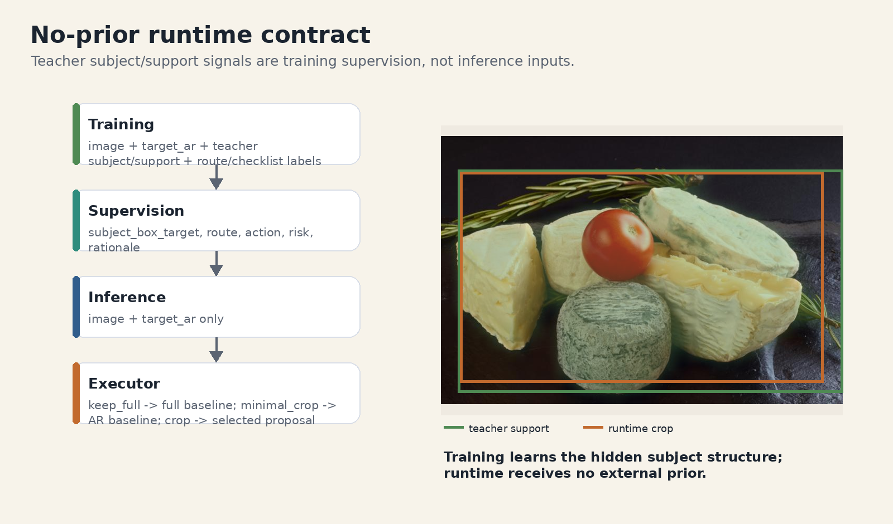

*그림 12-1. Teacher subject/support는 training supervision이고, runtime executor는 image와 target_ar만으로 full/minimal/crop action을 실행한다.*

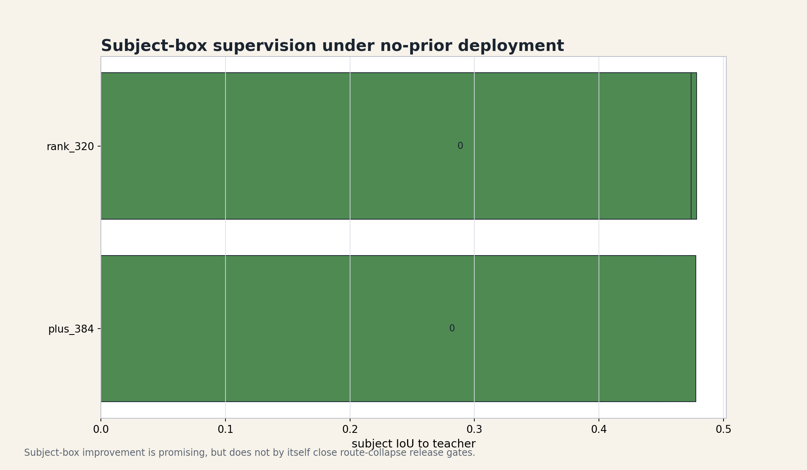

*그림 12-2. Subject-box supervision은 runtime 입력을 늘리는 방법이 아니라, no-prior 모델 내부에 subject localization을 학습시키는 방법이다.*

그림 12-1은 teacher prior가 inference shortcut이 아니라는 점을 명시한다. 그림 12-2는 subject-box head가 crop quality 보조 지표가 아니라 no-prior deployment reliability의 일부임을 보여 준다. 이 둘이 분리되면 model은 시각적으로 그럴듯한 crop을 만들면서도 왜 그 crop이 안전한지 설명하지 못한다.

No-prior contract에서는 subject-box supervision과 action consistency가 더 중요해진다. Data factory는 inference 때 사라질 teacher box를 단순히 붙이는 것이 아니라, internal subject localization과 policy decision을 가르쳐야 한다.

이 때문에 final crop metric이 좋아 보여도 subject-box target 품질이 중요하다. Model은 crop selection에서 높은 점수를 내면서도 subject가 존재하는지, 어디에 있는지, 선택한 crop이 올바른 이유로 subject를 보존하는지 모를 수 있다. No-prior deployment는 이런 “auxiliary” label을 product reliability requirement로 바꾼다.

## 13. 정량 결과

### 13.1 SSTK Main Factory 규모

질문: main product corpus는 positive box 이상의 구조화된 supervision을 충분히 제공하는가?

아래 수량은 repo-local `SSTK/Full_10000` materialized line 기준이다. 이미지 단위 corpus는 `10,000`장이지만, 학습 row는 image-targetAR task 단위로 확장된다. 6개 AR/FREE 조합에서 decision row는 `59,998`개이고, 이 중 conditional-DETR batch로 물질화된 task는 `48,766`개, skipped task는 `11,232`개다. Batch에 실제 포함된 고유 이미지는 `9,722`장이다.

| 지표 | 값 |
| --- | ---: |
| curated image files | 10,000 |
| materialized batch unique images | 9,722 |
| conditional-DETR batch rows | 48,766 |
| pairwise rows | 151,049 |
| listwise rows | 48,766 |
| decision rows | 59,998 |
| checklist/regression candidates | 263,083 |
| decision crop | 16,598 |
| decision minimal_crop | 43,010 |
| decision keep_full | 390 |

candidate generator 단계에서는 10,000장 전체에 대해 총 `7,533,038`개 후보를 만들었다. 이미지당 평균 후보 수는 `753.30`, p50은 `747`, p90은 `896`이다. 이 넓은 후보 bank가 바로 학습 batch로 모두 들어가는 것은 아니며, teacher scoring과 label conversion 후 대표 후보 slot으로 압축된다.

| Target AR | 총 후보 수 | 이미지당 평균 | p50 | p90 |
| --- | ---: | ---: | ---: | ---: |
| FREE | 1,951,872 | 195.19 | 199 | 240 |
| 4:3 | 1,350,612 | 135.06 | 140 | 176 |
| 16:9 | 1,325,602 | 132.56 | 140 | 173 |
| 1:1 | 1,211,483 | 121.15 | 119 | 148 |
| 3:4 | 906,683 | 90.67 | 76 | 157 |
| 9:16 | 786,786 | 78.68 | 69 | 136 |

conditional-DETR batch 안에서는 후보가 `matching_targets`, `candidate_pool`, `ignored_candidates`, `overflow_candidates`로 나뉜다. 총 sampled candidate slot은 `341,665`개이고, task당 평균 slot은 `7.01`개다.

| Candidate role | 개수 | 비율 | 의미 |
| --- | ---: | ---: | --- |
| matching_targets | 179,494 | 52.54% | 직접 positive 또는 soft-positive anchor |
| candidate_pool | 83,589 | 24.47% | negative/near-negative 및 contrast 후보 |
| ignored_candidates | 62,128 | 18.18% | ambiguous 또는 safe-leftover audit 후보 |
| overflow_candidates | 16,454 | 4.82% | hard/unsafe/future mining 후보 |

listwise/checklist/regression candidate label `263,083`개를 positive/negative 계열로 나누면 positive 계열이 `179,494`개, negative 계열이 `83,589`개다. Positive 계열에는 top1, soft positive, baseline positive가 포함되고, negative 계열에는 near negative와 negative가 포함된다.

| Label type | 개수 | 비율 |
| --- | ---: | ---: |
| top1 | 48,766 | 18.54% |
| soft_positive | 120,996 | 45.99% |
| baseline_positive | 9,732 | 3.70% |
| near_negative | 38,370 | 14.58% |
| negative | 45,219 | 17.19% |

batch task의 route 분포는 image-level subject-mode 분포와 다르다. 하나의 이미지가 여러 target AR task로 확장되고, 일부 route/AR 조합이 skipped되기 때문이다.

| Batch subject mode | rows | 비율 |
| --- | ---: | ---: |
| object_single | 17,832 | 36.57% |
| portrait_single | 10,127 | 20.77% |
| background_texture_copyspace | 7,177 | 14.72% |
| object_multi | 6,277 | 12.87% |
| scene_general | 5,217 | 10.70% |
| portrait_group | 2,136 | 4.38% |

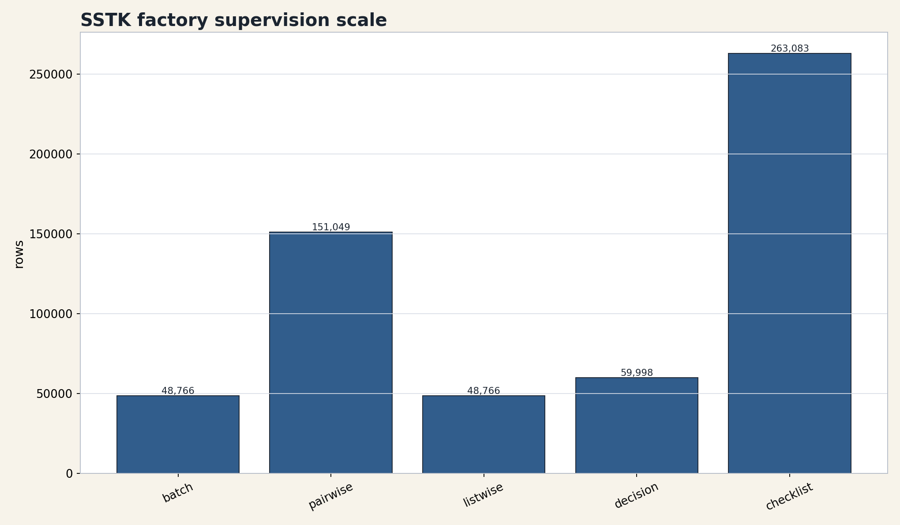

*그림 13-1. SSTK main factory는 batch row보다 훨씬 조밀한 pairwise/checklist/regression supervision을 생성한다.*

해석: SSTK는 단순 crop coordinate dataset이 아니다. 하나의 curated image가 여러 target AR task와 수백 개 후보로 확장되고, 그중 일부만 positive/negative/listwise/checklist supervision으로 압축된다. `minimal_crop` 쪽으로 기울어진 decision row 분포는 policy training이 action skew를 다뤄야 함을 보여 준다. Positive가 많다는 사실도 “쉬운 데이터셋”이라는 뜻이 아니다. 많은 positive는 top1 하나가 아니라 soft positive와 baseline positive를 포함하며, negative/near-negative 및 ignored/overflow 후보가 별도로 남아 hard mining과 safety audit을 가능하게 한다. 이 표가 student route/policy head가 충분하다는 증거는 아니다. Final evaluation은 이들이 아직 충분히 내재화되지 않았음을 보여 준다.

### 13.2 GAIC corrected_v2b 대비 Product-AR v1

질문: GAIC free-form label과 Product-AR label은 서로 대체 가능한가?

| Lineage | Train rows | Val rows | Test rows | 평균 candidates | Train pairwise | 해석 |
| --- | ---: | ---: | ---: | ---: | ---: | --- |
| T6 corrected_v2b | 2,509 | 189 | 475 | 86.38 / 85.93 / 86.15 | 240,864 | 넓은 free-form candidate ranking |
| T6 product_ar_v1 | 14,915 | 1,136 | 2,824 | 5.96 / 6.04 / 6.07 | 251,239 | 좁은 AR-conditioned product task |

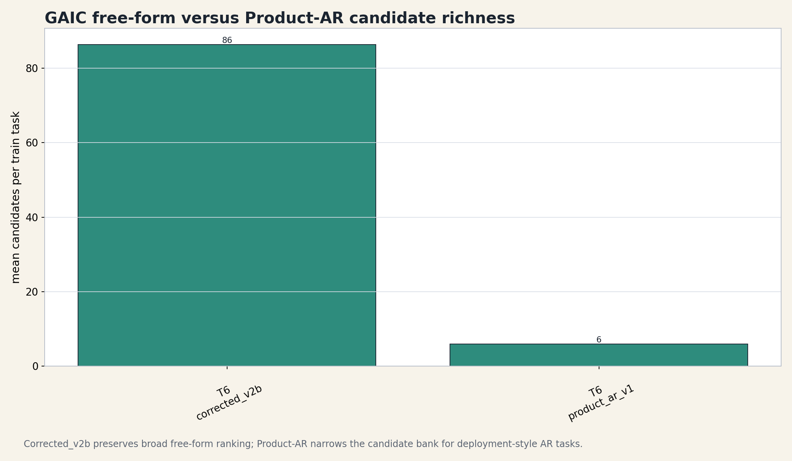

*그림 13-2. corrected_v2b와 product_ar_v1은 candidate richness와 task 정의가 다르므로 직접 대체 관계가 아니다.*

해석: corrected_v2b는 benchmark candidate richness를 유지하는 반면, product_ar_v1은 더 작은 candidate group으로 image-AR task를 확장한다. 두 label line은 서로 다른 질문에 답한다. 한쪽만 학습한 student는 다른 interface에서 성능이 떨어질 수 있다.

### 13.3 Public Explain-Safe와 Distill

질문: public ranker score를 student supervision으로 안전하게 사용할 수 있는가?

Train raw public export는 `227,755`개 candidate label, contradiction rate `0.5665`, fatal rate `0.1118`, top1 MOS `4.0516`, SRCC `0.9050`, PCC `0.9319`를 가진다. Safe conversion은 `240,864`개 train pairwise row를 만든다. Distill v2는 raw score blend weight `0.35`, unsafe cap `0.05`와 함께 `blend_rank_zscore`를 사용해 train pairwise row를 `401,440`개로 늘린다.

해석: public ranker score는 강력하지만 raw truth로 쓰기에는 안전하지 않다. 유용한 기여는 raw score 복사가 아니라 explanation-safe distillation이다.

### 13.4 Teacher Ceiling

질문: 남은 병목은 teacher quality인가?

Unified Public Benchmark는 FCDB, CPC, GNMC, GAIC를 하나의 비교 프레임으로 묶는다. 기존 `UNIFIED_PUBLIC_BENCHMARK_REPORT_KO.md`는 `public macro + GAIC component` 중심이었고, `UNIFIED_PUBLIC_BENCHMARK_EQUAL4_TEACHER_REPORT_KO_2026-04-23.md`는 이를 네 dataset 동등 가중치의 equal-4 score로 재정리했다. 여기서 FCDB primary는 IoU@top1, CPC primary는 weighted pairwise accuracy, GNMC primary는 IoU@top1, GAIC primary는 `0.50*(top1 MOS/5)+0.35*SRCC+0.15*Accw4@10`이다.

| Rank | Method | Family | equal4 raw | equal4 z | worst z | FCDB | CPC weighted | GNMC | GAIC primary |
| ---: | --- | --- | ---: | ---: | ---: | ---: | ---: | ---: | ---: |
| 1 | production_final_hybrid | hybrid teacher | 0.882696 | 1.148158 | 1.012435 | 0.9085 | 0.9135 | 0.9173 | 0.7915 |
| 2 | UCTR-H stage3 gate128 | UCTR teacher | 0.852693 | 0.863135 | -0.118412 | 0.9085 | 0.9135 | 0.9173 | 0.6715 |
| 3 | UCTR-H stage2 full-honest | UCTR teacher | 0.811868 | 0.465523 | -1.645942 | 0.9080 | 0.9120 | 0.9168 | 0.5107 |
| 4 | public cropper ensemble best | public cropper | 0.798613 | 0.020538 | -0.706939 | 0.7351 | 0.8918 | 0.7772 | 0.7903 |
| 5 | public cropper GAIC | public cropper | 0.792681 | -0.122526 | -0.678149 | 0.7376 | 0.8784 | 0.7692 | 0.7855 |
| 6 | public cropper CGS | public cropper | 0.785886 | -0.147538 | -0.726516 | 0.7334 | 0.8851 | 0.7702 | 0.7548 |
| 7 | teacher proxy compact utility | teacher proxy | 0.720220 | -1.097941 | -1.567600 | 0.7204 | 0.8374 | 0.7329 | 0.5902 |
| 8 | SSTK T1 historical + public proxy | historical teacher | 0.716914 | -1.129349 | -1.567600 | 0.7204 | 0.8374 | 0.7329 | 0.5770 |

아래 표는 equal-4 산식에 들어간 원본 benchmark metric을 풀어 쓴 것이다. FCDB와 GNMC는 top-1 crop의 GT IoU, CPC는 weighted pairwise accuracy, GAIC는 official candidate benchmark의 `top1 MOS`, `SRCC`, `Accw4@10`을 그대로 사용한다. `GAIC primary`만 composite이며, `top1 MOS`는 0-5 스케일 값이므로 equal-4 계산에서는 `top1 MOS / 5`로 정규화된다.

| Rank | Method | FCDB IoU@top1 | CPC weighted | GNMC IoU@top1 | GAIC top1 MOS | GAIC SRCC | GAIC Accw4@10 | GAIC primary | equal4 raw |
| ---: | --- | ---: | ---: | ---: | ---: | ---: | ---: | ---: | ---: |
| 1 | production_final_hybrid | 0.9085 | 0.9135 | 0.9173 | 3.9869 | 0.8530 | 0.6283 | 0.7915 | 0.882696 |
| 2 | UCTR-H stage3 gate128 | 0.9085 | 0.9135 | 0.9173 | 3.8461 | 0.6294 | 0.4438 | 0.6715 | 0.852693 |
| 3 | UCTR-H stage2 full-honest | 0.9080 | 0.9120 | 0.9168 | 3.4324 | 0.3810 | 0.2272 | 0.5107 | 0.811867 |
| 4 | public cropper ensemble best | 0.7351 | 0.8918 | 0.7772 | 3.9841 | 0.8524 | 0.6240 | 0.7903 | 0.798613 |
| 5 | public cropper GAIC | 0.7376 | 0.8784 | 0.7692 | 3.9853 | 0.8459 | 0.6062 | 0.7855 | 0.792681 |
| 6 | public cropper CGS | 0.7334 | 0.8851 | 0.7702 | 3.9210 | 0.7998 | 0.5521 | 0.7548 | 0.785886 |
| 7 | teacher proxy compact utility | 0.7204 | 0.8374 | 0.7329 | 3.6731 | 0.5022 | 0.3140 | 0.5902 | 0.720220 |
| 8 | SSTK T1 historical + public proxy | 0.7204 | 0.8374 | 0.7329 | 3.5985 | 0.4979 | 0.2856 | 0.5770 | 0.716914 |

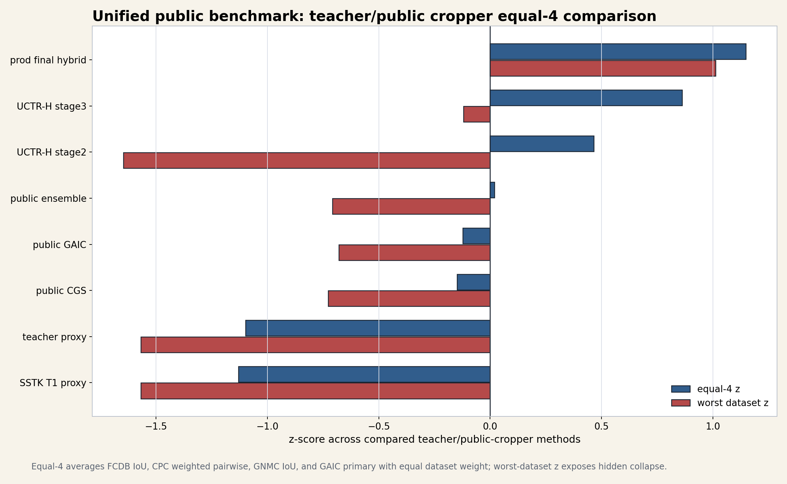

*그림 13-3. Equal-4 z-score는 평균 성능을, worst-dataset z는 특정 dataset collapse를 드러낸다.*

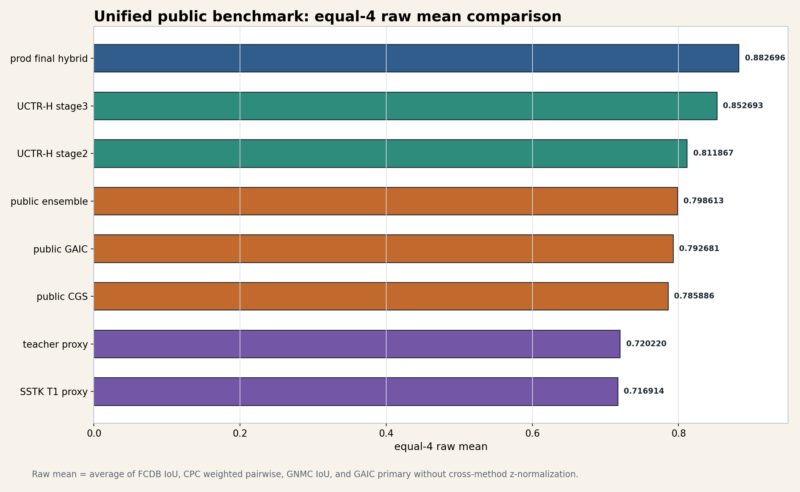

*그림 13-4. 정규화하지 않은 equal4 raw mean 기준에서도 production_final_hybrid, UCTR-H stage3, UCTR-H stage2, public cropper ensemble 순서가 유지된다.*

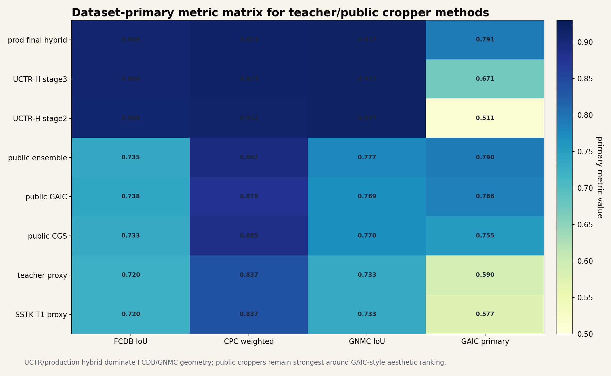

*그림 13-5. Dataset별 primary metric matrix는 UCTR/production hybrid와 public cropper의 강점이 서로 다른 축에 있음을 보여 준다.*

아래 표와 그림은 전체 leaderboard 중 현재 label factory 의사결정에 직접 관련되는 5개 방법만 다시 추린 것이다. Method명은 처음 보는 독자가 역할을 바로 이해할 수 있도록 “무엇을 학습/결합한 scorer인가”가 드러나게 풀어 썼다.

| Method | 역할 | equal4 raw | equal4 z | worst z | FCDB IoU | CPC weighted | GNMC IoU | GAIC top1 MOS | GAIC SRCC | GAIC Accw4@10 | GAIC primary |
| --- | --- | ---: | ---: | ---: | ---: | ---: | ---: | ---: | ---: | ---: | ---: |
| UCTR-H Stage3 딥 랭커(통합 Teacher) | public geometry와 GAIC ranking을 함께 학습한 deep crop ranker | 0.852693 | 0.863135 | -0.118412 | 0.9085 | 0.9135 | 0.9173 | 3.8461 | 0.6294 | 0.4438 | 0.6715 |
| Public Cropper 앙상블(GAIC+CGS) | GAIC MOS ranker와 CGS composition ranker를 결합한 외부 cropper | 0.798613 | 0.020538 | -0.706939 | 0.7351 | 0.8918 | 0.7772 | 3.9841 | 0.8524 | 0.6240 | 0.7903 |
| GAIC 공개 Cropper(MOS 순위 랭커) | GAIC candidate MOS 순위에 강한 public crop ranker | 0.792681 | -0.122526 | -0.678149 | 0.7376 | 0.8784 | 0.7692 | 3.9853 | 0.8459 | 0.6062 | 0.7855 |
| CGS 공개 Cropper(구도 순위 랭커) | composition/graph-style crop 선호를 반영하는 public crop ranker | 0.785886 | -0.147538 | -0.726516 | 0.7334 | 0.8851 | 0.7702 | 3.9210 | 0.7998 | 0.5521 | 0.7548 |
| Compact Teacher Proxy(경량 Utility 기준선) | 경량 utility feature로 만든 teacher proxy baseline | 0.720220 | -1.097941 | -1.567600 | 0.7204 | 0.8374 | 0.7329 | 3.6731 | 0.5022 | 0.3140 | 0.5902 |

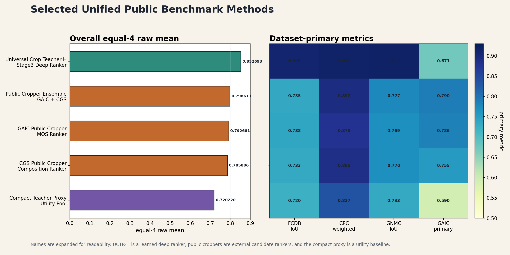

*그림 13-6. 요청한 5개 핵심 비교군만 분리하면 UCTR-H stage3는 geometry 계열에서 우세하고, public cropper ensemble/GAIC/CGS는 GAIC aesthetic-ranking 축에서 우세하다는 차이가 더 명확해진다.*

해석: `production_final_hybrid`가 equal-4 기준 전체 1위이며, worst-dataset z도 양수라 가장 균형적이다. 그러나 이는 단일 SSTK label scorer가 아니라 `public/general geometry -> UCTR stage3`, `GAIC/aesthetic ranking -> public cropper ensemble`로 나누는 routed hybrid policy다. 따라서 SSTK product label 생성에 그대로 “하나의 score teacher”로 주입하는 대상은 아니다.

`UCTR-H stage3`는 hybrid를 제외한 단일 learned teacher 중 가장 강하다. FCDB/CPC/GNMC geometry는 hybrid와 사실상 동률이고, stage2 대비 GAIC primary가 `0.5107 -> 0.6715`로 크게 개선됐다. 다만 GAIC primary는 public cropper ensemble의 `0.7903`보다 낮으므로, stage3는 geometry/generalization teacher로 강하고 public cropper ensemble은 GAIC/aesthetic ranking 보완 branch로 강하다고 해석해야 한다.

`UCTR-H stage2`는 equal-4 평균만 보면 3위지만, worst-dataset z가 `-1.645942`로 낮다. 이는 FCDB/CPC/GNMC가 매우 강해 평균을 끌어올리지만 GAIC 축이 약한 경우다. 따라서 teacher 선택에는 equal-4 평균과 함께 worst-dataset gate가 필요하다.

Public cropper 계열은 GAIC primary와 CPC weighted에서 강하지만 FCDB/GNMC geometry가 UCTR보다 약하다. `public_cropper_ensemble_best`는 GAIC/CGS 단일 cropper보다 안정적이며 GAIC primary가 `0.7903`으로 `production_final_hybrid`와 거의 맞닿아 있다. 하지만 FCDB `0.7351`, GNMC `0.7772`는 UCTR-H stage3의 `0.9085`, `0.9173`과 큰 차이가 있다. 이 때문에 public cropper는 direct deploy teacher가 아니라 external ranking/aesthetic pseudo-label source로 다뤄야 한다.

결론적으로 teacher ceiling 자체는 이미 충분히 높다. Student는 여전히 route hard gate를 실패하므로, 다음 병목은 단순히 또 다른 teacher를 찾는 것이 아니라 teacher의 route, subject, action, safety 구조를 no-prior student 안으로 전이하는 internalization이다.

### 13.5 최종 Student Shortlist

질문: 현시점 최선 student는 무엇이며, deployment를 막는 요소는 무엇인가?

| 지표 | 값 |
| --- | ---: |
| shortlist entries | 19 |
| completed entries | 19 |
| route collapse count | 19 |
| final gate pass count | 0 |
| default winner | SSTK public / subjectprior_route_proposal_v1 / balanced_288 |
| equal4 raw mean | 0.760155 |
| equal4 z-score | 1.380234 |
| official top1 MOS | 3.72358 |
| official SRCC | 0.64604 |
| direct alignment score | 0.76182 |
| route portrait single acc | 0.01204 |
| route portrait group acc | 0.71739 |

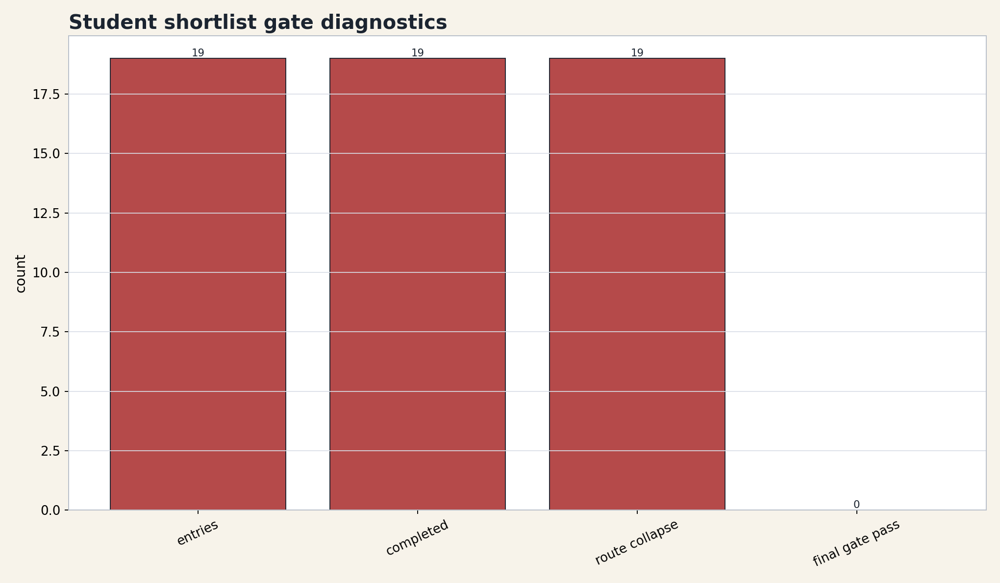

*그림 13-7. 최종 shortlist는 public crop quality signal을 일부 보존하지만 route-collapse hard gate는 통과하지 못한다.*

해석: best-available candidate는 존재하지만 final shipping model은 아니다. 이 결과는 route semantics가 해결되었다는 증거가 아니라, route head가 깨진 상태에서도 public quality가 보존될 수 있음을 보여 준다.

### 13.6 Subject-Box 후속 분석

질문: subject prior를 no-prior runtime 안으로 내재화할 수 있는가?

| 트랙 | 프로필 | Val subj IoU | Direct subj IoU | Direct neg acc | Direct hit@0.5 |
| --- | --- | ---: | ---: | ---: | ---: |
| GAIC UCTR v2 balanced-valid | plus_384 | 0.280450 | 0.331153 | 0.263254 | 0.926700 |
| GAIC UCTR v2 balanced-valid | rank_320 | 0.285814 | 0.309458 | 0.444241 | 0.934844 |
| SSTK UCTR v2 balanced-valid | plus_384 | 0.477671 | 0.522159 | 0.740658 | 0.969483 |
| SSTK UCTR v2 balanced-valid | rank_320 | 0.473988 | 0.516106 | 0.390882 | 0.970729 |

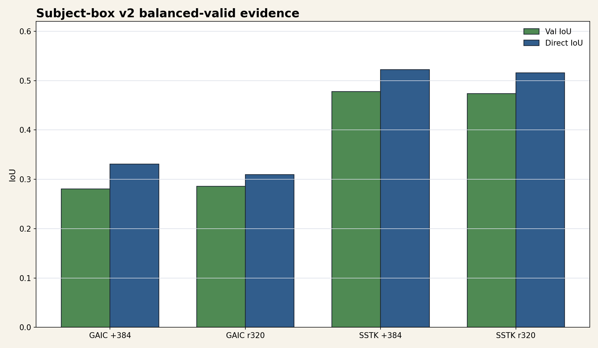

*그림 13-8. Subject-box v2 balanced-valid는 SSTK track에서 subject IoU를 높이지만, route-collapse 해결을 자동으로 보장하지 않는다.*

해석: SSTK v2 plus_384는 subject IoU와 no-subject negative accuracy 측면에서 유망하다. 그러나 subject-box 개선은 final deployment bundle의 route-collapse를 아직 해결하지 못했다. 이는 높은 우선순위의 경로이지 닫힌 결론이 아니다.

### 13.7 결과 수준의 시사점

정량 evidence는 네 가지 실무적 결론으로 이어진다.

1. Factory는 ranking head와 decision head를 학습할 만큼 충분한 규모를 갖췄지만, decision distribution은 불균형하며 all-crop Product-AR conversion으로부터 보호되어야 한다.
2. GAIC corrected와 Product-AR label은 경쟁적 대체물이 아니라 보완적 interface로 다뤄야 한다.
3. External public teacher score는 safety-aware conversion 이후에만 유용하며, raw score import는 product semantics를 손상시킨다.
4. 단기적으로 가장 큰 개선은 또 다른 teacher sweep이 아니라 route/subject/action internalization에서 나올 가능성이 높다.

이 시사점은 향후 experiment가 무엇을 측정해야 하는지도 정의한다. 새로운 run은 top1 MOS가 개선되었다는 이유만으로 성공이라고 부르면 안 된다. Route collapse, subject-box validity, decision/action consistency, risk behavior, qualitative failure family도 함께 보고해야 한다.

## 14. 정성 분석

정성 review는 미적 선호를 겨루는 절차가 아니다. 이는 model의 crop, route, subject box, action, explanation이 서로 일치하는지 확인하는 구조화된 audit이다. Contact sheet는 original image, teacher crop, selected student crop, candidate overlay, predicted subject box, teacher subject box, route label, decision action, checklist warning, why-tag 순서로 층을 나누어 읽어야 한다.

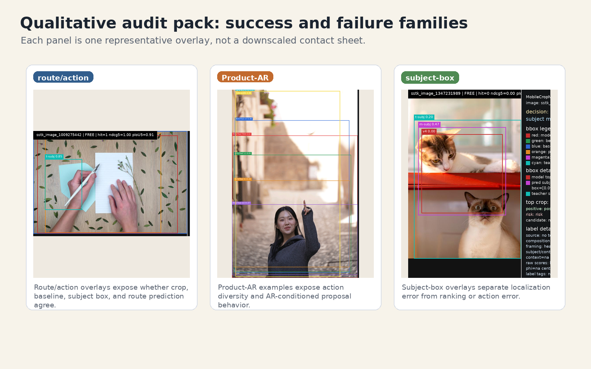

*그림 14-1. 정성 review pack은 성공 crop만이 아니라 route, action, subject-box, Product-AR failure family를 함께 포함해야 한다.*

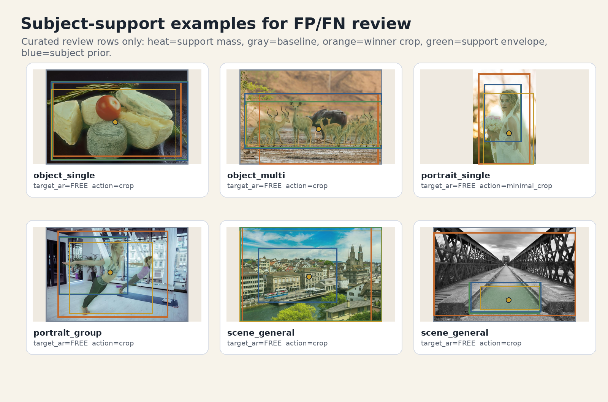

*그림 14-2. Subject-support와 winner crop overlay는 subject-box FP/FN, loose/tight crop, support mismatch를 분리해 검토하게 한다.*

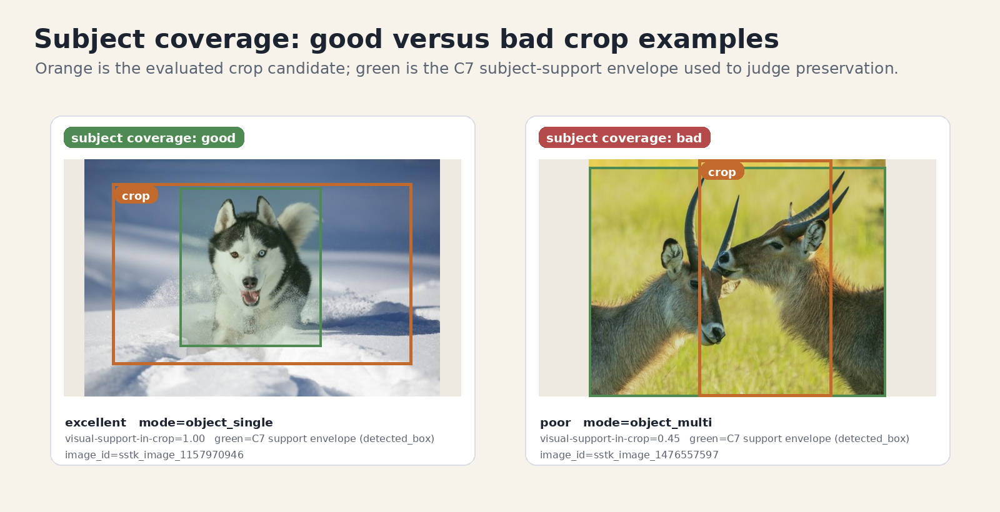

*그림 14-3. Subject coverage good/bad 예시는 crop 후보가 C7 subject-support envelope을 얼마나 보존하는지 직접 비교하게 한다. 초록 영역은 수동 GT가 아니라 detector seed와 latent support를 합친 시각화용 보존 envelope이다.*

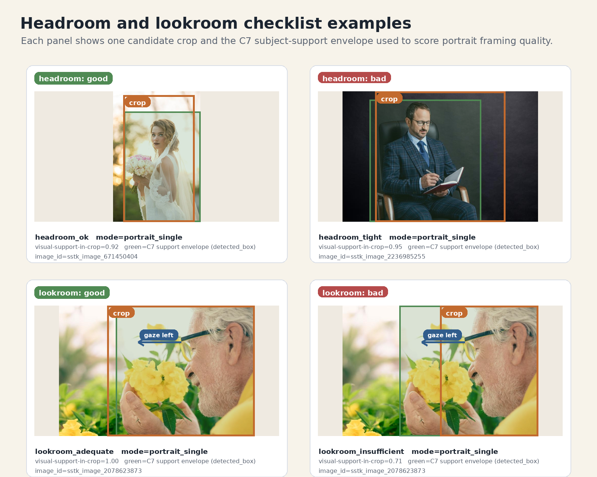

*그림 14-4. Headroom과 lookroom checklist는 portrait-sensitive framing 오류를 crop box와 C7 subject-support envelope의 관계로 분해한다. Lookroom 패널은 정면 인물이 아니라 측면 시선 인물을 사용하며, 파란 화살표는 C3/C6 계열 profile/gaze cue로 추정한 시선 방향을 표시한다. 렌더링은 letterbox 패딩을 제외한 실제 이미지 영역에 normalized box를 매핑한다.*

다음 두 overview figure는 처음 보는 독자가 teacher label과 MCN output의 crop/head contract를 한 화면에서 읽을 수 있도록 만든 성공 예시 pack이다. Teacher pack은 label JSONL에서 `portrait_single`, `object_single`, `object_multi`, `scene_general`, `background_texture_copyspace`를 2장씩 골랐고, selected crop, subject-mode, decision, checklist, why-tag를 함께 표시한다. MCN pack은 release-gate no-prior inference에서 crop hit, route match, decision match가 함께 좋은 10장을 골랐으며, 현 checkpoint의 성공 slice가 `background_texture_copyspace`, `scene_general`, `portrait_single`에 편중된다는 점도 같이 보여준다.


*그림 14-5. Teacher crop/head success gallery. 빨간 box는 selected crop이고 cyan box는 subject/support region이다. 각 카드의 우측에는 target AR, decision, teacher score, checklist, why-tag를 함께 배치했다.*

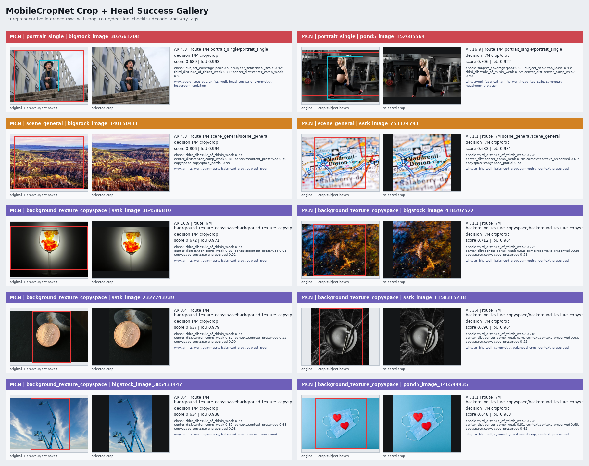

*그림 14-6. MobileCropNet crop/head success gallery. Release-gate head-good slice에서 대표 10장을 골라 crop, teacher/model route, teacher/model decision, score, IoU, decoded checklist/why-tag를 함께 표시했다.*

Winner-vs-fallback review는 `balanced_288`과 `rank_320`이 유사한 large-frame crop을 선택하는 경우가 많지만, `balanced_288`이 더 보수적이고 centered한 경향을 보여 equal-4 consistency에 유리하다는 점을 보여 준다. `plus_384`는 일부 high-capacity case를 개선할 수 있으나, 현재로서는 gate 전반에서 winner를 대체할 근거가 충분하지 않다.

권장 visual audit protocol은 다음과 같다.

1. 미적 판단 전에 target AR compatibility와 기본 crop validity를 먼저 확인한다.
2. 선택된 crop이 teacher subject 또는 의도한 support region을 보존하는지 확인한다.
3. Predicted route를 눈에 보이는 scene structure와 비교한다. Crop이 그럴듯해 보여도 route mismatch는 1급 실패다.
4. Decision action을 점검한다. full/minimal/crop은 baseline 대비 가시적 이득과 맞아야 한다.
5. Checklist와 why-tag를 image에 대조해 읽는다. Portrait/group image에서 generic rationale만 나오는 것은 경고 신호다.
6. Candidate failure와 ranking failure를 분리한다. 좋은 candidate가 없다면 수정 대상은 utility scoring이 아니라 candidate generation이다.
7. 단일 예제가 나쁜지뿐 아니라 failure가 family 단위로 체계적인지 기록한다.

실패 분류는 다음과 같다.

| 실패 유형 | 가시적 증상 | 가능성이 높은 upstream 원인 | 영향 받는 label/head | 권장 수정 |
| --- | --- | --- | --- | --- |
| Route collapse | person/group/scene을 object_single처럼 처리 | global route feature가 약하거나 route loss가 낮음 | route head, checklist applicability | subject-aware route feature, hard negative, route-balanced sampling |
| Portrait headroom/lookroom failure | face가 너무 타이트하거나 gaze side가 잘림 | C3/C6 signal이 내재화되지 않음 | checklist, why-tag, route | pose-aware portrait prior, score-first rationale head |
| Joint/face cut | limb 또는 face가 잘림 | subject box/support mismatch | risk/checklist/subject-box | 더 강한 hard reject mining과 subject support supervision |
| AR-only proposal | AR은 맞지만 subject framing이 약함 | generic AR-aware proposal 철학 | proposal head | subject-conditioned proposal refinement |
| All-crop policy | keep/minimal이 더 나은데도 model이 crop | decision_type diversity 손실 | decision/action executor | decision label 보존과 action consistency loss |
| Text/copy-space cut | text 또는 설계된 empty area 제거 | 약한 C4/C7 및 copy-space route | risk/checklist/route | text/copy-space candidate와 reject label |
| Unsafe external positive | public score는 높지만 semantic violation | raw external score가 safety를 덮어씀 | label conversion/risk | unsafe cap, fatal demotion, provenance audit |

정성 review는 benchmark gain이 controllable behavior로 이어지는지 검증함으로써 deployment sign-off에 영향을 줘야 한다. 점수는 높지만 portrait를 object로 routing하는 model은 final product freeze 준비가 되지 않았다.

따라서 유용한 qualitative pack은 성공 예시와 실패 예시를 모두 포함해야 한다. 최소한 portrait single, portrait group, object single, object multi, scene, copy-space/text, fixed AR, FREE, keep_full, minimal_crop, crop action 각각에 대한 예시를 보여야 한다. 이 coverage가 없으면 qualitative review는 소수의 보기 좋은 crop에 과적합하고 체계적인 route 또는 policy collapse를 놓칠 수 있다.

## 15. Benchmark와 배포 해석

Teacher equal-4와 student equal-4는 서로 다른 질문에 답한다. Teacher equal-4는 scoring policy가 FCDB, CPC, GNMC, GAIC 전반에서 좋은 crop을 선택할 수 있는지 묻는다. Student equal-4는 compact on-device model이 runtime constraint 아래에서 유용한 행동을 재현할 수 있는지 묻는다.

UCTR teacher strength가 자동으로 student strength로 전이되지는 않는다. UCTR-H는 scoring teacher로 훌륭할 수 있지만 student는 여전히 route, proposal, decision head에서 실패할 수 있다. 반대로 standalone teacher로는 UCTR이 더 강하더라도, SSTK public은 label distribution과 conversion이 MobileCropNet architecture에 더 잘 맞기 때문에 student로 승리할 수 있다.

`best_selection_score`는 training-run checkpoint selection metric이지 deployment decision metric이 아니다. Deployment selection은 equal-4 public benchmark, GAIC official metric, head sanity, product direct eval, latency, qualitative review를 함께 사용한다. Final gate에는 target-AR compatibility, risk behavior, proposal target recall, route-collapse absence 같은 hard check도 포함된다.

| 신호 | 측정 대상 | 단독으로 결정할 수 없는 것 |
| --- | --- | --- |
| teacher equal-4 | dataset 전반의 teacher scoring ceiling | student runtime behavior |
| student equal-4 | public benchmark consistency | explanation과 action correctness |
| GAIC official | MOS ranking quality | product safety와 route |
| head sanity | route/decision/checklist/rationale quality | visual crop quality 단독 |
| direct eval | product-style proposal/action alignment | broad public generalization |
| latency | deploy feasibility | semantic correctness |
| qualitative pack | visible failure mode | statistical reliability 단독 |
| final gate | combined deploy readiness | root cause 자체 |

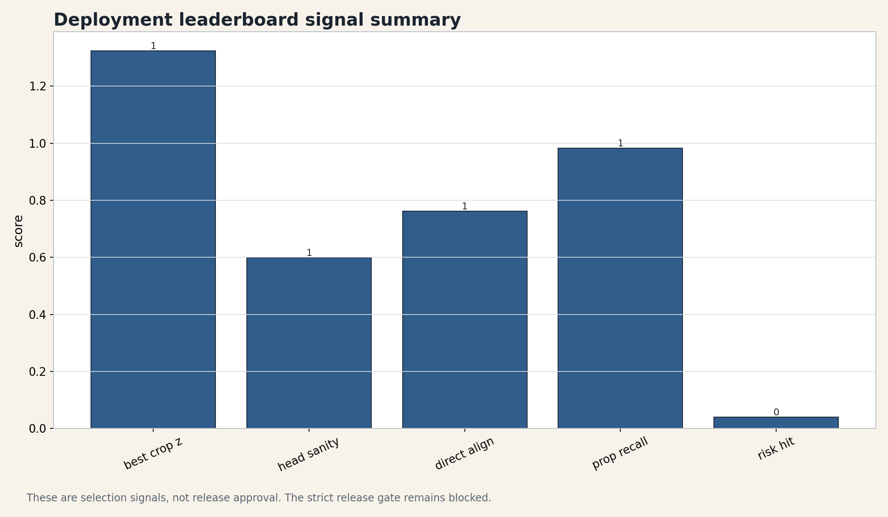

*그림 15-1. Deployment leaderboard의 quality, head sanity, direct alignment, proposal/risk signal은 release 판단의 일부일 뿐이다.*

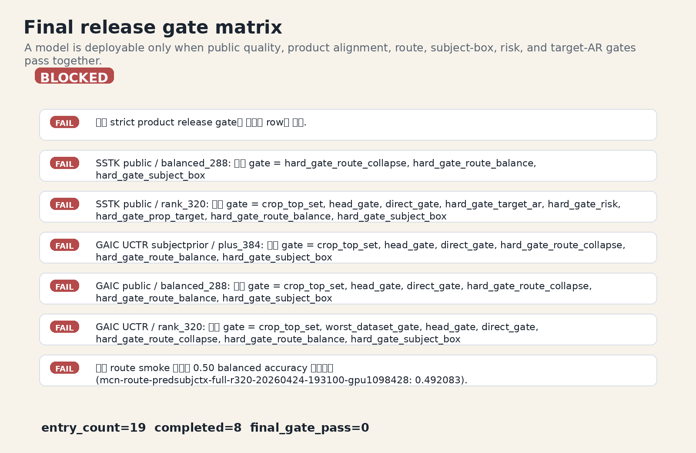

*그림 15-2. Strict release gate는 public score가 아니라 route, subject-box, risk, target-AR compatibility를 포함한 product readiness를 판정한다.*

그림 15-1은 후보 모델 비교에 필요한 연속형 signal을 요약하고, 그림 15-2는 왜 현재 상태를 shipping-ready로 부를 수 없는지 보여 준다. 특히 `best_selection_score` 또는 public equal-4가 높더라도 route-collapse, subject-box, target-AR, risk gate가 실패하면 deployment decision은 blocked로 남아야 한다.

## 16. 한계

현재 factory는 강하지만 완전하지 않다.

1. Product-AR 20260422 artifact 상태는 혼재되어 있다. SSTK public ensemble Product-AR은 full materialized지만, 여러 GAIC/T1/UCTR local manifest는 smoke/fallback 또는 1-image conversion이다.
2. Route collapse는 여전히 primary student blocker다. Final shortlist `19/19`는 route-collapse hard gate를 실패한다.
3. Subject-box v2 balanced-valid는 subject localization 일부를 개선했지만, final deployment integration과 route-collapse resolution은 아직 열려 있다.
4. Raw score 오해석 위험은 남아 있다. Public/GAIC score를 global regression truth로 다루면 안 된다.
5. Teacher domain과 student deployment domain은 다르다. Candidate, route, decision contract가 맞지 않으면 강한 teacher도 transfer에 실패할 수 있다.
6. Support-map supervision은 아직 conceptual design보다 약하다. C7은 audit과 scoring에 유용하지만, dense support-map student supervision은 충분히 활용되지 않았다.
7. Qualitative evidence는 유용하지만, 충분히 다양한 failure exemplar를 갖춘 standardized review pack은 아직 아니다.
8. Product policy decision diversity를 보존해야 한다. All-crop label line은 action learning을 과소 지정한다.

## 17. 향후 작업

다음 작업은 bounded하고 evidence-driven해야 한다.

1. Route-balanced sampling과 더 강한 route loss를 사용해 `SSTK public balanced_288`, `rank_320`, 필요하면 `plus_384`에서 route-collapse bounded rerun을 수행한다.
2. Portrait-sensitive checklist category에 대해 direct AUX classification 중심을 score-first rationale head로 대체한다.
3. Proposal이 AR-aware generic box에 머물지 않도록 subject-aware route/proposal coupling을 추가한다.
4. Eye-line, torso/pelvis anchor, gaze direction, support line을 사용해 pose-aware portrait prior를 확장한다.
5. Local refiner와 robustness training에 perturbation/repair label을 사용한다.
6. Bbox-only subject target을 넘어 dense subject-support map supervision을 승격한다.
7. 단순 checkpoint selection 변경 후가 아니라 route와 subject-box fix 이후 final gate를 다시 실행한다.
8. Route, action, subject-box, safety, target-AR failure exemplar를 포함한 standardized qualitative review pack을 만든다.
9. Report narrative와 final gate interpretation이 안정화된 뒤에만 slide/figure pack을 생성한다.

## 18. 결론

MobileCropNet 학습 데이터 생성은 온디바이스 이미지 크롭핑을 위한 candidate-centric, teacher-routed, policy-aware label factory를 정립한다. 신규성은 단일 teacher model이나 단일 dataset에 있지 않다. 기여는 이질적인 crop knowledge를 구조화된 student contract로 변환하는 데 있다. 이 contract는 candidate bank, safe teacher distillation, local ranking, pairwise/listwise supervision, decision/action label, subject-box target, checklist/rationale label, benchmark feedback으로 구성된다.

현재 evidence는 teacher quality가 더 이상 유일한 병목이 아님을 보여 준다. 강한 teacher policy가 존재하고, 여러 대규모 label lineage가 materialized되어 있다. 해결되지 않은 문제는 student internalization이다. Compact no-prior model은 inference에서 teacher hint를 받지 않고 data contract만으로 route, subject, proposal, policy, explanation behavior를 배워야 한다. 따라서 다음 과학적 단계는 단순히 새로운 teacher를 찾는 것이 아니라, 기존 label factory가 route, action, safety, qualitative gate를 함께 통과하는 deployable student를 가르치게 만드는 것이다.

## 부록 A. 그림 매니페스트

| 그림 | 경로 | 역할 |
| --- | --- | --- |
| pipeline overview | `Implement_Docs/assets_mobilecropnet_training_data_master_20260424/fig_pipeline_overview.png` | end-to-end factory |
| label lineages | `Implement_Docs/assets_mobilecropnet_training_data_master_20260424/fig_label_lineages.png` | SSTK/GAIC/Product-AR 수렴 구조 |
| training contract | `Implement_Docs/assets_mobilecropnet_training_data_master_20260424/fig_training_contract.png` | batch/listwise/pairwise 병합 |
| GAIC conversion comparison | `Implement_Docs/assets_mobilecropnet_training_data_master_20260424/fig_gaic_label_conversion_comparison.png` | corrected와 Product-AR 비교 |
| teacher leaderboard | `Implement_Docs/assets_mobilecropnet_training_data_master_20260424/fig_teacher_equal4_leaderboard.png` | teacher equal-4 |
| student diagnostics | `Implement_Docs/assets_mobilecropnet_training_data_master_20260424/fig_student_shortlist_diagnostics.png` | shortlist와 route collapse |
| qualitative panel | `Implement_Docs/assets_mobilecropnet_training_data_master_20260424/fig_qualitative_panel.png` | legacy visual audit asset, 본문 미삽입 |
| multimode summary | `Implement_Docs/assets_mobilecropnet_training_data_master_20260424/fig_multimode_sstk_summary.png` | auxiliary query corpus |
| public dataset annotation examples | `Implement_Docs/assets_mobilecropnet_training_data_master_20260424/fig_public_dataset_annotation_examples.png` | section 2 public benchmark dataset annotation 비교 |
| public cropper inference examples | `Implement_Docs/assets_mobilecropnet_training_data_master_20260424/fig_public_cropper_inference_examples.png` | section 2 public cropper top-1 inference 비교 |
| C1-C7 perception stack | `Implement_Docs/assets_mobilecropnet_training_data_master_20260424/fig_c1_c7_perception_stack_panel.png` | section 5 C-stage와 downstream label 연결 |
| C2/C3/C7 joint overlay | `Implement_Docs/assets_mobilecropnet_training_data_master_20260424/fig_c2_c3_c7_joint_overlay.png` | section 5 model signal joint overlay |
| subject support-map region examples | `Implement_Docs/assets_mobilecropnet_training_data_master_20260424/fig_subject_support_map_region_examples.png` | section 5 support-map 단독 예시 |
| C3/C6 portrait audit | `Implement_Docs/assets_mobilecropnet_training_data_master_20260424/fig_c3_c6_portrait_failure_panel.png` | section 5 인물/portrait failure evidence |
| C7 subject-support examples | `Implement_Docs/assets_mobilecropnet_training_data_master_20260424/fig_c7_subject_support_examples.png` | section 5 support overlay evidence |
| decoded support mass only examples | `Implement_Docs/assets_mobilecropnet_training_data_master_20260424/fig_decoded_support_mass_only_examples.png` | section 5 decoded support mass 단독 예시 |
| subject guidance clean examples | `Implement_Docs/assets_mobilecropnet_training_data_master_20260424/fig_subject_guidance_clean_examples.png` | section 5 피사체/guidance 단독 예시 |
| route subject-mode gallery | `Implement_Docs/assets_mobilecropnet_training_data_master_20260424/fig_route_subject_mode_gallery.png` | section 6 route policy examples |
| route subject-mode plain gallery | `Implement_Docs/assets_mobilecropnet_training_data_master_20260424/fig_route_subject_mode_plain_gallery.png` | section 6 crop box 없는 mode examples |
| route collapse examples | `Implement_Docs/assets_mobilecropnet_training_data_master_20260424/fig_route_collapse_examples.png` | section 6 route supervision과 collapse diagnostic |
| candidate bank by AR | `Implement_Docs/assets_mobilecropnet_training_data_master_20260424/fig_candidate_bank_by_ar.png` | section 7 target-AR별 candidate bank |
| candidate role split | `Implement_Docs/assets_mobilecropnet_training_data_master_20260424/fig_matching_candidate_pool_ignored_overflow.png` | section 7 candidate role evidence |
| teacher score disagreement | `Implement_Docs/assets_mobilecropnet_training_data_master_20260424/fig_teacher_score_disagreement_examples.png` | section 8 public score와 SSTK safety 충돌 |
| UCTR stage3 deep-ranker flow | `Implement_Docs/assets_mobilecropnet_training_data_master_20260424/fig_uctr_stage3_deep_ranker_flow.png` | section 8 UCTR stage3 vs T1 scoring 구조 |
| SSTK T1 subject-mode AR best crops | `Implement_Docs/assets_mobilecropnet_training_data_master_20260424/fig_sstk_t1_subject_mode_ar_best_crops.png` | section 8 T1 native score의 subject-mode/target-AR별 selected crop |
| SSTK UCTR subject-mode AR best crops | `Implement_Docs/assets_mobilecropnet_training_data_master_20260424/fig_sstk_uctr_subject_mode_ar_best_crops.png` | section 8 UCTR teacher score의 subject-mode/target-AR별 selected crop |
| safe conversion demotion | `Implement_Docs/assets_mobilecropnet_training_data_master_20260424/fig_safe_conversion_demoted_candidates.png` | section 8 unsafe cap과 safe conversion |
| training row contract | `Implement_Docs/assets_mobilecropnet_training_data_master_20260424/fig_training_row_contract_example.png` | section 9 batch-sidecar-student target 구조 |
| batch sidecar join | `Implement_Docs/assets_mobilecropnet_training_data_master_20260424/fig_batch_pairwise_listwise_join.png` | section 9 join 규모 |
| Product-AR materialization | `Implement_Docs/assets_mobilecropnet_training_data_master_20260424/fig_product_ar_branch_materialization_status.png` | section 10 branch 상태 분리 |
| decision distribution | `Implement_Docs/assets_mobilecropnet_training_data_master_20260424/fig_decision_distribution_sstk_vs_product_ar.png` | section 10 action skew |
| no-prior executor | `Implement_Docs/assets_mobilecropnet_training_data_master_20260424/fig_runtime_no_prior_action_executor_example.png` | section 12 runtime contract |
| no-prior subject box | `Implement_Docs/assets_mobilecropnet_training_data_master_20260424/fig_runtime_pred_subject_box_without_prior.png` | section 12 subject-box supervision |
| SSTK factory scale | `Implement_Docs/assets_mobilecropnet_training_data_master_20260424/fig_quant_sstk_factory_scale.png` | section 13 supervision 규모 |
| GAIC lineage comparison | `Implement_Docs/assets_mobilecropnet_training_data_master_20260424/fig_quant_gaic_label_lineage_comparison.png` | section 13 GAIC/Product-AR interface 비교 |
| Unified equal-4 teacher/cropper leaderboard | `Implement_Docs/assets_mobilecropnet_training_data_master_20260424/fig_unified_equal4_teacher_cropper_leaderboard.png` | section 13 teacher/public cropper equal-4 비교 |
| Unified equal-4 raw mean bar | `Implement_Docs/assets_mobilecropnet_training_data_master_20260424/fig_unified_equal4_raw_mean_bar.png` | section 13 정규화하지 않은 equal4 raw mean 비교 |
| Unified benchmark metric matrix | `Implement_Docs/assets_mobilecropnet_training_data_master_20260424/fig_unified_public_benchmark_metric_matrix.png` | section 13 dataset별 primary metric matrix |
| Unified selected methods comparison | `Implement_Docs/assets_mobilecropnet_training_data_master_20260424/fig_unified_selected_methods_comparison.png` | section 13 핵심 5개 teacher/public cropper 비교 |
| route collapse quantitative diagnostic | `Implement_Docs/assets_mobilecropnet_training_data_master_20260424/fig_quant_route_collapse_diagnostics.png` | section 13 student gate diagnostic |
| subject-box quantitative comparison | `Implement_Docs/assets_mobilecropnet_training_data_master_20260424/fig_quant_subject_box_v1_v2.png` | section 13 subject-box v2 evidence |
| qualitative failure taxonomy | `Implement_Docs/assets_mobilecropnet_training_data_master_20260424/fig_qualitative_failure_taxonomy_panel.png` | section 14 failure family coverage |
| subject-box FP/FN examples | `Implement_Docs/assets_mobilecropnet_training_data_master_20260424/fig_subject_box_fp_fn_examples.png` | section 14 support/crop mismatch review |
| subject coverage good/bad examples | `Implement_Docs/assets_mobilecropnet_training_data_master_20260424/fig_subject_coverage_good_bad_examples.png` | section 14 subject coverage checklist review |
| headroom/lookroom good/bad examples | `Implement_Docs/assets_mobilecropnet_training_data_master_20260424/fig_headroom_lookroom_good_bad_examples.png` | section 14 portrait-sensitive checklist review |
| teacher crop/head success gallery | `Implement_Docs/assets_mobilecropnet_training_data_master_20260424/fig_teacher_crop_head_success_gallery.png` | section 14 teacher crop, subject-mode, checklist, why-tag success overview |
| MCN crop/head success gallery | `Implement_Docs/assets_mobilecropnet_training_data_master_20260424/fig_mcn_crop_head_success_gallery.png` | section 14 MobileCropNet crop/head success overview |
| deployment leaderboard summary | `Implement_Docs/assets_mobilecropnet_training_data_master_20260424/fig_deployment_leaderboard_summary.png` | section 15 deployment signal summary |
| final gate matrix | `Implement_Docs/assets_mobilecropnet_training_data_master_20260424/fig_final_gate_pass_fail_matrix.png` | section 15 strict release gate |

## 부록 B. 원천 문서 매핑

| 주제 | 문서 |
| --- | --- |
| Data factory architecture | `Implement_Docs/SSTK_Cropping_DataFactory_Master_KO_v3_1.md`, `Implement_Docs/SSTK_Cropping_DataFactory_Enhanced_Onboarding_KO_v3_1.md` |
| 현재 구현 | `Implement_Docs/SSTK_Current_Implementation_Master_KO_2026-04-08-v2.md` |
| FinalScore 이론 | `Implement_Docs/SSTK_FinalScore_TrainingLabel_and_DataGenerator_Design_KO.md` |
| Teacher lineage | `Implement_Docs/SSTK_Teacher_GAIC_T1_T6_Onboarding_and_T6_Multimode_Label_Plan_KO_2026-04-17.md`, `Implement_Docs/SSTK_Teacher_GAIC_v2_Official_Benchmark_Improvement_Report_KO_2026-04-16.md` |
| UCTR-H와 hybrid teacher | `Implement_Docs/UniversalCropTeacher_H_Implementation_Report_KO_2026-04-20.md`, `Implement_Docs/UNIFIED_PUBLIC_BENCHMARK_EQUAL4_TEACHER_REPORT_KO_2026-04-23.md` |
| Unified Public Benchmark | `Implement_Docs/UNIFIED_PUBLIC_BENCHMARK_REPORT_KO.md`, `Implement_Docs/UNIFIED_PUBLIC_BENCHMARK_EQUAL4_TEACHER_REPORT_KO_2026-04-23.md` |
| Product-AR audit | `Implement_Docs/MobileCropNet_v4_0_Product_AR_Head_Audit_and_Execution_Status_KO_2026-04-22.md`, `Implement_Docs/MobileCropNet_v4_0_Teacher_Label_Execution_Report_KO_2026-04-22.md` |
| Final deployment | `Implement_Docs/MobileCropNet_v4_0_Final_Benchmark_And_Deployment_Status_KO_2026-04-24.md` |
| No-prior runtime | `Implement_Docs/MobileCropNet_v4_0_Runtime_NoPrior_DeployAlign_Implementation_KO_2026-04-24.md` |
| Subject-box follow-up | `Implement_Docs/MobileCropNet_v4_0_SubjectBox_IoU_Improvement_Plan_and_Patch_KO_2026-04-24.md` |
| Multimode | `Implement_Docs/SSTK_MultiMode_TrainingLabels_Enhanced_Onboarding_KO_v1_0.md` |

## 부록 C. 산출물 색인

| 근거 | 경로 |
| --- | --- |
| figure/source metric manifest | `Implement_Docs/assets_mobilecropnet_training_data_master_20260424/figure_manifest.json` |
| section visual source manifest | `Implement_Docs/assets_mobilecropnet_training_data_master_20260424/figure_manifest.json`의 `section_visuals`, `section_visual_source_paths` |
| box overlay validation | `Implement_Docs/assets_mobilecropnet_training_data_master_20260424/box_overlay_validation.json` |
| SSTK Full_10000 data spec summary | `Implement_Docs/assets_mobilecropnet_training_data_master_20260424/sstk_full10000_data_spec_summary.json` |
| SSTK main QA | `data/SSTK/Full_10000/artifacts/training_labels/260413_v1_multimode_leftover_ignore_monotonic/qa_summary.json` |
| SSTK curation category summary | `data/SSTK/Full_10000/filtered_sstk_100_summary.csv` |
| SSTK candidate overview | `data/SSTK/Full_10000/artifacts/candidates/candidates_ar_260413_v1_multimode_overview.json` |
| SSTK conditional-DETR batch | `data/SSTK/Full_10000/artifacts/training_labels/260413_v1_multimode_leftover_ignore_monotonic/train_conditional_detr_batch.jsonl` |
| SSTK candidate bank | `data/SSTK/Full_10000/artifacts/candidates/candidates_ar_260413_v1_multimode.jsonl` |
| GAIC corrected conversion | `data/GAIC_v2/OfficialSplits_SSTK_QF_C1C6CAPEXP_C7_EXP/*/artifacts/training_labels_t6_score_only_corrected_v2b/conversion_summary.json` |
| GAIC Product-AR v1 conversion | `data/GAIC_v2/OfficialSplits_SSTK_QF_C1C6CAPEXP_C7_EXP/*/artifacts/training_labels_t6_score_product_ar_v1/conversion_summary.json` |
| public score export | `artifacts/mobilecropnet_v4/public_score_sstk_explain_260420/public_score_label_export_summary.json` |
| public distill conversion | `artifacts/mobilecropnet_v4/public_score_sstk_explain_260420/public_score_distill_v2_label_convert_summary.json` |
| UCTR warehouse | `artifacts/universal_crop_teacher_h_20260421/full_honest/warehouse_summary.json` |
| teacher equal-4 | `artifacts/unified_public_benchmark_20260423_equal4_teacher/equal4_teacher_leaderboard.json` |
| public benchmark datasets | `data/Publics/` |
| public cropper grouped benchmark | `artifacts/unified_public_benchmark_20260420/public_cropper_full_grouped/` |
| public cropper GAIC predictions | `artifacts/unified_public_benchmark_20260420/public_cropper_full_grouped/public_cropper_gaic_predictions.jsonl` |
| public cropper CGS predictions | `artifacts/unified_public_benchmark_20260420/public_cropper_full_grouped/public_cropper_cgs_predictions.jsonl` |
| final student leaderboard | `artifacts/mobilecropnet_v4/shortlist_final_eval_20260423/final_deployment_leaderboard_latest/final_deployment_leaderboard.json` |
| unified recovery leaderboard | `artifacts/mobilecropnet_v4/unified_recovery_20260424/final_deployment_leaderboard_base_strict_check/final_deployment_leaderboard.json` |
| unified recovery release gate | `artifacts/mobilecropnet_v4/unified_recovery_20260424/release_gate_base_strict_check/release_gate_manifest.json` |
| Product-AR manifests | `artifacts/mobilecropnet_v4/product_ar_label_factory_20260422/*/*/label_generation_manifest.json` |
| subject-box report | `artifacts/mobilecropnet_v4/subject_box_head_uctr_20260423/report_smoke_20260424/subject_box_report.md` |
| latency report | `artifacts/mobilecropnet_v4/inference_latency/rtx3050_sstk_shortlist_20260424.json` |

## 부록 D. 코드 경로 색인

| 하위 시스템 | 대표 경로 |
| --- | --- |
| Curation | `src/filter_sstk_dataset.py`, `src/scripts/prepare_gaic_curated_dataset.py` |
| Main orchestration | `src/scripts/run_phaseA_to_teacher_e2e.sh`, `src/scripts/run_gaic_to_teacher_e2e.sh` |
| Candidate와 subject support | `src/generate_candidates.py`, `src/subject_region.py` |
| Teacher scoring | `src/score_teacher.py` |
| FinalScore builder | `src/scripts/build_finalscore_training_data.py` |
| GAIC/T6 conversion | `src/scripts/export_gaic_ranker_training_labels.py`, `src/scripts/convert_t6_score_labels_to_mobilecropnet_v4_batch.py` |
| Product-AR factory | `src/scripts/run_mobilecropnet_v4_product_ar_teacher_label_generation.sh`, `src/scripts/build_mobilecropnet_v4_product_ar_score_labels.py` |
| UCTR-H | `src/universal_crop_teacher/model.py`, `src/universal_crop_teacher/data.py`, `src/universal_crop_teacher/losses.py`, `src/universal_crop_teacher/warehouse.py` |
| Student data/model | `src/mobilecropnet_v4/data.py`, `src/mobilecropnet_v4/model.py`, `src/scripts/train_mobilecropnet_v4.py` |
| Runtime/eval | `src/scripts/infer_mobilecropnet_v4.py`, `src/scripts/evaluate_mobilecropnet_v4_product_ar_direct.py` |
| Reporting | `src/scripts/build_mobilecropnet_training_data_master_figures.py`, `src/scripts/build_mobilecropnet_training_data_section_visuals.py`, `src/scripts/build_mobilecropnet_v4_final_deployment_leaderboard.py` |

## 부록 E. 재현과 검증 명령

로컬 검증에는 프로젝트 Python interpreter를 사용한다.

```bash
/media/jyju25/Disk_JY/Projects_26/Venvs/ImageCropping_Py310/bin/python -m pytest tests/test_mobilecropnet_v4.py -q
```

```bash
/media/jyju25/Disk_JY/Projects_26/Venvs/ImageCropping_Py310/bin/python src/scripts/build_mobilecropnet_training_data_master_figures.py
```

```bash
MPLCONFIGDIR=/tmp/matplotlib-mobilecropnet /media/jyju25/Disk_JY/Projects_26/Venvs/ImageCropping_Py310/bin/python src/scripts/build_mobilecropnet_training_data_section_visuals.py --output-dir Implement_Docs/assets_mobilecropnet_training_data_master_20260424 --max-rows 800 --write-manifest
```

```bash
/media/jyju25/Disk_JY/Projects_26/Venvs/ImageCropping_Py310/bin/python src/scripts/research_agent_bridge.py validate --suite vlm_schema --timeout 300 --output artifacts/research_agent_runs/vlm_schema_validate_latest.json
```

보고서 자체는 제목 구조, figure path, one-line display equation, artifact 존재 여부, 본문 내 긴 raw path list 부재를 확인해 검증한다. 섹션 보완 Figure 생성 스크립트는 결과 Figure에서 `background_texture_copyspace` mode/result panel을 제외하며, 직접 그린 box overlay는 `box_overlay_validation.json`으로 normalized 좌표와 letterbox 제외 pixel 좌표를 검증한다.

## 부록 F. 요구사항 범위

| 요구사항 | 섹션 |
| --- | --- |
| 동기와 서론 | 1 |
| 관련 연구와 dataset 비교 | 2 |
| 문제 정식화와 수식 | 3 |
| 원천 코퍼스와 선별 | 4 |
| C1-C7 단계 | 5 |
| 라우팅과 subject mode | 6 |
| 후보 생성과 algorithm | 7 |
| Teacher와 pseudo-label 의미론 | 8 |
| Student 학습 계약 | 9 |
| Product-AR factory | 10 |
| Multi-mode 보조 label | 11 |
| No-prior runtime 시사점 | 12 |
| 정량 결과 | 13 |
| 정성 분석과 실패 분류 | 14 |
| Benchmark/deployment 해석 | 15 |
| 한계 | 16 |
| 향후 작업 | 17 |
| 결론 | 18 |
| Code/artifact/reproduction mapping | 부록 A-E |

## 부록 G. 향후 재작성 검증 체크리스트

보고서를 다시 갱신할 때 이 checklist를 사용한다.

| 점검 항목 | 기대 결과 |
| --- | --- |
| 본문 스타일 | command log가 아니라 방법/보고서 서술 |
| Display math | 모든 display equation이 one-line `$$ ... $$` |
| C1-C7 | 각 stage가 input, representation, downstream use, prevented failure를 포함 |
| Product-AR status | Smoke/fallback과 full materialization을 혼동하지 않음 |
| Runtime contract | `image + target_ar` no-prior inference가 명시됨 |
| Subject prior | runtime input이 아니라 training supervision으로 설명됨 |
| 정량 표 | 해석과 non-proof caveat를 포함 |
| 정성 섹션 | audit protocol과 failure taxonomy를 포함 |
| 부록 | raw path, command, source mapping, validation coverage를 포함 |
| Deployment interpretation | `best_selection_score`와 deployment selection을 분리 |
