# 1. 먼저 읽을 결론

이 문서는 SSTK Full 10K와 PhaseA PhotoPrimary 10K에 대해 생성된 **multi-mode crop 학습 라벨**을 처음 보는 엔지니어가 바로 이해하고 유지보수할 수 있도록 정리한 운영 해설서다. 기존 문서가 설계 제안, v3-v14 패치 히스토리, score formula, label schema, explainability 보강 내용을 시간순으로 계속 덧붙이면서 흐름이 흐려졌기 때문에, 이 버전은 현재 운영 기준을 먼저 설명하고 과거 맥락은 뒤로 분리했다.

가장 중요한 결론은 아래와 같다.

- 현재 source of truth는 **v14 구현과 v14 산출물**이다.
- 라벨 생성 단위는 이미지 1장당 global route 1개가 아니라, target AR와 mode/entity를 결합한 **mode query**다.
- output은 COCO dataset이 아니라 **COCO-format-compatible annotation JSON**이다. 즉 `images` / `annotations` / `categories` schema만 COCO 계열이다.
- 최신 파일명/폴더명은 혼동을 줄이기 위해 `coco/instances_*`가 아니라 `label_json/multimode_labels_*.json`을 사용한다.
- train/val split은 source image 기준 deterministic 9:1이다.
- 기존 v14 `multimode_labels_{full,train,val}.json`은 2026-06-02에 새 v15 없이 in-place로 explainability checklist/why-tag attributes가 추가됐다.
- `target_ar_only` JSON은 의도적으로 explainability field를 포함하지 않고 `attributes={"target_ar": ...}`만 유지한다.

현재 최신 Full 10K 산출물:

```text
data/SSTK/Full_10000/artifacts/training_labels_multimode/260601_v14_multimode_full10k_scene_subjectsafe_residual_patch_split9010
```

현재 최신 PhaseA PhotoPrimary 10K 산출물:

```text
data/SSTK/PhaseA_PhotoPrimary_10K_SigLIP2_v5_20260529/artifacts/training_labels_multimode/260601_v14_photo_primary_fullsstk_phaseA_scene_subjectsafe_residual_patch_split9010
```

{ width=100% }

# 2. 현재 운영 기준

## 2.1 Source Of Truth

처음 보는 엔지니어는 아래 파일을 먼저 확인하면 된다.

| 영역 | 파일 | 역할 |
|---|---|---|
| Mode ontology | `src/multimode/mode_catalog.py` | 10개 mode class, `category_id`, `tau_pos`, scale/context target |
| Entity atom | `src/multimode/entity_atoms.py` | person/group/object/scene atom 생성, `group_all` fallback, scene pseudo-subject neutralization |
| Query open | `src/multimode/query_builder.py` | atom에서 mode query 생성, secondary person primary-only 정책과 예외 |
| Candidate bank | `src/multimode/candidate_bank.py` | global candidate bank와 query-local synthetic seed 생성 |
| Mode score/gate | `src/multimode/mode_scorer.py` | v14 score component, hard reject, `strict_v11`, landscape teacher subject-safe scoring |
| Explainability | `src/multimode/explainability.py` | score component를 checklist regression target, threshold label, why-tag로 변환 |
| JSON writer | `src/multimode/coco_writer.py` | COCO-format-compatible JSON writer. 출력 폴더명은 `label_json/` |
| Label builder | `src/scripts/build_multimode_training_labels.py` | end-to-end 생성, split, summary/stat sidecar, optional negative |
| Existing label enrich | `src/scripts/enrich_multimode_labels_with_explainability.py` | 기존 v14 JSON에 explainability attributes in-place 추가 |
| Explainability validation | `src/scripts/validate_multimode_explainability_labels.py` | schema coverage, target_ar_only 축약 구조, final_score 정합 검증 |
| Path contract | `src/label_artifacts/paths.py` | 현재 `label_json/multimode_labels_*.json` 파일명과 legacy fallback mapping |

해석 원칙은 단순하다. 이 문서의 formula와 설계 설명은 온보딩을 돕기 위한 설명이고, 실제 운영 기준은 위 source file이다. 문서와 코드가 다르면 코드를 우선하고, 문서를 갱신해야 한다.

## 2.2 v14 산출물 구조

v14 run directory의 핵심 파일은 아래와 같다.

```text
<run_dir>/
  status.json
  summary.json
  dataset_stats.json
  validation_summary.json
  explainability_enrichment_summary.json
  explainability_label_policy.json
  explainability_validation_summary.json
  categories.json
  mode_query_status.jsonl
  mode_stats.csv
  target_ar_stats.csv
  mode_target_ar_stats.csv
  label_json/
    multimode_labels_full.json
    multimode_labels_train.json
    multimode_labels_val.json
    multimode_labels_target_ar_only_full.json
    multimode_labels_target_ar_only_train.json
    multimode_labels_target_ar_only_val.json
  splits/
    train_image_ids.txt
    val_image_ids.txt
    train_stats.json
    val_stats.json
    split_manifest.json
```

각 파일의 의미는 아래와 같다.

- `multimode_labels_full.json`: 전체 source image 라벨이다. mode/score/debug/explainability attributes를 모두 포함한다.
- `multimode_labels_train.json`, `multimode_labels_val.json`: 9:1 source-image split subset이다.
- `multimode_labels_target_ar_only_*.json`: 동일 annotation table을 유지하되 `attributes`를 `{"target_ar": ...}`만 남긴 축약판이다.
- `mode_query_status.jsonl`: query별 positive 여부와 no-positive 이유를 기록한다.
- `dataset_stats.json`, `mode_stats.csv`, `target_ar_stats.csv`, `mode_target_ar_stats.csv`: count와 imbalance를 검토하는 통계다.
- `explainability_label_policy.json`: checklist score에서 label을 파생하는 threshold 정책이다.
- `explainability_validation_summary.json`: explainability coverage와 `target_ar_only` 구조 검증 결과다.

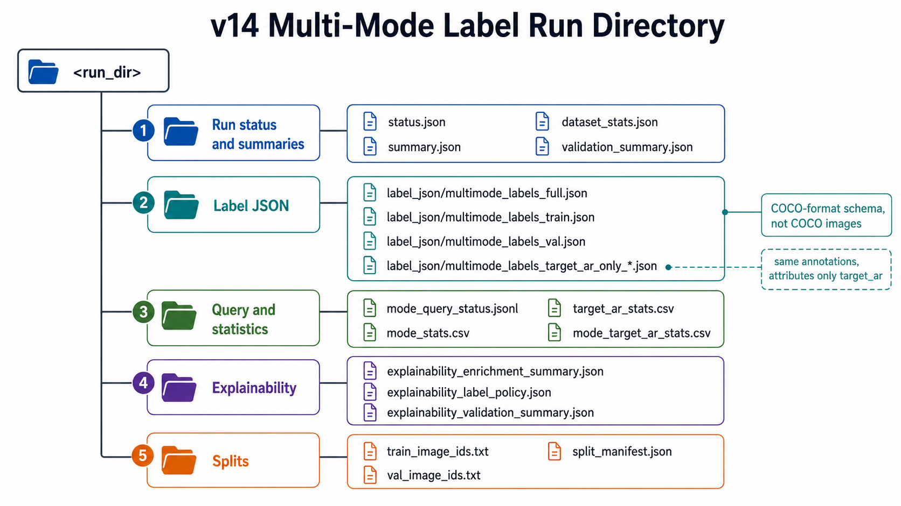{ width=100% }

위 Figure는 v14 run directory를 처음 보는 엔지니어가 `label_json/`, split sidecar, query status, 통계/검증 파일의 관계를 빠르게 파악하기 위한 지도다. 운영상 label JSON의 source of truth는 `label_json/multimode_labels_*.json`이고, 검증과 QA는 주변 sidecar를 함께 읽어야 한다.

## 2.3 v14 검증 요약

Full v14:

| 항목 | 값 |
|---|---:|
| source image | 10,000 |
| train / val image | 9,000 / 1,000 |
| mode query | 211,057 |
| annotation | 150,744 |
| positive annotation | 82,437 |
| negative annotation | 68,307 |
| explainability schema coverage | 1.0 |
| missing score components | 0 |
| final_score mismatch | 0 |
| target_ar_only 구조 검증 | true |

PhaseA v14:

| 항목 | 값 |
|---|---:|
| source image | 10,000 |
| train / val image | 9,000 / 1,000 |
| mode query | 217,890 |
| annotation | 167,387 |
| positive annotation | 86,554 |
| negative annotation | 80,833 |
| explainability schema coverage | 1.0 |
| missing score components | 0 |
| final_score mismatch | 0 |
| target_ar_only 구조 검증 | true |

`mode query` 수는 annotation 수가 아니다. `mode_query_status.jsonl`의 row 수이며, source image, target AR, entity atom, mode 조합으로 열린 query의 총 개수다. query가 열렸더라도 positive 후보가 없거나 threshold/hard gate를 통과하지 못하면 label JSON annotation은 생성되지 않을 수 있다.

## 2.4 PhaseA v14 정성 리뷰 후속 산출물

2026-06-04 PhaseA v14 `crop_review_v14_photo_primary/stratified_200_best_by_ar_mode` 정성 리뷰에서 face 세로 AR 누락, 특정 Full v14 person crop 누락, face center/rot 혼동, headroom/lookroom guide anchor, object mode 제거 variant 요구가 확인됐다. 후속 전수 분석 결과와 생성 산출물은 아래 위치에 둔다.

- 리뷰 원문: `data/SSTK/PhaseA_PhotoPrimary_10K_SigLIP2_v5_20260529/artifacts/training_labels_multimode/260601_v14_photo_primary_fullsstk_phaseA_scene_subjectsafe_residual_patch_split9010/crop_review_v14_photo_primary/review_jy_260604.md`
- 후속 보고서: `data/SSTK/PhaseA_PhotoPrimary_10K_SigLIP2_v5_20260529/artifacts/training_labels_multimode/260601_v14_photo_primary_fullsstk_phaseA_scene_subjectsafe_residual_patch_split9010/crop_review_v14_photo_primary/review_jy_260604_followup/review_jy_260604_followup_report_KO.md`
- 통계/샘플별 원인 CSV/JSON: `data/SSTK/PhaseA_PhotoPrimary_10K_SigLIP2_v5_20260529/artifacts/training_labels_multimode/260601_v14_photo_primary_fullsstk_phaseA_scene_subjectsafe_residual_patch_split9010/crop_review_v14_photo_primary/review_jy_260604_followup/`
- object mode 제거 label JSON variant: `data/SSTK/PhaseA_PhotoPrimary_10K_SigLIP2_v5_20260529/artifacts/training_labels_multimode/260601_v14_photo_primary_fullsstk_phaseA_scene_subjectsafe_residual_patch_split9010/crop_review_v14_photo_primary/review_jy_260604_followup/label_json_no_object_modes/`

핵심 결론:

- PhaseA v14 face positive query rate는 `3:4=0.252979`, `9:16=0.074756`으로 낮다. 주요 원인은 `body_leakage/body_leakage_strict`, `head_top_cut`, `face_center_placement_miss_strict`, `other_person_intrusion`이다.
- `bigstock_image_41702452`는 face `3:4`, `9:16` query가 열렸으나 `body_leakage/body_leakage_strict`로 no-positive 처리됐다.
- Full v14 `sstk_image_1197510367`의 person crop 누락은 candidate 미생성보다 `support_grounding_miss`, `center_support_grounding_miss`, `rot_support_grounding_miss` hard gate 영향이 크다. upper-body/half-body portrait에는 support grounding 완화와 shot-type별 gate 분리가 필요하다.
- Full v14 `pond5_image_241706455`의 face `1:1`, `3:4`는 center-strong 후보가 있었지만 body leakage가 더 높아 negative로 밀렸고, positive는 `center_comp_weak` 후보가 선택됐다. 후속 개선은 face center 최소 조건 강화와 head/shoulder crop의 body leakage cap 재보정을 함께 검토해야 한다.
- PhaseA full split 기준 object mode 제거 variant는 annotation `167,387 -> 81,175`개이며, 남은 category는 `landscape`, `single_person_center`, `single_person_rot`, `group_center`, `group_rot`, `face`로 재인덱싱했다.

# 3. 왜 Multi-Mode인가

기존 global route 기반 builder는 `(image_id, target_ar)`마다 하나의 global `subject_mode`를 고르고, 그 route 아래에서 `matching_targets`와 `candidate_pool`을 구성한다. 이 구조는 대표 crop policy를 고르는 데는 유효하지만, 한 이미지 안에 여러 crop intent를 동시에 남기는 데 한계가 있다.

새 프레임워크의 핵심 변화는 아래 한 줄이다.

$$ \text{기존 global route 1개} \Longrightarrow \text{이미지-AR마다 다수의 mode query를 독립 평가하는 구조} $$

mode query는 다음과 같다.

$$ q=(\mathrm{image\_task},\mathrm{mode\_id},\mathrm{entity\_id},\mathrm{target\_ar}) $$

이 변화가 필요한 이유는 다음과 같다.

- 한 이미지에 사람, 그룹, 객체, 장면이 동시에 존재할 수 있다.
- 같은 이미지라도 `single_person_center`는 불가능하고 `group_center`는 가능할 수 있다.
- 어떤 query는 positive가 없고, 어떤 query는 positive가 있을 수 있다.
- `category_id`는 더 이상 global `subject_mode`가 아니라 crop mode class id다.
- detector-style 또는 intent-conditioned cropper는 mode별 positive/no-positive를 명시적으로 학습해야 한다.

{ width=100% }

초심자 관점에서는 이렇게 이해하면 된다.

- 기존: “이 이미지의 대표 subject/crop route는 무엇인가?”
- Multi-mode: “이 이미지와 target AR에서 어떤 crop intent가 성립 가능한가?”

# 4. 기본 용어

## 4.1 Image Task

같은 원본 이미지라도 target AR가 달라지면 후보 crop, positive 여부, negative set이 모두 달라진다. 설계상 image task는 다음과 같다.

$$ \mathrm{image\_task}=(\mathrm{source\_image},\mathrm{target\_ar}) $$

개념상 deterministic id는 다음처럼 만들 수 있다.

$$ \mathrm{image\_task\_id}=\mathrm{hash}(\mathrm{source\_image\_id},\mathrm{target\_ar}) $$

현재 구현은 top-level `images[]`를 source image 단위로 유지한다. image-task 정보는 `annotations[].attributes.target_ar`, `query_id`, `mode_query_status.jsonl`에 저장한다. 이는 COCO-format reader와 기존 downstream loader가 source image 단위 `images[]`를 더 안정적으로 처리하기 때문이다.

## 4.2 Entity Atom

mode query를 열기 전, query anchor가 되는 atom을 만든다.

- person atom: C2 person, C3 pose, face evidence, human cluster를 결합한 단일 인물 anchor.
- group atom: trusted person graph component 또는 `group_all` fallback.
- object atom: dominant non-person object 또는 top-2 union.
- scene atom: `scene_subtype`, copyspace, horizon/symmetry, scene pseudo-subject 상태를 가진 장면 anchor.

mode와 atom은 다르다. `single_person_center`는 mode이고, `person_02`는 entity atom이다. 이 둘을 분리해야 같은 이미지 안에서 여러 인물, 그룹, 객체를 각각 평가할 수 있다.

## 4.3 Mode Query

query는 atom과 mode를 결합한 실제 평가 단위다.

$$ q=(\mathrm{image\_task},\mathrm{mode\_id},\mathrm{entity\_id},\mathrm{target\_ar}) $$

현재 구현의 deterministic `query_id` 형식은 다음이다.

```text
{source_image_id}::{target_ar}::{mode_name}::{entity_id}
```

`annotations[].id`는 run 내부 sequential id다. 같은 입력과 정렬이면 재현되지만 hash 기반 global stable id는 아니다. rerun 간 annotation 단위 diff가 강하게 필요하면 future patch로 `annotation_uid` 또는 `stable_annotation_key`를 추가하는 것이 좋다.

## 4.4 Subject Mode와 Mode Name

가장 자주 헷갈리는 지점이다.

- `subject_mode`: 기존 global router의 coarse prior다. 예: `portrait_group`, `scene_general`.
- `mode_name`: 최종 `category_id`와 1:1 대응하는 crop intent class다. 예: `group_center`, `single_person_rot`, `landscape`.

따라서 global `subject_mode=portrait_group`인 이미지에서도 `single_person_center`, `single_person_rot`, `group_center`, `group_rot`, `landscape` query가 동시에 열릴 수 있다.

## 4.5 Multi-Person 장면 해석 예시

이 예시는 특정 운영 이미지나 별도 dataset split을 가리키는 것이 아니다. 처음 보는 엔지니어가 multi-mode 구조를 이해할 수 있도록 만든 **multi-person toy scenario**다. 실제 label JSON에서는 `source_image_id`가 원본 이미지별 ID로 들어가며, 아래 설명의 `sample_image_0001` 같은 이름은 schema 설명용 placeholder로 보면 된다.

예를 들어 한 이미지가 4명의 사람이 있는 group portrait라고 하자. 기존 global route 관점에서는 AR별로 대체로 `portrait_group` 하나의 route로 수렴하고 group 중심 positive만 남기기 쉽다. Multi-mode 관점에서는 다음이 동시에 참일 수 있다.

1. global route는 여전히 `portrait_group`이다.
2. person atom 4개에 대해 각각 `single_person_*` query를 열 수 있다.
3. 각 person query는 intrusion, joint cut, threshold miss 때문에 positive가 없을 수 있다.
4. group query는 positive가 될 수 있다.
5. scene prior가 충분하면 `landscape`도 positive가 될 수 있다.

즉 “query를 열어 평가한다”와 “annotation을 남긴다”는 별도 단계다.

# 5. Mode Ontology

현재 v14 구현은 base 10-class ontology를 유지한다. `category_id`와 threshold의 source of truth는 `src/multimode/mode_catalog.py`다.

{ width=100% }

| category_id | mode_name | 의미 |
|---:|---|---|
| 0 | `landscape` | scene-wide / wide-scene / copyspace-intent scene |
| 1 | `single_person_center` | 단일 인물 centered framing |
| 2 | `single_person_rot` | 단일 인물 thirds / rule-of-thirds framing |
| 3 | `group_center` | group union centered framing |
| 4 | `group_rot` | group union thirds / rule-of-thirds framing |
| 5 | `face` | face close-up / head-shoulder intent |
| 6 | `object_single_center` | 단일 객체 centered framing |
| 7 | `object_single_rot` | 단일 객체 thirds framing |
| 8 | `object_multi_center` | 복수 객체 centered framing |
| 9 | `object_multi_rot` | 복수 객체 thirds framing |

`pet_*`, `background`, `text_document`는 v14에서도 별도 class로 열지 않는다.

- `pet_*`: 현재 precompute만으로 pet 전용 pose/gaze/headroom 근거가 부족하다.
- `background`: copy-space intent는 있지만 `landscape`와 경계가 불안정하다.
- `text_document`: OCR-backed evidence를 더 엄격히 정의한 뒤 여는 편이 안전하다.

`landscape`라는 이름은 compatibility 때문에 유지한다. 의미적으로는 scene-wide class에 더 가깝기 때문에 `attributes.scene_subtype`, `attributes.entity_type="scene"`, `attributes.route_family`, `attributes.copyspace_*`, `attributes.scene_*`를 함께 봐야 한다.

# 6. End-To-End Pipeline

{ width=100% }

## 6.1 전체 흐름

pipeline은 아래 순서로 동작한다.

1. 입력 feature/candidate row를 읽는다.
2. target AR별 image task를 만든다.
3. global route prior를 읽어 soft prior로 사용한다.
4. person/group/object/scene entity atom을 만든다.
5. atom별로 열 수 있는 mode query를 생성한다.
6. global candidate bank를 만들고 query-local synthetic seed를 확장한다.
7. mode별 scorer가 후보를 scoring하고 hard reject를 적용한다.
8. query당 best positive 최대 1개를 선택한다.
9. positive가 존재하는 query에 대해서 optional negative를 제한적으로 기록한다.
10. label JSON, target_ar_only JSON, query status, split/stat sidecar를 쓴다.
11. explainability checklist/why-tag attributes를 annotation attributes에 붙인다.

의사코드는 아래와 같다.

```python
for image in images:
    global_feats = build_global_feats(image)
    for target_ar in target_ars:
        image_task = make_image_task(image, target_ar)
        route_prior = route_subject_mode(...)
        atoms = build_entity_atoms(global_feats, route_prior)
        queries = build_mode_queries(atoms, route_prior, target_ar)
        global_bank = build_global_candidate_bank(image_task, global_feats, route_prior)
        for query in queries:
            local_bank = expand_query_candidates(global_bank, query)
            scored = score_query_candidates(local_bank, query)
            best_positive = select_best_positive(scored, query)
            negatives = select_optional_negatives(scored, query)
            write_annotations(...)
```

## 6.2 Current SSTK 자산 재사용

이 framework는 greenfield 재작성이 아니다. 기존 자산을 아래처럼 재사용한다.

- `subject_mode_router.py`: global prior, scene subtype, copyspace side, subject set.
- `saliency_semantic.py`: primary family, layout structure, human/object cluster.
- `subject_region.py`: support/core/envelope와 `crop_guidance_spec`.
- `support_seed.py`: support-aware seed ranking.
- `score_teacher.py`: checklist, safety, geometry 신호.
- `build_finalscore_training_data.py`: positive/ignored/overflow 운영 감각과 audit semantics.

실무 원칙은 다음이다.

- global `subject_mode`는 버리지 않고 hard gate에서 soft prior로 낮춘다.
- candidate generator는 유지하고 global bank 위에 query-local expansion을 붙인다.
- geometry/checklist/safety 신호는 query 기준으로 재매핑한다.
- current ranking/policy builder를 즉시 대체하지 않고 parallel artifact path로 운영한다.

## 6.3 Query Open Rule

각 image-task에 대해 열리는 query 집합은 아래처럼 이해하면 된다.

$$ \mathcal{Q}(I,AR)=\bigcup_{e\in\mathcal{E}(I)}\mathcal{M}(e,I,AR) $$

v14의 주요 query open rule:

- person atom은 기본적으로 `person_atom_trusted=1`이어야 열린다.
- primary person은 보수적으로 허용한다.
- rank > 0 secondary person은 primary-only default 정책 때문에 대부분 닫힌다.
- secondary person 예외는 rank 1이면서 dominance, area share, face score가 매우 높을 때만 허용한다.
- `portrait_group`에서는 group portrait secondary exception threshold를 별도로 완화한다.
- face query는 trusted person atom이고 `face_query_valid=1`인 경우에만 열린다.
- face bbox가 비정상적으로 크지만 high-confidence이면 `_face_fallback_box()`로 head box를 보정할 수 있다.
- group atom은 trusted person이 2명 이상이고 multi-human evidence가 충분해야 열린다.
- v10 이후 `portrait_group`에서 duplicate-suppressed raw persons가 merge된 경우 `group_all` fallback atom을 만들 수 있다.
- object atom은 C2 segmentation/detection의 non-person instance 중 importance와 area가 너무 낮지 않은 top object만 사용한다.
- scene atom은 항상 `scene_main`으로 만들어지지만, low-reliability pseudo-subject는 v14에서 full-frame neutral subject로 바꾸고 `landscape_subject_safe_enabled=0`을 저장한다.

query는 열렸지만 annotation이 없을 수 있다. 이 규칙이 중요하다. 억지 positive를 만들면 detector가 실제로 성립하지 않는 framing intent를 학습한다.

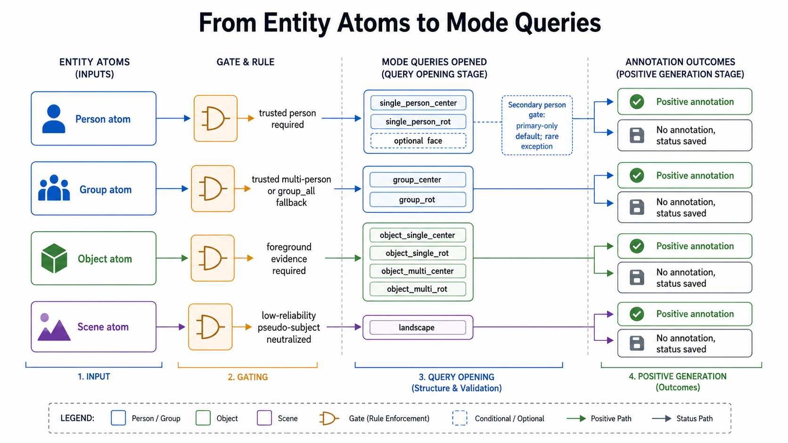{ width=100% }

위 Figure는 person/group/object/scene atom이 어떤 조건에서 mode query로 확장되는지 요약한다. 특히 secondary person은 primary-only default이며, 예외는 dominance/face/area 근거가 강한 경우에만 열린다.

## 6.4 Candidate Bank와 Local Expansion

{ width=100% }

candidate generation은 global bank와 query-local expansion의 2단 구조다.

1. Global candidate bank
   - baseline, grid, support-map seed, teacher proposal 등 기존 candidate 자산을 재사용한다.
   - 현재 구현은 `candidate_row["candidates_by_ar"][target_ar]`를 base bank로 읽는다.

2. Query-local expansion
   - person-centered jitter
   - group union centered / thirds seed
   - object-centered seed
   - face-tight seed
   - horizon-aligned / wide scene seed
   - 현재 구현은 `candidate_bank.py`의 `_synthetic_seed_boxes()`가 mode별 scale ladder와 placement rule로 seed를 추가한다.

scene query는 global bank만으로도 충분한 경우가 많지만, person별 single-person query는 global bank만으로 누락되기 쉽다. 그래서 global bank는 recall의 기반을 만들고, local expansion은 빠진 intent를 보강한다.

## 6.5 Landscape Candidate Policy

v14의 landscape candidate policy는 `prefer_gaic_subject_safe`다. 이 policy는 landscape query에서 후보를 아래 우선순위로 좁힌다.

1. target AR가 `FREE`이고 direct GAIC teacher 후보가 있으면 direct GAIC와 GAIC-lineage 후보를 우선 사용한다.
2. 그 외 AR에서는 GAIC provenance가 있는 teacher lineage 후보를 우선 사용한다.
3. GAIC-lineage가 없으면 다른 teacher 후보로 fallback한다.
4. teacher 후보도 없으면 전체 후보로 fallback한다.

이후 `teacher_subject_safe` score policy가 적용된다. landscape positive는 GAIC `q_teach`가 높은 crop을 중심으로 고르되, subject-safe가 active인 human/object route에서는 subject cut을 막기 위해 `core_recall`, `q_subj` gate, 작은 bonus/penalty를 추가한다.

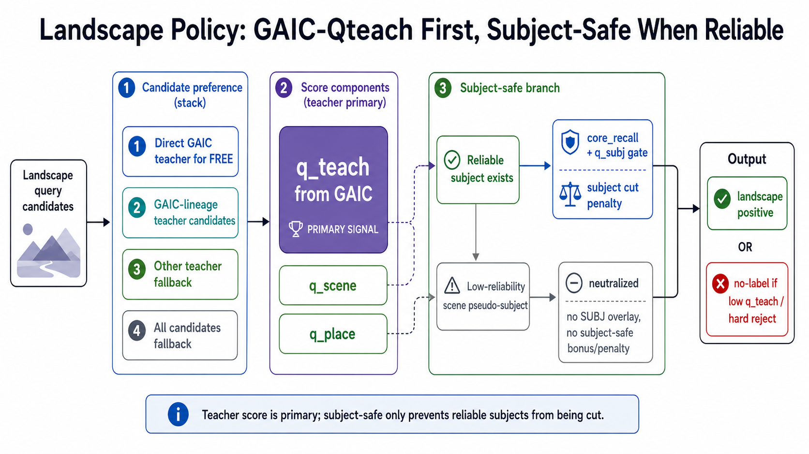{ width=100% }

위 Figure는 landscape mode가 “GAIC teacher crop을 우선 따르되, 신뢰 가능한 subject가 있는 경우에만 subject-safe 보정한다”는 v14 정책을 나타낸다. low-reliability scene pseudo-subject는 score/gate/overlay subject로 쓰지 않는다.

# 7. Score, Gate, Positive Selection

{ width=100% }

## 7.1 운영 옵션

Full v14와 PhaseA v14의 핵심 생성 옵션은 아래 조합이다.

```text
--landscape_candidate_policy prefer_gaic_subject_safe
--landscape_score_policy teacher_subject_safe
--landscape_teacher_score_scope gaic
--mode_intent_policy strict_v11
--include_optional_negatives
--split_train_ratio 0.9
--split_seed 20260506
```

## 7.2 공통 원칙

mode scorer는 geometry/checklist/safety 신호를 query 기준으로 재매핑한다. 원 설계안의 `A_macro`는 현재 multi-mode utility에서 제외한다.

$$ U_q(c)=U_q^{(S)}(c)+U_q^{(C)}(c)+U_q^{(T)}(c)-P_q(c) $$

여기서 각 항의 의미는 다음이다.

- $U^{(S)}$: subject/support preservation
- $U^{(C)}$: composition/headroom/lookroom/context/horizon/copyspace
- $U^{(T)}$: optional teacher tie-breaker
- $P_q$: soft penalty

hard reject와 utility는 분리한다.

$$ H_q(c)=\mathbf{1}[\text{mode-specific hard reject 없음}] $$

utility는 “얼마나 좋은가”이고, hard reject는 “positive가 될 자격이 있는가”다. 아무리 score가 높아도 fatal face cut, severe joint cut, subject truncation, target AR mismatch 같은 hard reject가 있으면 positive가 될 수 없다.

## 7.3 Positive와 Negative

query별 positive set은 아래와 같다.

$$ \mathcal{P}(q)=\{c\in\mathcal{C}(q)\mid H_q(c)=1\land U_q(c)\ge\tau_q\} $$

현재 v14 구현은 query당 best positive를 최대 1개만 남긴다.

$$ c_q^*=\arg\max_{c\in\mathcal{C}(q),H_q(c)=1}U_q(c) $$

규칙:

- $U_q(c_q^*)\ge\tau_q$ 이면 positive annotation을 만든다.
- positive annotation은 `gt_flag=1`, `is_best=1`이다.
- positive가 없으면 label JSON annotation은 만들지 않고 `mode_query_status.jsonl`에 no-positive reason을 남긴다.
- optional negative는 positive가 존재하는 query에 대해서만 annotation으로 기록한다.
- hard negative 최대 1개, near negative 최대 1개, 총 negative 최대 2개다.

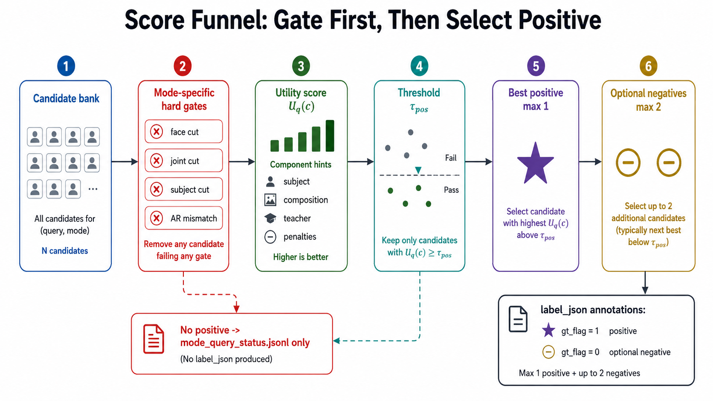{ width=100% }

위 Figure는 utility score와 hard reject의 역할을 분리해서 보여준다. annotation으로 남는 positive는 query별 best crop 최대 1개이며, optional negative는 positive가 존재하는 query에서만 제한적으로 기록한다.

## 7.4 Positive Threshold

현재 positive threshold는 `mode_catalog.py`의 `tau_pos`를 따른다.

| mode | tau_pos |
|---|---:|
| `landscape` | 0.47 |
| `single_person_center` | 0.62 |
| `single_person_rot` | 0.62 |
| `group_center` | 0.60 |
| `group_rot` | 0.60 |
| `face` | 0.68 |
| `object_single_center` | 0.58 |
| `object_single_rot` | 0.58 |
| `object_multi_center` | 0.57 |
| `object_multi_rot` | 0.57 |

## 7.5 Score Components

`mode_scorer.py`가 만들고 `build_multimode_training_labels.py`가 `annotations[].attributes.score_components`에 저장하는 핵심 component는 아래와 같다. 문서나 리뷰 메모에서 `R_goup_balance`처럼 보이는 표현은 오탈자이며, 실제 구현 field는 `group_balance`다.

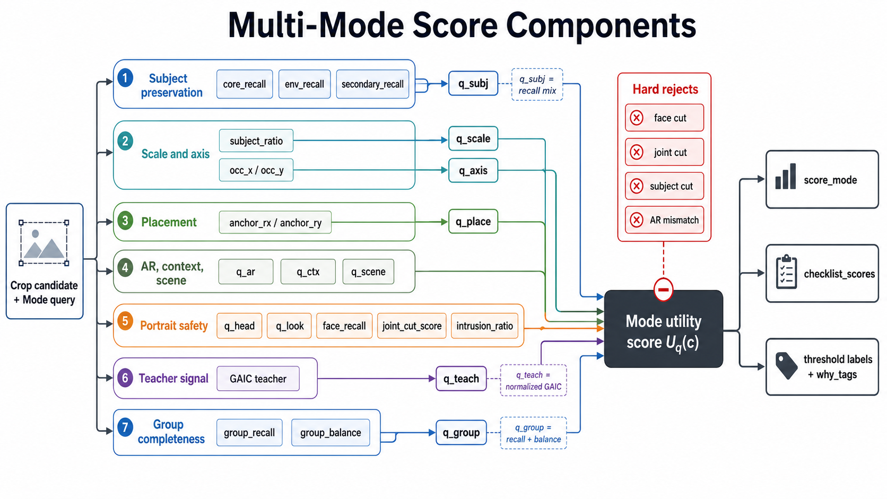{ width=100% }

위 Figure는 `score_components`, hard reject, checklist/why-tag가 어떻게 연결되는지 보는 개념 지도다. 각 component의 실제 field name과 threshold 정책은 아래 목록, `src/multimode/mode_scorer.py`, `src/multimode/explainability.py`를 기준으로 한다.

기본 box recall:

$$ R(B,c)=\frac{\mathrm{area}(B\cap c)}{\max(\epsilon,\mathrm{area}(B))} $$

주요 component:

- `core_recall`: query 핵심 subject box에 대한 recall.
- `env_recall`: support/context envelope box에 대한 recall.
- `secondary_recall`: secondary core box가 있으면 그 recall, 없으면 `env_recall`.
- `q_subj`: subject 보존 score.
- `subject_ratio`: crop 면적 대비 query anchor box 면적.
- `q_scale`: mode별 target subject ratio와 가까운지 보는 Gaussian score.
- `anchor_rx`, `anchor_ry`: crop 내부 anchor center 위치.
- `q_place`: center mode는 중앙, rot mode는 thirds placement에 가까운지 보는 score.
- `occ_x`, `occ_y`, `occ_dom`, `occ_min`: crop 내부 anchor 점유율.
- `q_axis`: mode별 기대 점유율에 가까운지 보는 score.
- `q_ar`: target AR 정합 score.
- `q_ctx`: context amount가 mode별 target에 가까운지 보는 score.
- `q_scene`: horizon/symmetry/wide crop 품질.
- `q_head`: headroom score.
- `q_look`: gaze 기반 lookroom score.
- `face_recall`: face box 또는 group member face boxes의 평균 recall.
- `joint_visible_ratio`, `joint_cut_score`: visible keypoint 보존율과 complement.
- `intrusion_ratio`: target person/face 외 다른 person이 crop 안에 차지하는 면적 비율.
- `face_body_leakage`: face mode에서 torso/body가 과도하게 들어오는 정도.
- `group_recall`: group member boxes 각각의 recall 평균.
- `group_balance`: member recall 간 편차가 작을수록 1에 가까운 balance score.
- `q_group`: group completeness score.
- `q_teach`: teacher raw score를 bounded quality로 정규화한 값.
- `alignment_bonus`: mode와 global route alignment에 따른 작은 bonus.
- `route_dom_penalty`: route가 맞지 않는 object query에서 atom dominance가 부족할 때 붙는 penalty.
- `object_recall`: object mode에서 non-person C2 object boxes 중 crop recall 최대값.
- `saliency_crop_overlap`, `saliency_fg_area_ratio`: object mode hard gate용 saliency foreground overlap.

`q_subj`:

$$ q_{\mathrm{subj}}=\mathrm{clip}_{[0,1]}(0.55R_{\mathrm{core}}+0.25R_{\mathrm{env}}+0.20R_{\mathrm{secondary}}) $$

`q_scale`:

$$ q_{\mathrm{scale}}=\exp\left(-\frac{(\mathrm{subject\_ratio}-\mu_{\mathrm{mode}})^2}{2\sigma_{\mathrm{mode}}^2}\right) $$

`q_scene`:

$$ q_{\mathrm{scene}}=\mathrm{clip}_{[0,1]}(0.45q_{\mathrm{horizon}}+0.30q_{\mathrm{symmetry}}+0.25q_{\mathrm{wide}}) $$

`group_recall`:

$$ R_{\mathrm{group\_recall}}=\frac{1}{N}\sum_{i=1}^{N}R(B_i,c) $$

`group_balance`:

$$ R_{\mathrm{group\_balance}}=\mathrm{clip}_{[0,1]}\left(1-\frac{\sqrt{\frac{1}{N}\sum_i(R(B_i,c)-R_{\mathrm{group\_recall}})^2}}{0.35}\right) $$

`q_group`:

$$ q_{\mathrm{group}}=\mathrm{clip}_{[0,1]}(0.55R_{\mathrm{group\_recall}}+0.25R_{\mathrm{group\_balance}}+0.20R_{\mathrm{env}}) $$

`q_teach`:

$$ q_{\mathrm{teach}}=\mathrm{clip}_{[0,1]}\left(\frac{\mathrm{teacher\_score\_raw}+1.5}{6.0}\right) $$

### 7.5.1 Score Component 시각 예시

아래 Figure들은 수식과 field name을 crop geometry에 연결해 이해하기 위한 보조 자료다. 학습 라벨에는 Figure 자체가 저장되는 것이 아니라 `attributes.score_components`, `attributes.checklist_scores`, `attributes.checklist_labels`, `attributes.why_tags`가 저장된다.

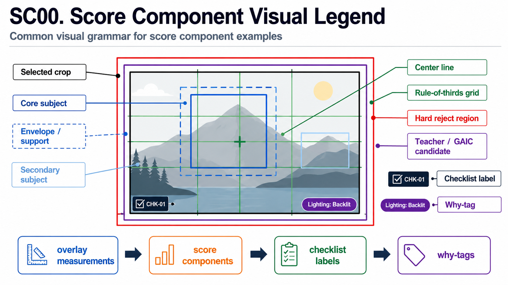{ width=100% }

`SC00`은 crop box, subject/support, headroom, lookroom, center/thirds anchor, teacher evidence를 읽는 공통 시각 legend다.

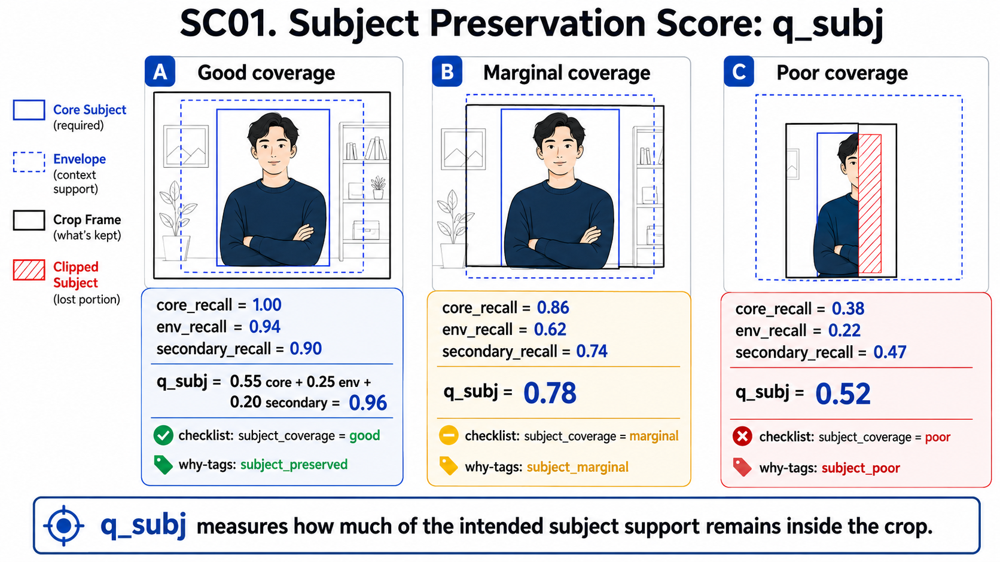{ width=100% }

`SC01`은 `core_recall`, `env_recall`, `secondary_recall`이 `q_subj`로 합쳐지는 방식을 보여준다. 이 값은 subject 보존의 핵심 regression target이자 `subject_coverage` checklist label의 source다.

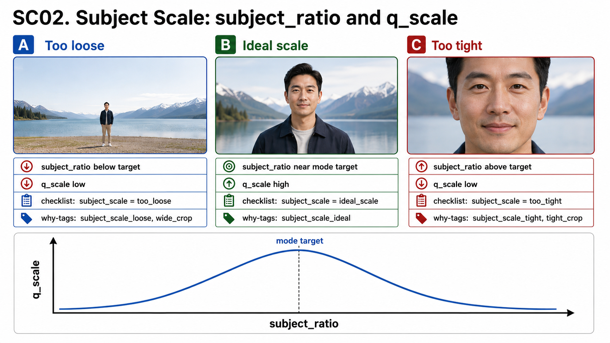{ width=100% }

`SC02`는 `subject_ratio`와 mode별 target scale을 비교해 `q_scale`을 만드는 방식을 설명한다. downstream에서는 연속 score를 먼저 예측하고, threshold로 `too_loose`, `ideal_scale`, `too_tight` label을 만든다.

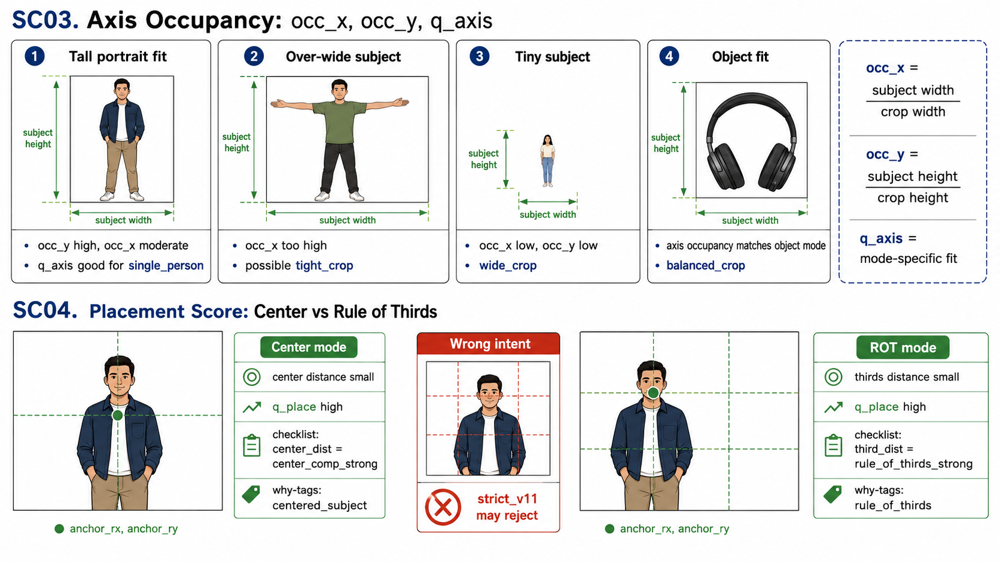{ width=100% }

`SC03-SC06`은 `q_axis`, `q_place`, `q_ar`, `q_ctx`를 한 번에 묶어 보여준다. center/rot 의도 구분은 `q_place`만이 아니라 hard gate와 함께 해석해야 한다.

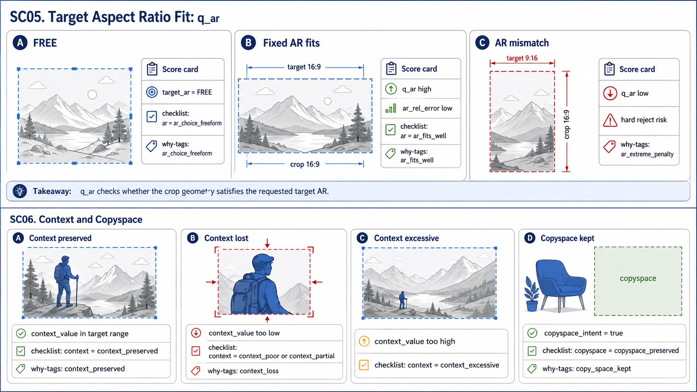{ width=100% }

`SC07/SC12`는 `q_scene`과 `q_teach`의 관계를 보여준다. v14 landscape에서는 `q_teach`가 주도 신호이고, `q_scene`은 scene 품질 보조 신호로 작게 반영된다.

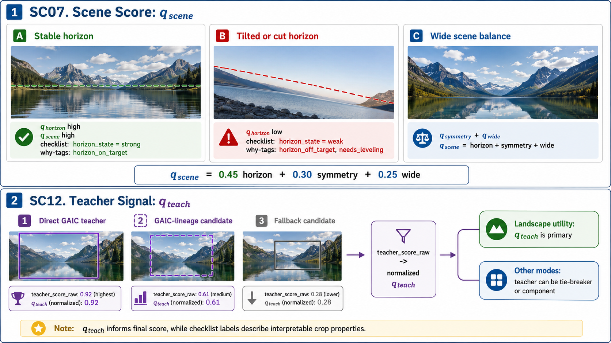{ width=100% }

`SC07/SC12` 보조 Figure는 GAIC teacher confidence와 scene/horizon/copy-space 판단이 다른 예시에서도 동일한 field로 기록된다는 점을 보완한다.

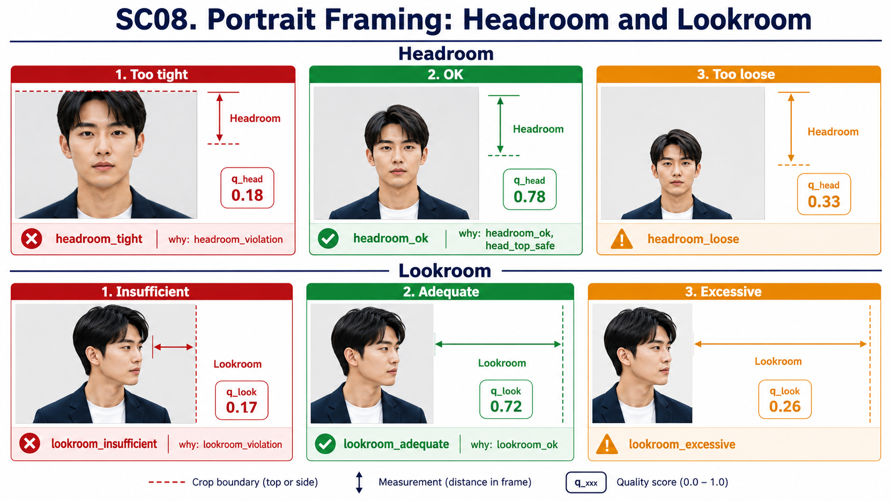{ width=100% }

`SC08`은 person/group/face mode에서 `q_head`, `q_look`이 어떤 시각 기준을 갖는지 보여준다. `lookroom`은 gaze 방향이 있는 경우에만 applicable하다.

실제 PhaseA v14 원본 이미지와 crop label을 사용한 headroom/lookroom 해석 예시는 [SSTK_MultiMode_Headroom_Lookroom_Explainability_Guide_KO_2026-06-04.md](SSTK_MultiMode_Headroom_Lookroom_Explainability_Guide_KO_2026-06-04.md)를 참조한다.

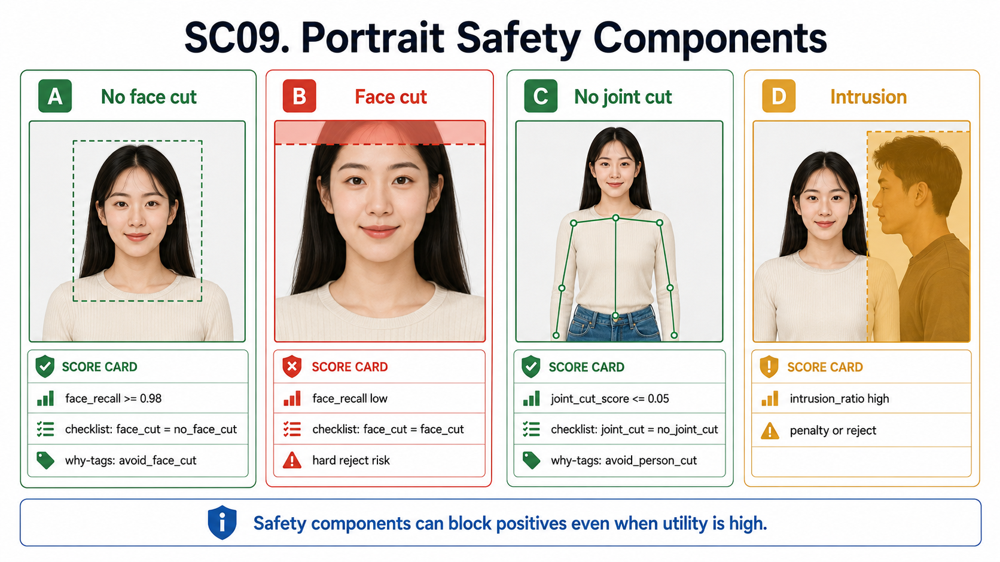{ width=100% }

`SC09`는 `face_recall`, `joint_visible_ratio`, `joint_cut_score`, `intrusion_ratio`, `face_body_leakage`를 portrait safety 관점에서 묶는다. 이 축은 final score를 낮추는 soft penalty와 hard reject 양쪽에 영향을 준다.

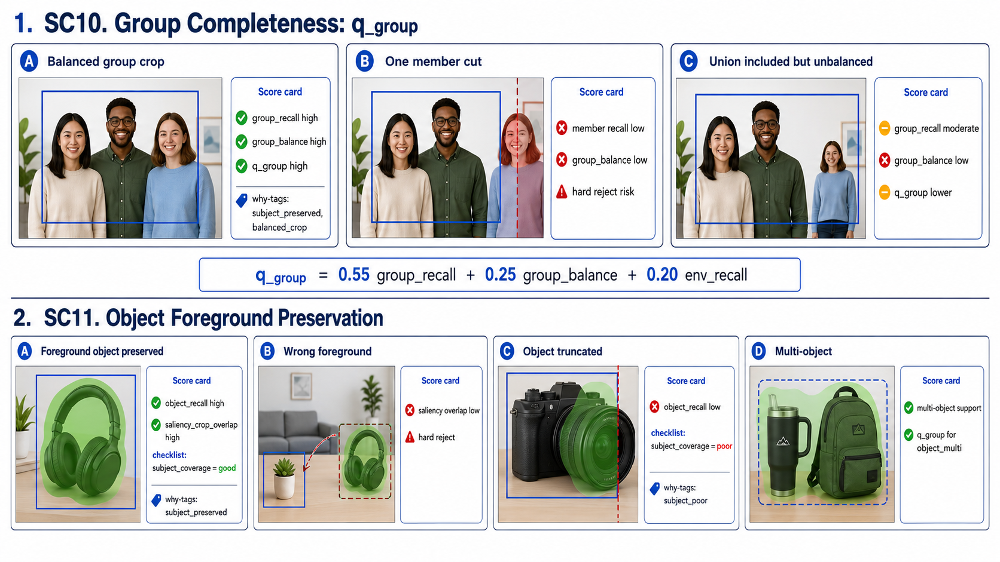{ width=100% }

`SC10/SC11`은 `group_recall`, `group_balance`, `q_group`, `object_recall`, `saliency_crop_overlap`을 보여준다. group은 member completeness/balance를, object는 non-person foreground 보존을 우선 본다.

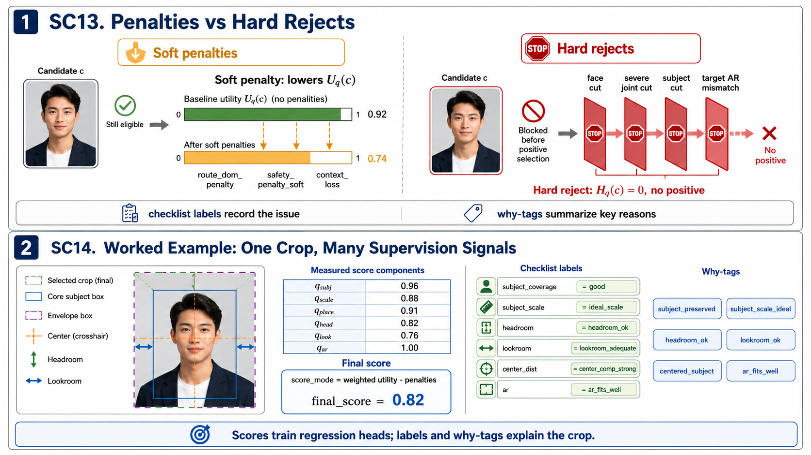{ width=100% }

`SC13/SC14`는 soft penalty, hard reject, checklist label, why-tag가 한 annotation 안에서 어떻게 함께 저장되는지 보여주는 worked example이다.

## 7.6 Mode별 Utility

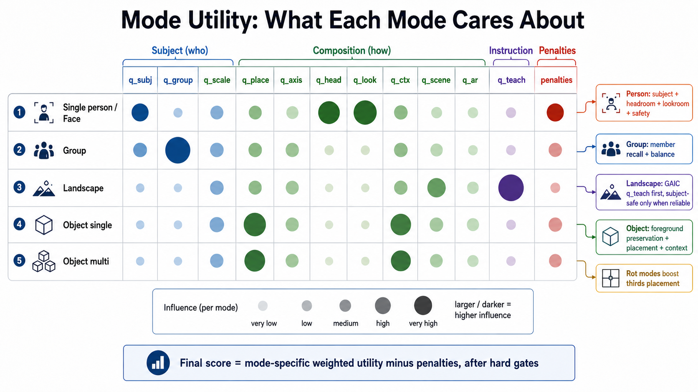{ width=100% }

위 Figure는 mode별 utility가 어떤 component를 강하게 보는지 요약한다. 정확한 가중치와 penalty는 아래 식과 `mode_scorer.py`를 기준으로 한다.

아래 식은 v14 운영식을 이해하기 위한 요약이다. 실제 source of truth는 `mode_scorer.py`다. 식에서 `A`는 `alignment_bonus`, `P_route`는 `route_dom_penalty`, `I`는 `intrusion_ratio`, `J`는 `joint_cut_score`, `L_body`는 `face_body_leakage`, `R_obj`는 `object_recall`이다.

`single_person_center`:

$$ U_{\mathrm{single\_person\_center}}=0.27q_{\mathrm{subj}}+0.10q_{\mathrm{scale}}+0.17q_{\mathrm{place}}+0.12q_{\mathrm{axis}}+0.13q_{\mathrm{head}}+0.10q_{\mathrm{look}}+0.05q_{\mathrm{ctx}}+0.05q_{\mathrm{ar}}+A-0.25I-0.18J $$

`single_person_rot`:

$$ U_{\mathrm{single\_person\_rot}}=0.27q_{\mathrm{subj}}+0.10q_{\mathrm{scale}}+0.18q_{\mathrm{place}}+0.12q_{\mathrm{axis}}+0.13q_{\mathrm{head}}+0.10q_{\mathrm{look}}+0.05q_{\mathrm{ctx}}+0.05q_{\mathrm{ar}}+A-0.25I-0.18J $$

`face`:

$$ U_{\mathrm{face}}=0.30q_{\mathrm{subj}}+0.28q_{\mathrm{scale}}+0.12q_{\mathrm{place}}+0.12q_{\mathrm{head}}+0.05q_{\mathrm{look}}+0.07q_{\mathrm{ctx}}+0.06q_{\mathrm{ar}}+A-0.30I-0.22L_{\mathrm{body}} $$

`group_center`:

$$ U_{\mathrm{group\_center}}=0.24q_{\mathrm{group}}+0.16q_{\mathrm{subj}}+0.10q_{\mathrm{scale}}+0.15q_{\mathrm{place}}+0.08q_{\mathrm{axis}}+0.08q_{\mathrm{head}}+0.11q_{\mathrm{ctx}}+0.05q_{\mathrm{ar}}+A-0.15J $$

`group_rot`:

$$ U_{\mathrm{group\_rot}}=0.23q_{\mathrm{group}}+0.15q_{\mathrm{subj}}+0.09q_{\mathrm{scale}}+0.20q_{\mathrm{place}}+0.08q_{\mathrm{axis}}+0.06q_{\mathrm{head}}+0.11q_{\mathrm{ctx}}+0.05q_{\mathrm{ar}}+A-0.15J $$

`landscape`:

$$ U_{\mathrm{landscape}}=q_{\mathrm{teach}}+\mathbf{1}_{\mathrm{safe}}(0.010q_{\mathrm{subj}}+0.008R_{\mathrm{core}}-0.040P_{\mathrm{subject\_cut}})+0.004q_{\mathrm{scene}}+0.003q_{\mathrm{place}} $$

subject cut penalty:

$$ P_{\mathrm{subject\_cut}}=\max(0,\tau_{\mathrm{core}}-R_{\mathrm{core}})+\max(0,\tau_{\mathrm{subj}}-q_{\mathrm{subj}}) $$

scene/interior image에서 GAIC 기준 `q_teach < 0.47`이면 `landscape_low_gaic_qteach_scene_no_label` hard reject가 걸려 no-label이 된다.

`object_single_center`:

$$ U_{\mathrm{object\_single\_center}}=0.30q_{\mathrm{subj}}+0.14q_{\mathrm{scale}}+0.14q_{\mathrm{place}}+0.13q_{\mathrm{axis}}+0.10q_{\mathrm{ctx}}+0.10q_{\mathrm{scene}}+0.07q_{\mathrm{ar}}+A-P_{\mathrm{route}}-0.12(1-R_{\mathrm{obj}}) $$

`object_single_rot`:

$$ U_{\mathrm{object\_single\_rot}}=0.28q_{\mathrm{subj}}+0.13q_{\mathrm{scale}}+0.18q_{\mathrm{place}}+0.13q_{\mathrm{axis}}+0.09q_{\mathrm{ctx}}+0.10q_{\mathrm{scene}}+0.07q_{\mathrm{ar}}+A-P_{\mathrm{route}}-0.12(1-R_{\mathrm{obj}}) $$

`object_multi_center`:

$$ U_{\mathrm{object\_multi\_center}}=0.22q_{\mathrm{subj}}+0.22q_{\mathrm{group}}+0.10q_{\mathrm{scale}}+0.14q_{\mathrm{place}}+0.10q_{\mathrm{axis}}+0.14q_{\mathrm{ctx}}+0.08q_{\mathrm{ar}}+A-P_{\mathrm{route}} $$

`object_multi_rot`:

$$ U_{\mathrm{object\_multi\_rot}}=0.20q_{\mathrm{subj}}+0.22q_{\mathrm{group}}+0.09q_{\mathrm{scale}}+0.20q_{\mathrm{place}}+0.10q_{\mathrm{axis}}+0.14q_{\mathrm{ctx}}+0.08q_{\mathrm{ar}}+A-P_{\mathrm{route}} $$

## 7.7 Strict Intent Gate

v11 이후 `strict_v11` hard gate가 들어갔다. 목적은 mode intent가 다른 crop을 positive로 남기지 않는 것이다.

- center mode가 thirds/ROT처럼 보이면 reject한다.
- rot mode가 center-like이면 reject한다.
- person/face mode는 face/head/joint cut과 intrusion을 강하게 본다.
- group mode는 key member severe cut, group recall 부족, member balance 붕괴를 본다.
- object mode는 saliency foreground overlap이 낮으면 positive에서 제외한다.
- landscape는 GAIC-Qteach 중심이지만 reliable subject가 있는 경우 subject cut을 막는다.

# 8. Label JSON Schema

{ width=100% }

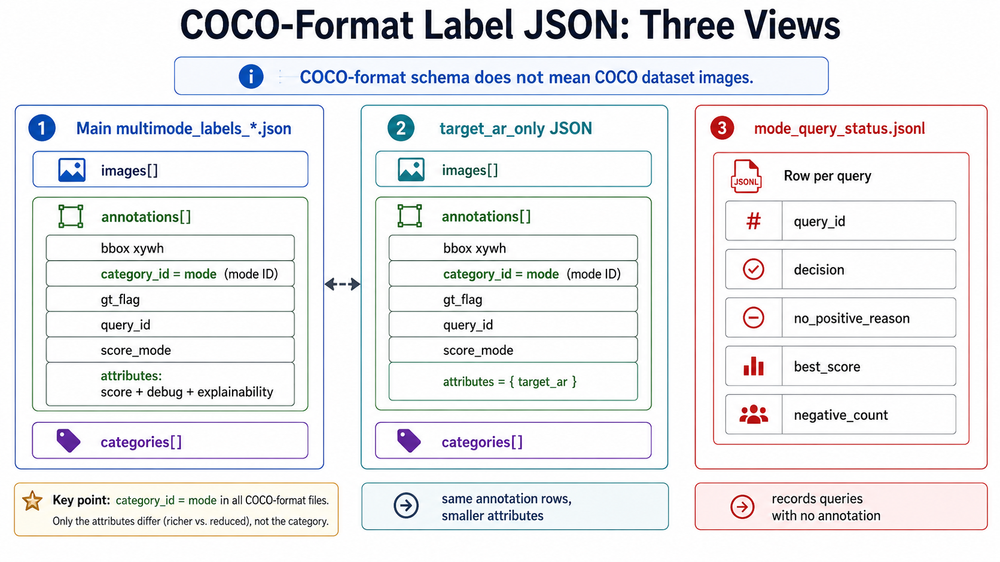{ width=100% }

위 Figure는 main label JSON, target-AR-only JSON, mode query status sidecar의 역할 차이를 보여준다. 여기서 COCO-format은 schema 호환 형식을 의미하며 COCO dataset 자체를 뜻하지 않는다.

## 8.1 COCO-Format의 의미

이 문서의 COCO-format은 `images`, `annotations`, `categories` top-level key를 가진 annotation schema를 뜻한다. COCO dataset 이미지를 사용한다는 뜻이 아니다.

main label JSON은 positive와 optional negative를 하나의 `annotations[]`에 함께 담는다.

- `gt_flag=1`: positive
- `gt_flag=0`: optional negative
- `iscrowd=0`: 고정, 학습에서는 무시 가능
- `is_best=1`: 해당 query의 best positive

## 8.2 Annotation Top-Level Field

#### 주요 top-level field:

- `id`: run 내부 sequential annotation id.
- `image_id`: `images[].id`를 참조한다.
- `category_id`: `mode_catalog.py`의 mode id.
- `bbox`: pixel `xywh` 형식 crop box.
- `area`: `bbox[2] * bbox[3]`.
- `gt_flag`: positive면 1, optional negative면 0.
- `query_id`, `entity_id`, `mode_name`: 어떤 mode query에서 나온 annotation인지 식별한다.
- `is_best`: positive best crop이면 1, optional negative면 0.
- `score_mode`: 해당 mode utility 최종 score.
- `source_route_mode`: global router의 coarse route.

## 8.3 Attributes Field

`attributes`에는 다음 정보가 들어간다.

- `target_ar`, `entity_type`, `route_family`, `route_mode`
- `candidate_id`, `candidate_source`
- `score_components`: `q_subj`, `q_scale`, `q_axis`, `q_place`, `q_ar`, `q_ctx`, `q_scene`, `q_head`, `q_look`, `q_group`, `q_teach`, recall/debug component
- `subject_debug`: query의 core/envelope/anchor/support/face/head/member box
- query open/gate attribute: `route_aligned`, `route_bucket`, `dominance_score`, secondary person exception field, group/object/scene metadata
- negative field: `negative_reason`, `hard_reject_reasons`, `query_has_positive`
- explainability field: `checklist_scores`, `checklist_labels`, `checklist_applicable`, `why_tags`, `teacher_checklist_labels`, `teacher_checklist_scores`, `teacher_why_tags`, `explainability_schema_version`, `explainability_label_policy_version`

## 8.4 Target-AR-Only Files

`target_ar_only` 파일은 category가 target AR로 바뀌는 파일이 아니다. `categories[]`, `mode_name`, annotation row 수는 main file과 동일하고, `attributes`만 `{"target_ar": ...}`로 축약한다.

사용 목적:

- target AR만 필요한 loader의 memory/load 부담을 줄인다.
- score/debug/explainability attributes가 필요 없는 실험과 호환한다.
- main label JSON과 annotation count가 같아야 한다.

Full/PhaseA v14 모두 `validate_multimode_explainability_labels.py`로 `target_ar_only` 구조와 count match를 검증했다.

## 8.5 Mode Query Status Sidecar

`mode_query_status.jsonl`은 “왜 annotation이 없었는가”를 남기는 파일이다. 현재 구현은 query row마다 `decision`과 `no_positive_reason`을 저장한다.

- `decision=positive`: positive annotation 생성.
- `decision=no_candidates`: 후보 crop 없음.
- `decision=no_positive`: best 후보가 hard reject됨.
- `decision=below_tau`: hard reject는 아니지만 threshold 미달.

예시:

```json
{
  "source_image_id": "sample_image_0001",
  "target_ar": "FREE",
  "query_id": "sample_image_0001::FREE::single_person_rot::person_02",
  "mode_name": "single_person_rot",
  "mode_id": 2,
  "entity_id": "person_02",
  "entity_type": "person",
  "route_mode": "portrait_group",
  "route_family": "human",
  "decision": "below_tau",
  "tau_pos": 0.62,
  "candidate_count": 42,
  "positive_exists": 0,
  "positive_score": null,
  "best_score": 0.412,
  "negative_count": 1,
  "no_positive_reason": "below_tau",
  "attributes": {
    "route_gate_rule": "portrait_group_prominent_person"
  }
}
```

# 9. Explainability Checklist와 Why-Tag

## 9.1 왜 추가했는가

MobileCropNet v4 계열 실험에서는 crop box만 학습하는 것보다, crop이 좋은 이유와 위험한 이유를 score component로 함께 학습하는 쪽이 설명 가능성과 오류 분석에 유리했다. 이에 따라 2026-06-02 기존 v14 `multimode_labels_{full,train,val}.json`에 explainability attributes를 in-place 추가했다.

핵심 전략은 **regression-first, threshold-label-second**다. 모델은 먼저 `checklist_scores`의 연속값을 예측하고, 사람이 읽는 label은 예측 score에 threshold를 적용해 만든다.

$$ \hat{y}_{\mathrm{label},k}=\mathrm{Threshold}_k(\hat{s}_k) $$

이 방식은 `headroom_ok`, `lookroom_insufficient` 같은 label을 직접 classification으로만 학습하는 것보다 calibration과 threshold 조정이 쉽다.

MobileCropNet v4에서 이 방향을 검토했던 정량 근거는 [부록 C](#부록-c-mobilecropnet-v4-checklistwhy-tag-성능-근거)에 정리했다. 실제 multimode label을 설명 가능한 cropper 학습에 연결하는 모델 구조와 loss/postprocess 계약은 [부록 D](#부록-d-설명-가능한-cropper-학습-계약)를 따른다.

## 9.2 Checklist와 Why-Tag의 차이

질문이 가장 많이 들어올 수 있는 부분이다. 둘은 겹치는 정보가 있지만 같은 것은 아니다. 따라서 현재 정책은 **통합하지 않고 둘 다 유지**한다. 다만 why-tag는 사람이 직접 독립 라벨링한 별도 truth가 아니라, checklist/score/reject state에서 파생되는 sparse summary로 관리한다.

| 구분 | Checklist | Why-tag |
|---|---|---|
| 목적 | 모델 학습용 구조화 target과 QA metric | 사람이 빠르게 이해하는 설명 tag와 optional multi-label target |
| 형태 | 고정 key-value schema | sparse multi-label list |
| 값 | `checklist_scores`, `checklist_labels`, `checklist_applicable` | `why_tags` |
| 밀도 | annotation마다 동일 key를 갖고, 적용 불가 항목은 `na` 또는 applicable 0 | 필요한 tag만 존재 |
| 학습 | regression head의 주 target, label head의 보조 target | 낮은 weight의 auxiliary multi-label target 또는 검수/debug |
| 예시 | `headroom=headroom_ok`, `center_dist=center_comp_strong`, `subject_coverage=good` | `headroom_ok`, `centered_subject`, `subject_preserved` |
| 해석 | “각 평가 축의 상태가 무엇인가” | “이 crop을 설명하는 핵심 이유가 무엇인가” |

예를 들어 `checklist_labels.context=context_preserved`는 context 축의 상태를 나타내는 구조화 label이다. 같은 annotation의 `why_tags`에 `context_preserved`가 들어가면 reviewer에게 “context가 보존되어 이 crop이 타당하다”는 핵심 설명을 제공한다. 반대로 checklist에는 `ar`, `horizon_state`, `joint_cut` 같은 모든 축이 항상 존재하지만, why-tag에는 설명에 필요한 일부 tag만 들어간다.

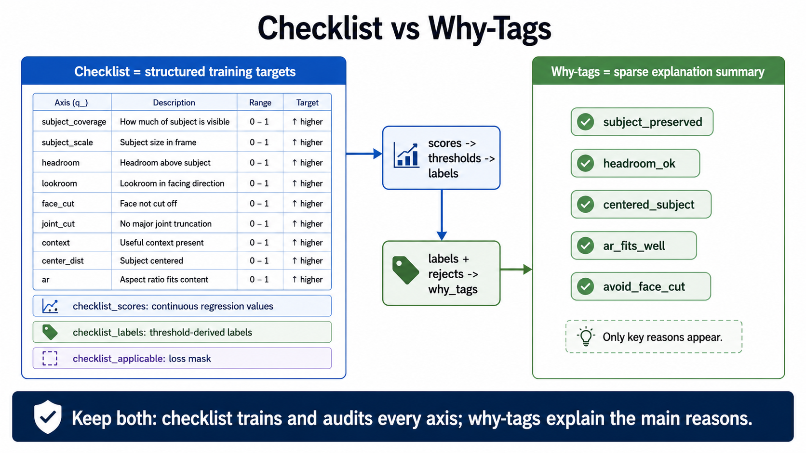{ width=100% }

왜 통합하지 않는가:

- checklist는 fixed schema와 applicability mask가 필요하다. regression/classification loss와 통계 집계에 적합하다.
- why-tag는 사람이 읽는 sparse explanation interface다. 모든 축을 반복하면 너무 길어지고, tag 의미가 흐려진다.
- why-tag는 checklist에서 파생되므로 유지 비용을 낮출 수 있다.
- future UI/검수 도구에서는 checklist table과 why-tag badge를 서로 다른 용도로 보여줄 수 있다.

권장 정책:

1. `checklist_scores`를 primary supervision으로 둔다.
2. `checklist_labels`는 score threshold 파생 label로 유지한다.
3. `why_tags`는 checklist/reject state의 deterministic summary로 유지한다.
4. 두 schema를 한 field로 물리적으로 합치지 않는다.
5. 장기적으로는 `attributes.explainability` namespace 아래로 구조를 묶는 schema v2를 고려할 수 있지만, v14/v4 loader 호환을 위해 현재 top-level attributes key는 유지한다.

## 9.3 Added Attributes

추가된 field:

- `attributes.checklist_scores.final_score`: annotation top-level `score_mode`를 attributes 내부에도 복제한 값.
- `attributes.checklist_scores`: regression head target. 예: `subject_coverage_ratio`, `subject_scale_ratio`, `headroom_ratio`, `lookroom_ratio`, `context_value`, `third_strength`, `center_strength`, `C_headroom`, `C_lookroom`, `C_context`, `safety_penalty_*`.
- `attributes.checklist_labels`: score threshold로 파생한 설명 가능 label.
- `attributes.checklist_applicable`: mode별 적용 가능 여부와 loss mask.
- `attributes.why_tags`: 사람이 읽는 crop 선택/거절 이유 tag.
- `attributes.teacher_checklist_labels`, `attributes.teacher_checklist_scores`, `attributes.teacher_why_tags`: 기존 MobileCropNet v4 loader와 호환하기 위한 alias.
- `attributes.explainability_schema_version`: 현재 `multimode_explainability_v1`.
- `attributes.explainability_label_policy_version`: 현재 `thresholds_20260602_v1`.
- `attributes.explainability`: schema/policy/mode-family compact meta.

## 9.4 Checklist Threshold Policy

아래 threshold는 `src/multimode/explainability.py`와 `explainability_label_policy.json`의 현재 기준이다.

| 항목 | 적용 mode | score source | label 기준 |
|---|---|---|---|
| `subject_coverage` | person/object, subject-safe active landscape | `q_subj` | `excellent >= 0.98`, `good >= 0.90`, `marginal >= 0.70`, 그 외 `poor` |
| `subject_scale` | person/object | `subject_ratio` | `target - 0.8*sigma` 미만 `too_loose`, `target + 0.9*sigma` 초과 `too_tight`, 사이 `ideal_scale` |
| `headroom` | person/group/face | `headroom_value` | face `<0.03` tight, `>0.26` loose. group `<0.035` tight, `>0.18` loose. single `<0.04` tight, `>0.20` loose |
| `lookroom` | gaze가 left/right인 person/group/face | `lookroom_value` | `<1.05` insufficient, `1.05~2.50` adequate, `>2.50` excessive |
| `face_cut` | person/group/face | `face_recall` | `>=0.98` no cut, `>=0.90` mild, 그 외 cut |
| `joint_cut` | person/group/face | `joint_cut_score` | `<=0.05` no cut, `<=0.35` mild, 그 외 cut |
| `context` | all modes | `context_value` | `<0.20` poor, `<0.45` partial, `<=0.82` preserved, 그 외 excessive |
| `third_dist` | rot modes | thirds distance | `<=0.075` strong, 그 외 weak |
| `center_dist` | center/face/landscape modes | center distance | `<=0.125` strong, 그 외 weak |
| `ar` | all modes | `target_ar`, `q_ar`, `ar_rel_error` | `FREE`는 freeform, 고정 AR은 `q_ar >= 0.97` 또는 `ar_rel_error <= 0.035`이면 fits well |
| `horizon_state` | landscape | `q_scene` | `>=0.75` strong, `>=0.55` ok, 그 외 weak |
| `copyspace` | `copyspace_intent=1` | `context_value` | `>=0.60` preserved, `>=0.35` partial, 그 외 missing |

## 9.5 학습 적용 계약

권장 head 구성:

- primary crop/mode head: 기존 bbox/mode/target-AR 학습을 유지한다.
- score regression head: `checklist_scores`의 연속값을 예측한다.
- applicability mask: `checklist_applicable[k]=0`인 항목은 loss에서 제외한다.
- optional label head: `checklist_labels`는 보조 classification loss 또는 evaluation/debug target으로 사용한다.
- why-tag head: `why_tags`는 multi-label 보조 target으로 사용할 수 있지만, 초기 실험에서는 loss weight를 낮게 둔다.

중요한 해석:

- `final_score`는 최종 mode utility score다.
- `subject_coverage_ratio`, `subject_scale_ratio`, `C_headroom`, `C_lookroom`, `C_context`, `placement_score`, `third_strength`, `center_strength`, `safety_penalty_*`는 설명 가능한 구성 score다.
- 운영 label은 regression 출력에 threshold를 적용해 만드는 것을 기본값으로 둔다.
- 모델 head, loss, 후처리, evaluation contract의 상세 학습 계약은 [부록 D](#부록-d-설명-가능한-cropper-학습-계약)에 둔다.

# 10. QA와 검증

{ width=100% }

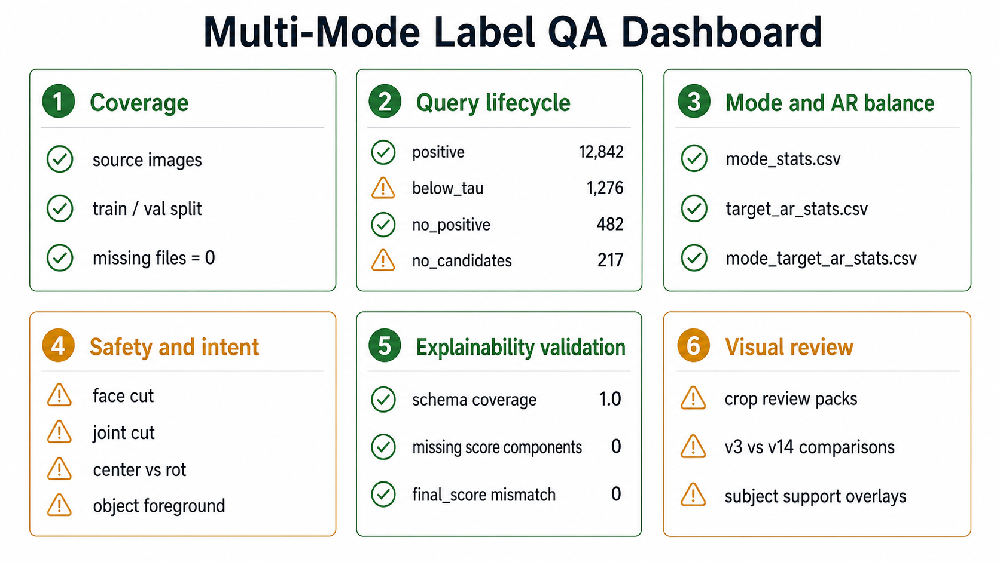{ width=100% }

위 Figure는 count/stat, query status, hard reject, visual review, explainability validation을 함께 보는 QA dashboard 개념도다. 단일 score만 보는 대신 mode/AR/route/candidate source별로 분해해 봐야 한다.

## 10.1 필수 QA 축

라벨 품질은 단일 accuracy로 판단하지 않는다. 최소한 아래 항목을 본다.

- query open: mode별 query 생성률이 지나치게 낮거나 높지 않은가.
- positive yield: mode별 positive 존재율과 no-positive rate가 합리적인가.
- person safety: intrusion fail rate와 joint/face fail rate가 과도하지 않은가.
- group completeness: member completeness fail rate가 과도하지 않은가.
- object structure: saliency foreground overlap과 truncation fail이 과도하지 않은가.
- scene semantics: landscape positive rate와 copyspace attribute coverage가 자연스러운가.
- duplicate positive: 같은 crop가 여러 query에서 동시에 positive가 되는 비율이 과도하지 않은가.
- negative budget: query당 negative 수와 label JSON size가 과도하지 않은가.
- explainability: checklist schema coverage, missing score components, final_score mismatch가 0인가.
- target_ar_only: main JSON과 annotation count가 같고 attributes가 `target_ar`만 갖는가.

반드시 분해해서 볼 축:

- by `mode_name`
- by `source_route_mode`
- by `target_ar`
- by `entity_source`
- by `candidate_source`
- by `hard_reject_reasons`
- by `checklist_labels`
- by `why_tags`

## 10.2 주요 검증 파일

현재 v14 산출물에서 QA는 아래 파일을 우선 확인한다.

- `summary.json`: image/task/query/annotation count와 split 요약.
- `validation_summary.json`: 기본 label/split 검증.
- `dataset_stats.json`: mode/AR/mode-AR 통계와 query negative histogram.
- `mode_stats.csv`, `target_ar_stats.csv`, `mode_target_ar_stats.csv`: spreadsheet 검토용 통계.
- `mode_query_status.jsonl`: query별 decision과 no-positive reason.
- `explainability_enrichment_summary.json`: explainability 보강 결과.
- `explainability_label_policy.json`: threshold policy.
- `explainability_validation_summary.json`: checklist/why-tag/final_score/target_ar_only 검증.
- `crop_review_v14_*/stratified_200_best_by_ar_mode/`: 단독 정성 리뷰 패널.
- `compare_v3_v14/`: v3 대비 변화량과 대표 비교 시각화.

## 10.3 Duplicate Positive

같은 bbox가 여러 query의 positive가 되는 것은 항상 오류가 아니다. 예를 들어 같은 crop이 `group_center`와 `landscape` 모두에 타당할 수 있다. 다만 동일 bbox가 과도하게 반복되어 class boundary를 무너뜨리면 warning이다.

현재 v14 label JSON은 `is_shared_positive`와 `shared_group_id`를 쓰지 않는다. duplicate positive는 QA 지표와 visual review로 판단하고, downstream에서 필요할 때 sampler 또는 schema extension으로 다루는 편이 맞다.

## 10.4 시각화

주요 review pack:

```text
crop_review_v14_full/stratified_200_best_by_ar_mode/
crop_review_v14_photo_primary/stratified_200_best_by_ar_mode/
compare_v3_v14/
compare_v13_v14/expanded_all_v3_visualize_with_subject_support_crops/
```

`SUBJ` overlay는 v14에서 `landscape_subject_safe_active=1`일 때만 의미 있는 subject-safe overlay로 본다. low-reliability scene pseudo-subject는 score/gate/overlay subject로 사용하지 않는다.

# 11. Current SSTK Builder와의 관계

이 framework는 current pairwise/listwise/decision/checklist/canonical/batch builder를 즉시 대체하지 않는다.

기존 builder가 다루는 semantics:

- `matching_targets`
- `candidate_pool`
- `ignored_candidates`
- `overflow_candidates`
- pairwise / listwise / decision / checklist / regression / DETR batch view

multi-mode label JSON의 목적:

- mode-conditioned detector-style label artifact
- query별 positive/no-positive 상태
- mode/category 기반 crop supervision
- optional negative annotation
- explainability checklist/why-tag attributes

따라서 둘은 경쟁 관계가 아니라 서로 다른 downstream을 위한 parallel artifact path에 가깝다.

권장 연결 방식:

1. current builder는 그대로 유지한다.
2. multimode label JSON artifact를 병렬로 생성한다.
3. downstream detector-style student나 multimode selector 실험에 명시적으로 연결한다.
4. 충분한 검증 후 current builder와의 통합 여부를 검토한다.

# 12. v14까지의 보완 히스토리

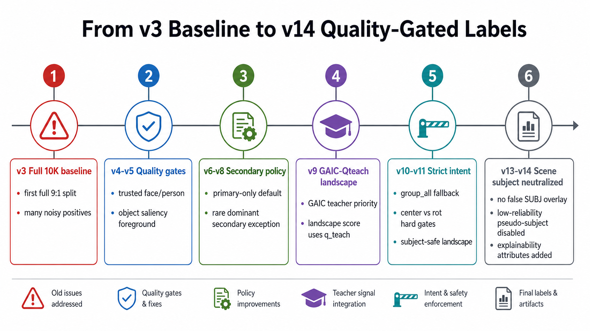{ width=100% }

위 Figure는 v3 baseline 이후 v14까지 주요 보완 축을 시간순으로 요약한다. 각 version의 세부 변경은 아래 항목과 version별 산출물 문서를 함께 확인한다.

## 12.1 v3 Baseline

`260506_v3_multimode_full10k_split9010`은 Full 10K 전체와 9:1 split을 처음 닫은 baseline이다. 당시 query 수는 297,991, annotation 수는 355,679였다. 이후 시각화에서 face/person/object 오검출성 positive가 확인되어 품질 gate 개선이 필요했다.

## 12.2 v4-v5 Quality Gate

v4-v5에서는 trusted person/face gate, object saliency foreground gate, center/rot hard gate audit, landscape non-scene teacher/context gate를 추가했다.

대표 개선:

- 휴대폰에 face box가 붙는 문제 차단.
- 아령 등 비인물 foreground에 person/face query가 붙는 문제 완화.
- object saliency foreground 미포함 positive를 v5에서 0건으로 감소.
- 다만 당시 `secondary_person_positive`가 남아 있어 최종 후보로 확정하지 않았다.

## 12.3 v6-v8 Secondary Person Policy

secondary person은 primary-only를 기본값으로 두고, rank > 0이더라도 dominance, face score, area share가 매우 높은 경우만 예외 허용하는 정책으로 이동했다. group portrait에서는 secondary face/person exception 조건을 별도로 완화했다.

## 12.4 v9 Landscape GAIC-Qteach

v9은 landscape mode가 GAIC cropper 결과를 더 직접 따르도록 `--landscape_candidate_policy prefer_gaic`, `--landscape_score_policy teacher_only`, `--landscape_teacher_score_scope gaic`을 적용한 후보였다. FREE crop은 direct GAIC 후보를 우선 보고, 고정 AR은 GAIC provenance/lineage 후보를 우선 사용했다.

## 12.5 v10 Support Grounding과 Group Fallback

v10은 v9 리뷰에서 확인된 support grounding miss, merged-human group 누락, 낮은 GAIC-Qteach scene/interior positive 문제를 보완했다.

적용:

- `group_all` fallback atom 추가.
- low GAIC-Qteach scene/interior image는 no-label로 둠.
- grounding miss 완화와 group fallback 정책 보강.

## 12.6 v11 Strict Intent와 Subject-Safe Landscape

v11은 center/ROT 의도 불일치와 subject-cut landscape 문제를 겨냥했다.

적용:

- `--mode_intent_policy strict_v11`
- `--landscape_score_policy teacher_subject_safe`
- `--landscape_candidate_policy prefer_gaic_subject_safe`

## 12.7 v13-v14 Scene Pseudo-Subject Neutralization

v11-v13 시각화에서 scene/interior 및 distributed-attention 이미지의 `SUBJ` 영역이 좌상단 등 의미 없는 위치에 표시되는 문제가 확인됐다. v14는 의심 scene pseudo-subject를 crop gate, score bonus/penalty, `SUBJ` overlay에 쓰지 않도록 보완했다.

v14 적용:

- 큰 `distributed_attention` guidance envelope를 low-reliability scene subject로 격하.
- low-reliability `multi_subject`와 detector/saliency severe disagreement를 subject-safe 비활성화 대상으로 추가.
- `dominant_subject/raw_anchor`라도 saliency와 거의 맞지 않거나 saliency가 극소이면 subject-safe 비활성화.
- scene core/support box는 full-frame diagnostic core로 격하.
- `landscape_subject_safe_active=1`일 때만 `SUBJ` overlay를 표시.

## 12.8 2026-06-02 Explainability 보강

기존 v14 label JSON에 새 version directory 없이 explainability attributes를 in-place 추가했다.

보강 대상:

```text
label_json/multimode_labels_full.json
label_json/multimode_labels_train.json
label_json/multimode_labels_val.json
```

검증:

- Full/PhaseA v14 모두 explainability schema coverage 1.0.
- missing score components 0.
- `checklist_scores.final_score`와 top-level `score_mode` mismatch 0.
- `target_ar_only`는 `target_ar` only 구조 유지.

# 13. 구현/운영 단계별 체크리스트

{ width=100% }

## 13.1 P0: 기본 라벨 산출물

- 완료: base 10-class ontology 고정.
- 완료: deterministic `query_id`, `entity_id` 규약 고정.
- 완료: `label_json/multimode_labels_*.json` 출력 체계 고정.
- 완료: train/val 9:1 split.
- 완료: query lifecycle sidecar `mode_query_status.jsonl`.
- 완료: class imbalance, no-positive rate, negative budget 통계.
- 완료: current builder와 parallel artifact path 원칙 명시.

## 13.2 P1: 품질 Gate와 Review

- 완료: query-local candidate expansion.
- 완료: threshold calibration과 v14 `tau_pos`.
- 완료: trusted person/face, group fallback, object saliency foreground, strict center/rot gate.
- 완료: landscape GAIC-Qteach subject-safe policy.
- 완료: debug visualization, crop review visualization.
- 완료: v3-v14 comparison과 대표 샘플 문서화.

## 13.3 P2: Explainability와 Downstream 연결

- 완료: 기존 v14 `multimode_labels_{full,train,val}.json`에 explainability checklist/why-tag attributes in-place 보강.
- 완료: `checklist_scores.final_score` 포함.
- 완료: `teacher_checklist_*` MobileCropNet v4 compatibility alias.
- 진행 대상: explainability-enriched multimode artifact를 detector-style/MobileCropNet 학습에 연결 검증.
- 유지: `pet_*`, `background`, `text_document`는 future class.
- 유지: OCR-backed text mode는 precompute 신뢰도가 충분해진 뒤 편입.

# 14. 최종 운영 권고

현재 v14 기준 권고는 아래와 같다.

1. global `subject_mode`는 hard gate가 아니라 soft prior로 사용한다.
2. 라벨 생성 기본 단위는 image-level route가 아니라 `mode query`다.
3. output은 `gt_flag`가 포함된 COCO-format-compatible label JSON으로 만든다.
4. 산출물 경로와 파일명은 `label_json/multimode_labels_*.json` 체계를 사용한다.
5. landscape는 GAIC teacher score를 중심으로 하되, reliable subject가 있는 human/object route에서만 subject-safe 보정을 적용한다.
6. person center/rot, group center/rot, object center/rot는 `strict_v11` hard gate로 mode intent를 분리한다.
7. low-reliability scene pseudo-subject는 score/gate/overlay subject로 쓰지 않는다.
8. 설명 가능 학습은 `checklist_scores` regression head를 기본으로 하고, `checklist_labels`는 threshold 후처리 label 또는 보조 target으로 쓴다.
9. `why_tags`는 checklist의 대체물이 아니라 sparse explanation summary로 유지한다.
10. current ranking/policy builder와는 parallel artifact path로 유지한다.

후속 확장 후보:

- annotation 단위 global stable id가 필요하면 hash 기반 `annotation_uid`를 추가한다.
- duplicate positive를 downstream에서 구분해야 하면 `is_shared_positive` / `shared_group_id`를 추가한다.
- text/OCR, pet/background 전용 class는 precompute 신뢰도가 충분히 올라간 뒤 별도 ontology로 연다.
- schema v2에서는 explainability field를 `attributes.explainability.*` namespace로 물리적으로 묶는 방안을 검토할 수 있다. 단 v14/v4 loader 호환 때문에 현 field는 유지해야 한다.

# 부록 A. Formula Quick Reference

Mode query:

$$ q=(\mathrm{image\_task},\mathrm{mode\_id},\mathrm{entity\_id},\mathrm{target\_ar}) $$

Positive set:

$$ \mathcal{P}(q)=\{c\in\mathcal{C}(q)\mid H_q(c)=1\land U_q(c)\ge\tau_q\} $$

Utility skeleton:

$$ U_q(c)=U_q^{(S)}(c)+U_q^{(C)}(c)+U_q^{(T)}(c)-P_q(c) $$

Hard reject gate:

$$ H_q(c)=\mathbf{1}[\text{mode-specific hard reject 없음}] $$

Best positive:

$$ c_q^*=\arg\max_{c\in\mathcal{C}(q),H_q(c)=1}U_q(c) $$

Image-task id:

$$ \mathrm{image\_task\_id}=\mathrm{hash}(\mathrm{source\_image\_id},\mathrm{target\_ar}) $$

Conceptual subject preservation:

$$ Q_{\mathrm{subj}}(c;q)=0.55R_{\mathrm{core}}(c;q)+0.25R_{\mathrm{env}}(c;q)+0.20R_{\mathrm{struct}}(c;q) $$

현재 구현의 세 번째 항은 별도 `R_struct`가 아니라 `secondary_recall`이다. 운영식은 7.5의 `q_subj`를 따른다.

Conceptual center placement:

$$ Q_{\mathrm{place}}^{\mathrm{center}}(c;q)=\exp\left(-\frac{(x_q(c)-0.5)^2+(y_q(c)-0.5)^2}{2\sigma_{\mathrm{place}}^2}\right) $$

Conceptual rot placement:

$$ Q_{\mathrm{place}}^{\mathrm{rot}}(c;q)=\max\left\{\exp\left(-\frac{(x_q(c)-1/3)^2+(y_q(c)-0.5)^2}{2\sigma_{\mathrm{place}}^2}\right),\exp\left(-\frac{(x_q(c)-2/3)^2+(y_q(c)-0.5)^2}{2\sigma_{\mathrm{place}}^2}\right)\right\} $$

Conceptual framing quality:

$$ Q_{\mathrm{frame}}(c;q)=0.35Q_{\mathrm{head}}+0.25Q_{\mathrm{look}}+0.20\mathbf{1}[\mathrm{no\_face\_cut}]+0.20\mathbf{1}[\mathrm{no\_joint\_cut}] $$

현재 구현은 `Q_frame`이라는 단일 저장 component를 만들지 않고 `q_head`, `q_look`, `face_recall`, `joint_cut_score`를 별도 component와 hard reject로 사용한다.

Conceptual scene score:

$$ Q_{\mathrm{scene}}(c;q)=0.45Q_{\mathrm{horizon}}+0.30Q_{\mathrm{sym}}+0.25Q_{\mathrm{wide}} $$

Conceptual copy-space score:

$$ Q_{\mathrm{copy}}(c;q)=0.70Q_{\mathrm{blank\_side}}+0.30Q_{\mathrm{foreground\_suppression}} $$

Conceptual text score:

$$ Q_{\mathrm{text}}(c;q)=0.75R_{\mathrm{text\_recall}}(c;q)+0.25R_{\mathrm{text\_margin}}(c;q) $$

현재 v14는 `text_document` mode를 열지 않으므로 text score는 future OCR-backed extension의 conceptual reference로만 남긴다.

# 부록 B. Annotation 예시

아래 예시는 현재 `label_json/multimode_labels_*.json`의 형태를 축약한 것이다. 실제 파일의 `score_components`, `subject_debug`, scene/person/object metadata는 더 많은 field를 포함한다.

```json
{
  "id": 9000001,
  "image_id": 1000001,
  "category_id": 3,
  "bbox": [17.1, 123.1, 594.5, 356.8],
  "area": 212139.76,
  "iscrowd": 0,
  "gt_flag": 1,
  "query_id": "sample_image_0001::FREE::group_center::group_all",
  "entity_id": "group_all",
  "mode_name": "group_center",
  "is_best": 1,
  "score_mode": 0.744,
  "source_route_mode": "portrait_group",
  "attributes": {
    "target_ar": "FREE",
    "entity_type": "group",
    "route_family": "human",
    "route_mode": "portrait_group",
    "candidate_id": "mm::sample_image_0001::FREE::group_center::group_all::seed_portrait_50_50_1",
    "candidate_source": "multimode_seed",
    "negative_reason": "",
    "hard_reject_reasons": [],
    "query_has_positive": 1,
    "score_components": {
      "q_subj": 0.99,
      "q_group": 0.96,
      "q_place": 0.81,
      "q_ar": 1.0,
      "group_recall": 0.98,
      "group_balance": 0.94
    },
    "explainability_schema_version": "multimode_explainability_v1",
    "explainability_label_policy_version": "thresholds_20260602_v1",
    "checklist_scores": {
      "final_score": 0.744,
      "subject_coverage_ratio": 0.99,
      "subject_scale_ratio": 0.34,
      "context_value": 0.66,
      "placement_score": 0.81,
      "center_strength": 0.88,
      "C_headroom": 0.72,
      "safety_penalty_hard": 0.0,
      "safety_penalty_soft": 0.256
    },
    "checklist_labels": {
      "subject_coverage": "excellent",
      "subject_scale": "ideal_scale",
      "headroom": "headroom_ok",
      "lookroom": "na",
      "face_cut": "no_face_cut",
      "joint_cut": "no_joint_cut",
      "copyspace": "na",
      "context": "context_preserved",
      "third_dist": "na",
      "phi_dist": "na",
      "center_dist": "center_comp_strong",
      "ar": "ar_choice_freeform",
      "horizon_state": "na"
    },
    "checklist_applicable": {
      "subject_coverage": 1,
      "subject_scale": 1,
      "headroom": 1,
      "lookroom": 0,
      "face_cut": 1,
      "joint_cut": 1,
      "copyspace": 0,
      "context": 1,
      "third_dist": 0,
      "phi_dist": 0,
      "center_dist": 1,
      "ar": 1,
      "horizon_state": 0
    },
    "why_tags": [
      "avoid_face_cut",
      "avoid_person_cut",
      "ar_choice_freeform",
      "context_preserved",
      "centered_subject",
      "subject_preserved",
      "subject_scale_ideal",
      "head_top_safe",
      "headroom_ok"
    ],
    "teacher_checklist_labels": {
      "subject_coverage": "excellent",
      "subject_scale": "ideal_scale"
    },
    "teacher_checklist_scores": {
      "final_score": 0.744,
      "subject_coverage_ratio": 0.99
    },
    "teacher_why_tags": [
      "subject_preserved",
      "subject_scale_ideal"
    ],
    "explainability": {
      "schema_version": "multimode_explainability_v1",
      "label_policy_version": "thresholds_20260602_v1",
      "mode_family": "portrait_group",
      "checklist_non_na_count": 8
    },
    "subject_debug": {
      "core_bbox_norm_xyxy": [0.12, 0.18, 0.88, 0.82],
      "envelope_bbox_norm_xyxy": [0.12, 0.18, 0.88, 0.82],
      "member_boxes_norm_xyxy": [
        [0.12, 0.20, 0.42, 0.82],
        [0.45, 0.18, 0.88, 0.80]
      ]
    }
  }
}
```

# 부록 C. MobileCropNet v4 Checklist/Why-Tag 성능 근거

이 부록은 9장의 explainability 설계가 왜 `regression-first, threshold-label-second`로 정리됐는지 설명하기 위한 근거다. source of truth는 `MobileCropNet_v4_0_Implementation_Master_Report_KO_2026-04-27.md`, `src/mobilecropnet_v4/model.py`, 그리고 `artifacts/mobilecropnet_v4/**/summary.json`의 machine-readable metric이다.

## C.1 v4 구조 요약

MobileCropNet v4는 checklist/why-tag를 단순 설명 문구가 아니라 release-safety surface로 다뤘다. [MobileCropNet v4 master report](MobileCropNet_v4_0_Implementation_Master_Report_KO_2026-04-27.md)의 6.12와 11.9 기준 구조는 아래와 같다.

| head | target | loss / metric |
|---|---|---|
| `checklist_class_head` | group별 categorical checklist label | CE, `checklist_class_acc` |
| `checklist_applicability_head` | route/crop별 checklist 적용 가능 여부 | BCE, precision/recall |
| `detail_score_head` | subject coverage, scale, headroom, lookroom, context, placement 등 연속 score | SmoothL1, `detail_score_mae` |
| `why_tag_head` | crop 선택/거절 이유 multi-label tag | multilabel BCE, precision/recall |

구현상 class label head가 score regression head로 완전히 대체된 것은 아니다. class/applicability/detail/why head가 병렬로 있었고, 일부 best 계열에서 continuous detail score regression의 비중을 더 크게 둔 것이다.

## C.2 v4 도달 성능

`artifacts/mobilecropnet_v4/**/summary.json` 중 `best_row.val.*`에 checklist/why metric이 있는 52개 run을 집계했다. 그중 `state=completed`인 47개 run의 범위는 아래와 같다.

| 지표 | completed run 중앙값 | 최고 또는 최저 | 해석 |
|---|---:|---:|---|
| `checklist_class_acc` | 0.6768 | 최고 0.7253 | categorical checklist label은 약 68-73% 수준 |
| `checklist_applicability_precision` | 0.9224 | 최고 0.9484 | 적용 가능한 checklist를 고르는 precision은 높음 |
| `checklist_applicability_recall` | 0.9282 | 최고 0.9685 | applicability recall도 높음 |
| `detail_score_mae` | 0.1473 | 최저 0.1280 | 0-1 score regression MAE 약 0.13-0.15 |
| `why_tag_precision` | 0.7456 | 최고 0.8009 | why-tag precision은 약 75-80% |
| `why_tag_recall` | 0.6732 | 최고 0.7350 | why-tag recall은 precision보다 낮음 |
| `why_tag_F1` | 0.7039 | 최고 0.7665 | 설명 tag는 중간 이상이지만 완성형은 아님 |

가장 좋은 explanation metric을 보인 completed run은 `mcn-route-focal-margin-r320-20260427-121226`이었다.

| metric | 값 |
|---|---:|
| `checklist_class_acc` | 0.7253 |
| `checklist_applicability_precision` | 0.9388 |
| `checklist_applicability_recall` | 0.9188 |
| `detail_score_mae` | 0.1280 |
| `why_tag_precision` | 0.8009 |
| `why_tag_recall` | 0.7350 |
| `why_tag_F1` | 0.7665 |

다만 같은 run은 `top_return_hit=0.3962`, `route_acc=0.4488`, `subject_box_iou=0.4687`이었다. 즉 explanation head만 보면 가장 좋았지만, cropper 전체 release gate를 통과한 것은 아니었다.

## C.3 초기 detail-explain 계열 한계

`artifacts/mobilecropnet_v4/detail_explain/detail_explain_visualization_audit_20260417.json`도 확인했다. 초기 detail-explain 시각화 감사에서는 model top crop 자체에 checklist label을 직접 붙일 수 있는 경우가 제한적이었다.

| run | rows | direct top-crop label | nearest labeled candidate fallback | unavailable |
|---|---:|---:|---:|---:|
| `mcn-v4-balanced288-detail-explain-20260416-185647` | 625 | 160 | 445 | 20 |
| `mcn-v4-hq320-detail-explain-20260416-185647` | 625 | 145 | 460 | 20 |
| `mcn-v4-turbo256-detail-explain-20260416-185647` | 625 | 190 | 415 | 20 |

이것은 v4에 explanation head가 없었다는 뜻이 아니다. 다만 초기 설명 시각화는 final crop에 직접 붙은 label보다 nearest labeled candidate fallback에 많이 의존했다. 따라서 explainability를 제품 출력으로 쓰려면 score regression, applicability, postprocess label generation, final-crop alignment를 함께 검증해야 한다.

## C.4 v14 설계에 주는 결론

v4 경험에서 얻은 실무 결론은 다음이다.

1. checklist score는 primary regression target으로 두는 것이 맞다.
2. 사람이 읽는 checklist label은 score threshold로 파생하고, optional label head는 보조 학습/평가용으로 둔다.
3. why-tag는 sparse explanation summary이므로 primary truth로 과신하지 않는다.
4. why-tag head를 쓰더라도 low-weight auxiliary multi-label target으로 시작한다.
5. release 판단은 explanation metric만으로 하지 않는다. route/mode intent, subject safety, crop quality, action/top-return, qualitative failure와 함께 본다.

# 부록 D. 설명 가능한 Cropper 학습 계약

이 부록은 v14 `label_json/multimode_labels_{full,train,val}.json`의 explainability attributes를 이용해 설명 가능한 cropper 또는 detector-style multimode cropper를 학습할 때의 권장 계약이다.

## D.1 학습 입력

학습 sample은 기본적으로 `image + target_ar + candidate/crop query`로 구성한다. 모델 유형에 따라 candidate crop이 명시적으로 들어갈 수도 있고, 모델이 proposal을 직접 생성할 수도 있다.

사용하는 label field:

- crop/mode target: `bbox`, `mode_name`, `category_id`, `gt_flag`, `target_ar`, `score_mode`.
- score target: `attributes.checklist_scores`.
- label target: `attributes.checklist_labels`.
- applicability target: `attributes.checklist_applicable`.
- sparse explanation target: `attributes.why_tags`.
- compatibility alias: `teacher_checklist_scores`, `teacher_checklist_labels`, `teacher_why_tags`.
- debug/evaluation: `attributes.score_components`, `attributes.subject_debug`, `hard_reject_reasons`, `negative_reason`.

`target_ar_only` JSON은 explainability 학습에 쓰지 않는다. 이 파일은 `attributes.target_ar`만 보존하므로 score/checklist/why target이 없다.

## D.2 권장 모델 head

권장 구조는 primary crop head와 explainability heads를 분리한다.

| head | 출력 | 학습 target | 기본 용도 |
|---|---|---|---|
| crop/mode head | crop box, mode logits, objectness/positive score | `bbox`, `category_id`, `gt_flag`, `score_mode` | crop detection/selection |
| score regression head | `checklist_scores`와 핵심 score component 연속값 | `attributes.checklist_scores` | primary explainability supervision |
| checklist applicability head | checklist group별 적용 확률 | `attributes.checklist_applicable` | loss mask와 runtime display mask |
| optional checklist label head | group별 categorical label | `attributes.checklist_labels` | 보조 CE 또는 evaluation/debug |
| why-tag head | sparse multi-label tag logits | `attributes.why_tags` | 낮은 weight의 auxiliary explanation |
| risk/reject head | unsafe/reject probability 또는 reason class | `hard_reject_reasons`, `negative_reason`, `gt_flag=0` | unsafe crop 억제와 failure analysis |

score regression head에는 최소한 아래 항목을 포함한다.

- final utility: `final_score`.
- subject preservation: `subject_coverage_ratio`, `subject_scale_ratio`.
- placement/composition: `placement_score`, `third_strength`, `center_strength`.
- portrait detail: `headroom_ratio`, `lookroom_ratio`, `C_headroom`, `C_lookroom`.
- context/scene: `context_value`, `C_context`, `horizon_state` source score.
- safety: `safety_penalty_hard`, `safety_penalty_soft`, face/joint cut 관련 score.

`attributes.score_components`의 `q_subj`, `q_scale`, `q_place`, `q_ar`, `q_ctx`, `q_scene`, `q_head`, `q_look`, `q_group`, `q_teach`도 별도 regression target으로 확장할 수 있다. 다만 first experiment에서는 `checklist_scores`의 compact target을 우선 쓰고, mode별 utility component 회귀는 ablation으로 추가하는 편이 안전하다.

## D.3 Loss 구성

권장 total loss는 아래처럼 분리한다.

$$ L=L_{\mathrm{crop}}+\lambda_{\mathrm{score}}L_{\mathrm{score}}+\lambda_{\mathrm{app}}L_{\mathrm{app}}+\lambda_{\mathrm{label}}L_{\mathrm{label}}+\lambda_{\mathrm{why}}L_{\mathrm{why}}+\lambda_{\mathrm{risk}}L_{\mathrm{risk}} $$

각 loss의 기본 해석:

- `L_crop`: bbox/mode/objectness/positive selection loss.
- `L_score`: `checklist_scores`에 대한 SmoothL1 또는 Huber regression. `checklist_applicable[k]=0`인 항목은 제외한다.
- `L_app`: checklist applicability BCE. runtime에서 무엇을 표시할지 결정하므로 precision/recall을 모두 본다.
- `L_label`: optional categorical checklist CE. score threshold 파생 label을 보조로 맞히는 용도다.
- `L_why`: why-tag multilabel BCE. class imbalance가 크면 `pos_weight` 또는 focal BCE를 쓴다.
- `L_risk`: hard reject/negative reason/risk target에 대한 BCE 또는 CE.

초기 권장 weight 방향:

- `lambda_score`를 가장 중요한 explanation weight로 둔다.
- `lambda_app`은 mode-inapplicable hallucination을 막을 만큼 충분히 둔다.
- `lambda_label`은 작게 시작한다. label은 score에서 파생되므로 primary truth가 아니다.
- `lambda_why`는 더 작게 시작한다. v4에서 why-tag recall이 상대적으로 낮았고 sparse label 성격이 강했기 때문이다.
- optional negative annotation을 학습할 때는 risk/reject head에는 사용하되, positive crop quality score regression과 섞지 않는다.

## D.4 후처리 출력

runtime에서 사람이 보는 label은 기본적으로 predicted score에서 파생한다.

1. 모델이 `checklist_scores`를 예측한다.
2. score를 `0-1` 범위로 clamp 또는 sigmoid 보정한다.
3. `explainability_label_policy.json`의 threshold를 적용해 `checklist_labels`를 만든다.
4. applicability probability가 threshold보다 낮은 group은 label을 `na`로 둔다.
5. why-tag는 파생 checklist/reject state에서 deterministic summary로 재생성하는 것을 기본값으로 둔다.
6. neural why-tag logits는 보조 신호로만 사용하고, calibration이 검증된 tag만 UI/API에 노출한다.

이 정책은 `why_tags`를 버린다는 뜻이 아니다. 학습에는 auxiliary target으로 쓰되, 운영 출력에서는 score와 threshold에서 재생성되는 checklist label을 더 신뢰한다는 뜻이다.

## D.5 Evaluation 기준

설명 가능한 cropper 평가는 crop 성능과 explanation 성능을 분리해서 보되, 최종 release 판단은 둘을 함께 본다.

필수 explanation metric:

- score regression: `detail_score_mae`, component별 MAE, calibration curve.
- checklist label: threshold 후 label accuracy, per-class confusion.
- applicability: precision, recall, mode-inapplicable hallucination rate.
- why-tag: precision, recall, F1, frequent tag별 confusion.
- consistency: predicted checklist label과 predicted score threshold label의 불일치율.
- safety: hard reject crop에 대한 risk/why warning hit rate.

v4 기준 참고 baseline:

- `detail_score_mae`는 `0.13-0.15` 수준이면 초기 유효 신호로 볼 수 있다.
- `checklist_class_acc`는 `0.68-0.73` 수준까지 도달한 사례가 있다.
- `checklist_applicability` precision/recall은 `0.92` 이상이 가능했다.
- `why_tag_F1`은 `0.70` 전후, 최고 `0.77` 수준이었다.

이 수치는 v14 multimode 모델의 release threshold가 아니다. 새 모델은 label schema와 crop objective가 다르므로 같은 metric을 재측정해야 한다. 다만 v4보다 낮은 applicability나 score MAE가 나오면 explainability head 설계 또는 target mask를 먼저 의심해야 한다.

## D.6 운영 원칙

- checklist score는 모델이 설명 가능한 crop quality를 학습하는 primary target이다.
- checklist label은 score threshold의 사람이 읽는 view다.
- why-tag는 checklist/reject state의 sparse summary다.
- `checklist_applicable=0`인 축은 loss와 UI에서 모두 제외해야 한다.
- `lookroom`은 side gaze에서만 학습/표시한다.
- `target_ar_only` 파일은 explainability 실험에 쓰지 않는다.
- crop quality가 좋더라도 explanation이 mode intent와 모순되면 QA warning으로 남긴다.
- explanation metric이 좋아도 crop/mode/subject safety가 나쁘면 release candidate로 보지 않는다.

# 부록 E. 그림 파일 경로

이 문서는 `Implement_Docs/` 바로 아래에 있고, 그림은 두 경로에 나뉘어 있다.

```text
Implement_Docs/SSTK_MultiMode_TrainingLabels_Markdown_Bundle/assets/
Implement_Docs/assets_figs/SSTK_MultiMode_TrainingLabels_Enhanced_Onboarding_KO_v1_0/
```

따라서 문서 내 그림 참조는 `assets/...`가 아니라 아래처럼 작성해야 PyCharm Markdown preview에서 깨지지 않는다.

```markdown


```

`assets_figs/...` 아래 ChatGPT 생성 Figure는 timestamp 기반 원본 파일명을 사용하지 않고, 문서 섹션과 의미를 알 수 있는 `fig_v14_*.png` 이름으로 정리했다.
