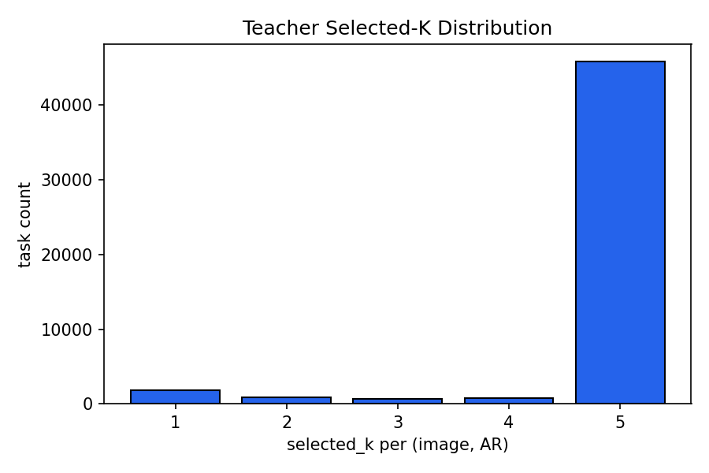
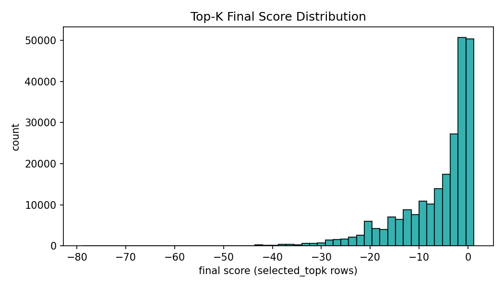
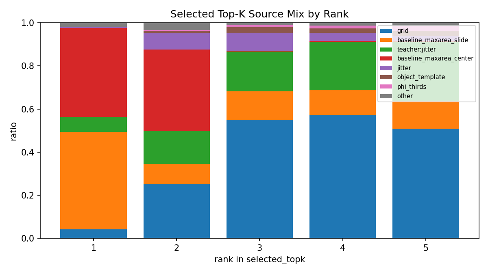
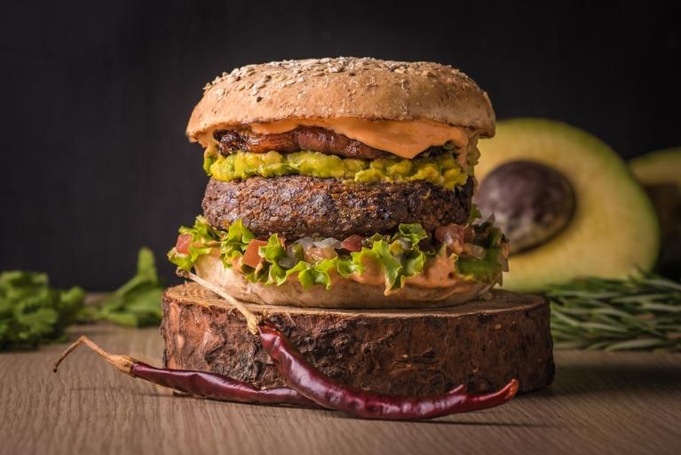

# 10K Cropping Pipeline 결과 보고서 초안 (국문)

- 데이터셋: `data/SSTK/10K`
- 기준 문서: `README_SSTK_Curation.md`, `ImplementPlan_Docs/SSTK_Cropping_DataFactory_QwenLabeler_Reorganized_KO_v1_9.md`
- 기준 실행 산출물: `run_tag=e2e_260227_r0`
- 작성 시각: 2026-02-27 17:45:27

## 1) 전체 결과 요약

- Filtered 이미지 수: **10,000장**
- Phase A super category 분포(12종): people_multi=835, architecture_exterior=834, landscape_nature=834, 나머지 대부분 833 내외
- Candidate 생성: 평균 **533.4583** / image, 주입률 **1.000**
- Public Teacher raw/proposal: **30,000 / 10,000**
- Teacher Scorer QA: `crop` 0.3736, `minimal_crop` 0.6264
- Teacher 점수(최종): mean=-3.9795, p90=1.0558, neg_rate=0.7337
- 보고서용 보강 시각화: precompute(12장) + teacher(60 task) 생성 완료

## 2) 파이프라인 단계별 로직/역할

### 2.1 Phase A (Filter & Curate)
- 입력: SSTK tar 메타/태그/품질 점수
- 역할: 품질/카테고리 기준 curated pool 구성, 이후 단계 공통 입력 parquet 생성
- 출력: `filtered_sstk_100.parquet`

### 2.2 Phase B-1 (Perception Precompute: C1/C2/C3/C5)
- C2: object/segmentation, C3: person pose/face/headpose, C5: horizon/symmetry
- 역할: candidate/teacher scoring에 필요한 구조적 feature 전처리
- 출력: `artifacts/precompute/feats_c2c3c5_v2_strict_enriched.jsonl`

### 2.3 v1.9 8.2.0a Public Teacher Proposal 주입
- GAIC/CACNet/CGS 추론 결과를 free-form seed proposal로 변환
- 역할: grid/rule 기반 후보의 blind spot 보완
- 출력: `artifacts/public_teachers/raw/*.jsonl`, `artifacts/public_teachers/proposals/*.jsonl`

### 2.4 Candidate Generator
- 입력: filtered parquet + precompute(C2/C3) + public teacher proposal
- 역할: AR별 후보군 대량 생성, baseline/grid/phi/jitter/teacher seed 통합
- 출력: `artifacts/candidates/candidates_ar_e2e_260227_r0.jsonl` + overview/viz

### 2.5 Teacher Scorer (Cheap -> Expensive -> Top-K)
- 역할: 후보를 점수화하고 최종 crop decision(`crop|minimal_crop|keep_full`) 도출
- 현재 산출물 기준: `use_real_expensive=true` (QA의 `expensive_source_counts={real: 49998}`)
- 출력: `artifacts/teacher/scores/teacher_scores_ar_e2e_260227_r0.jsonl` + overview/qa/viz
- Top-K 해석(핵심):
  - `candidate.candidate_counts_by_ar`는 Teacher 입력 후보 수(`num_input_candidates`)이며, 최종 K가 아님
  - Teacher 내부 흐름: `num_input_candidates -> num_valid_candidates -> num_effective_candidates -> cheap_top_m(<=30) -> selected_topk(<=top_k)`
  - 설정값 `top_k=5`는 상한(upper bound)이며, 항상 5개가 보장되지는 않음
  - 실제 최종 K는 `selected_topk` 길이(`K_actual`)로 판단
- Top-K 전체 분포(10,000장 x AR 5종, 일부 AR 결손 포함):
  - task 수: 49,998, `K_actual` 분포: {'1': 1856, '2': 873, '3': 675, '4': 745, '5': 45849}
  - 평균 K=4.7572, p50=5.0, p90=5.0
  - K<5 비율: 0.0830 (4,149 / 49,998)
  - Top-K final score(min/mean/p50/p90/max): -78.772 / -6.069 / -2.898 / 1.012 / 1.178
  - Top-K source 상위: grid(90337), baseline_maxarea_slide(44369), teacher:jitter(42566), baseline_maxarea_center(39314), jitter(10619), object_template(3917)

### 2.6 Teacher Score 계산식 (코드 기준)
- 1) Cheap score
  - `cheap = λ_cov*cov - λ_cut*p_cut - λ_text*p_text + λ_comp*r_comp + λ_hr*r_headroom + λ_lr*r_lookroom + λ_sym*r_sym + λ_ctx*r_context + λ_cs*r_copyspace`
  - `r_comp = w_third*r_third + w_phi*r_phi + w_center*r_center + w_horizon*r_horizon`
  - 기본 가중치(`TeacherScorerConfig`): `lambda_cov=1.20, lambda_cut=1.80, lambda_comp=1.00, lambda_hr=0.65, lambda_lr=0.55, lambda_sym=0.25, lambda_ctx=0.45, lambda_cs=0.35`
  - 라우팅(shot_type/flags)에 따라 `effective_lambdas`로 재가중됨(예: copy-space면 `ctx/cs` 강화)
- 2) Expensive prior/proxy (real 모델 미사용 시)
  - `aesthetic_proxy = 0.45*r_comp + 0.20*sym + 0.20*cov + 0.15*context_fit - 0.30*min(1,p_cut)`
  - `ca_proxy = 0.65*cov + 0.35*context_fit`
- 3) Expensive + Final score
  - `expensive = w_a*A_norm + w_ca*cos + w_cov*cov - w_cut*p_cut - w_text*p_text + w_edge*r_edge`
  - `final = expensive + w_area*log(area_ratio)`
  - 기본 가중치: `w_a=1.0, w_ca=0.3, w_cov=0.5, w_cut=2.0, w_text=0.0, w_edge=0.5`
  - `A_norm = clamp((A_raw - aesthetic_score_min) / (aesthetic_score_max - aesthetic_score_min), 0, 1)` (`min=1, max=10`)
  - `w_area`는 라우팅 기반: copy-space/landscape `0.12`, product `0.06`, 기본 `0.10`
- 4) Keep-vs-Crop decision
  - `delta = best_final - baseline_final`
  - `delta < tau_improve`이면 baseline 유지 경로(`baseline_full`이면 `keep_full`, 아니면 `minimal_crop`)
  - `delta >= tau_improve`이면 `crop`
  - `tau_improve`는 라우팅 기반: copy-space/landscape `0.055`, group(또는 인물 2+) `0.045`, portrait `0.03`, product `0.015`, 기본 `0.035`
- 5) Top-K 선택
  - `cheap_top_m`(기본 30) 후보를 expensive 재평가 후 정렬
  - `select_topk_diverse(k=5, tau_div=0.75)`로 IoU 다양성 제약을 적용해 선택
  - 다양성 제약으로 모자라면 남은 상위 후보로 fill하여 최대 `top_k`까지 채움

## 3) 단계별 입출력 포맷 정의 (예시 샘플: `sstk_image_2190537205`)

- Phase A row 예시: [`assets/samples/json/sstk_image_2190537205.json`](assets/samples/json/sstk_image_2190537205.json) 의 `phaseA`
- Precompute row 예시: 같은 파일의 `precompute` + merged jsonl의 `c2_seg/c3_pose/c5_geom`
- Public Teacher proposal 예시: 같은 파일의 `public_teacher` (teacher별 `free_form` bbox/score)
- Candidate row 예시: 같은 파일의 `candidate` (`candidate_counts_by_ar`, `proposal_injected`)
- Teacher row 예시: 같은 파일의 `teacher.by_ar` (`decision_type`, `delta_improve`, `tau_improve`, composition check)

## 4) Visualization 키 항목 설명 (Teacher Overlay)

- `decision`: baseline 대비 최종 정책 (`crop`, `minimal_crop`, `keep_full`)
- `delta`: `best_score - baseline_score` 개선량
- `tau`: 개선량 임계치(카테고리/정책 기반 threshold)
- `headroom/lookroom/horizon/context`: composition rule별 pass/fail 체크
- `top1 final`: 최종 선택된 crop 후보 점수
- `A_raw`: 미학 점수 원시값(실모델 Aesthetic head 출력, 기본 스케일 1~10 근처)
- `A_norm`: `A_raw`를 `[0,1]`로 정규화한 값 (`(A_raw-1)/(10-1)`; 범위 클리핑)
- `cos`: crop 이미지 임베딩과 태그 텍스트 임베딩의 cosine similarity (`[-1,1]`)
- `src`: expensive score 소스 (`real`=실모델, `proxy`=대체값)

## 5) 단계별 시각화 산출물

### 5.1 Candidate 단계 (집계 시각화)


- `sample_candidate_boxes.png` 해석: 검은 테두리=정규화 캔버스, 빨강=`must_keep`, 파랑=일반 후보, 초록=`subject_prior`
- `stacked_source_mix_by_ar.png` 해석: y축 ratio(해당 AR 내부 비율), source는 상위 항목 + other
- source 용어: `baseline`(안전 앵커), `grid`(전역 coverage), `phi`(`phi_thirds`), `jitter`(국소 탐색), `teacher seed`(`teacher:*`, `teacher:jitter`)

### 5.2 Precompute 단계 (보고서용 12샘플)
- 경로: `../../precompute/visualizations/components_e2e_260227_r0_report12`
- 요약: selected=12, rendered=12, missing=0
- `selected`: 시각화 대상으로 선택된 이미지 수
- `rendered`: 실제 로딩/오버레이 저장 완료 수
- `missing`: 선택되었지만 로딩 실패한 수

대표 샘플(`sstk_image_2190537205`)


### 5.3 Teacher 단계 (보고서용 12샘플 x 5AR)
- 경로: `../../teacher/visualizations/teacher_scorer_e2e_260227_r0_report12`
- 요약: selected_tasks=60, rendered=60, missing=0


Top-K 분포 시각화(전체 task 기준):



- `teacher_selected_k_distribution`: `(image,AR)`별 최종 K 분포
- `teacher_topk_final_score_hist`: selected_topk row들의 final score 분포
- `teacher_topk_source_mix_by_rank`: rank(1~5)별 source 비율

## 6) Super Category별 예시 샘플 (원본 + 단계 결과 매칭)

|super_cat|image_id|원본|Precompute Combined|Teacher(AR 1:1)|샘플 JSON|
|---|---|---|---|---|---|
|animals|sstk_image_2257975789||||[json](assets/samples/json/sstk_image_2257975789.json)|
|architecture_exterior|sstk_image_1165522843||||[json](assets/samples/json/sstk_image_1165522843.json)|
|documents_text|sstk_image_2129282159||||[json](assets/samples/json/sstk_image_2129282159.json)|
|food|sstk_image_2024012429||||[json](assets/samples/json/sstk_image_2024012429.json)|
|indoor_interior|sstk_image_629195588||||[json](assets/samples/json/sstk_image_629195588.json)|
|landscape_nature|sstk_image_1104016514||||[json](assets/samples/json/sstk_image_1104016514.json)|
|other_ambiguous|sstk_image_174059567||||[json](assets/samples/json/sstk_image_174059567.json)|
|people_multi|pond5_image_99604568||||[json](assets/samples/json/pond5_image_99604568.json)|
|people_single|sstk_image_2190537205||||[json](assets/samples/json/sstk_image_2190537205.json)|
|product_object|sstk_image_1955755765||||[json](assets/samples/json/sstk_image_1955755765.json)|
|sports|sstk_image_1178976352||||[json](assets/samples/json/sstk_image_1178976352.json)|
|transportation|sstk_image_1977782153||||[json](assets/samples/json/sstk_image_1977782153.json)|

## 7) 공개 Teacher(5.5) 결과 요약

- raw jsonl rows: **30,000**
- teacher별 rows: `{'gaic': 10000, 'cacnet': 10000, 'cgs': 10000}`
- proposal non-zero rows: `{'cacnet': 10000, 'cgs': 9990, 'gaic': 9990}`
- error rows(raw): `{}`

## 8) 산출물 경로 체크 (보고서 기준)

- candidates: `data/SSTK/10K/artifacts/candidates/candidates_ar_e2e_260227_r0.jsonl`
- teacher: `data/SSTK/10K/artifacts/teacher/scores/teacher_scores_ar_e2e_260227_r0.jsonl`
- precompute viz(report12): `data/SSTK/10K/artifacts/precompute/visualizations/components_e2e_260227_r0_report12`
- teacher viz(report12): `data/SSTK/10K/artifacts/teacher/visualizations/teacher_scorer_e2e_260227_r0_report12`
- topk analytics: `data/SSTK/10K/artifacts/reports/e2e_260227_r0/assets/analytics/teacher_topk`

## 9) 재현 명령어 (이번 보고서 보강분)

```bash
# precompute viz (12 super_cat 샘플)
python src/visualize_components.py \
  --parquet data/SSTK/10K/filtered_sstk_100.parquet \
  --merged_jsonl data/SSTK/10K/artifacts/precompute/feats_c2c3c5_v2_strict_enriched.jsonl \
  --tar_dir /sstk/20230916/sstk_100 \
  --image_dir data/SSTK/10K/images \
  --out_dir data/SSTK/10K/artifacts/precompute/visualizations/components_e2e_260227_r0_report12 \
  --image_ids_file data/SSTK/10K/artifacts/reports/e2e_260227_r0/sample_ids_supercat12.txt \
  --num_samples 12 --draw_combined 1

# teacher viz (12 샘플 x 5 AR)
python src/visualize_teacher_scores.py \
  --teacher_scores_jsonl data/SSTK/10K/artifacts/teacher/scores/teacher_scores_ar_e2e_260227_r0.jsonl \
  --parquet data/SSTK/10K/filtered_sstk_100.parquet \
  --tar_dir /sstk/20230916/sstk_100 \
  --image_dir data/SSTK/10K/images \
  --out_dir data/SSTK/10K/artifacts/teacher/visualizations/teacher_scorer_e2e_260227_r0_report12 \
  --image_ids_file data/SSTK/10K/artifacts/reports/e2e_260227_r0/sample_ids_supercat12.txt \
  --target_ar all --decision_filter all --num_samples 0
```

## 10) 검토 포인트(초안 단계)

- 현재 run_tag 기준 teacher 결과는 `use_real_expensive=true` 경로로 일관되게 생성됨
- Top-K 분포/score/source 분석 자산은 보고서 `assets/analytics/teacher_topk`에 정리됨
- 추가 요청 시 동일 포맷으로 EN 버전 보고서 및 PPT 요약본 변환 가능
