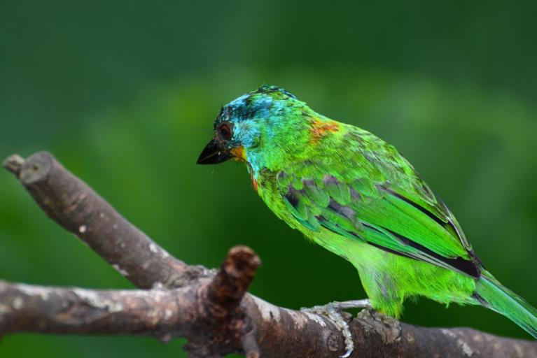
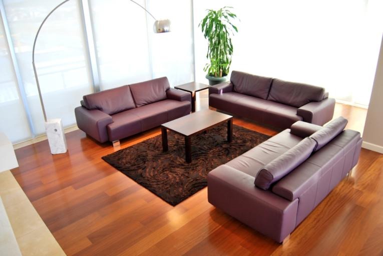
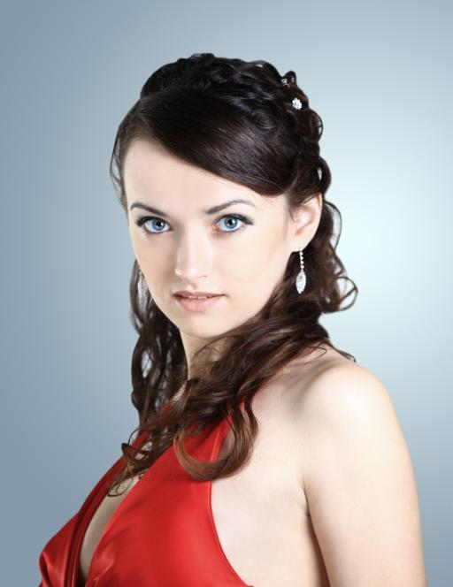
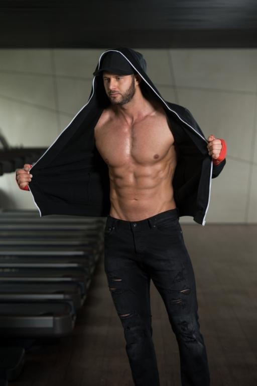

# 10K_local Cropping Pipeline 결과 보고서 초안 (국문)

- 데이터셋: `data/SSTK/10K_local`
- 기준 문서: `README_SSTK_Curation.md`, `ImplementPlan_Docs/SSTK_Cropping_DataFactory_QwenLabeler_Reorganized_KO_v1_9.md`
- 기준 실행 산출물: `run_tag=rerun1_public_e2e`
- 작성 시각: 2026-02-27 15:23:31

## 1) 전체 결과 요약

- Filtered 이미지 수: **500장** (super category 12종 균형 샘플링)
- Candidate 생성: 평균 **531.7** / image, 주입률 **1.000**
- Public Teacher raw: 총 **1500** 레코드 (gaic/cacnet/cgs 각 {'gaic': 500, 'cacnet': 500, 'cgs': 500})
- Teacher Scorer QA: `crop` 0.3880, `minimal_crop` 0.6120
- Teacher 점수(최종): mean=-3.6476, p90=1.0597, neg_rate=0.7144
- 보고서용 보강 시각화: precompute(12장) + teacher(12샘플 x 5AR = 60장) 추가 생성 완료

## 2) 파이프라인 단계별 로직/역할

### 2.1 Phase A (Filter & Curate)
- 입력: SSTK tar 메타/태그/품질 점수
- 역할: 품질/카테고리 기준으로 curated pool 구성, 이후 단계 공통 입력 parquet 생성
- 출력: `filtered_sstk_100.parquet`

### 2.2 Phase B-1 (Perception Precompute: C1/C2/C3/C5)
- C2: object/segmentation, C3: person pose/face/headpose, C5: horizon/symmetry
- 역할: candidate/teacher scoring에 필요한 구조적 feature 전처리
- 출력: `artifacts/precompute/feats_c2c3c5_v2_strict_enriched.jsonl` (+ c1/c2/c3/c5 개별 jsonl)

### 2.3 v1.9 8.2.0a Public Teacher Proposal 주입
- GAIC/CACNet/CGS 추론 결과를 free-form seed proposal로 변환
- 역할: grid/rule 기반 후보의 blind spot 보완
- 출력: `artifacts/public_teachers/raw/*.jsonl`, `artifacts/public_teachers/proposals/*.jsonl`

### 2.4 Candidate Generator
- 입력: filtered parquet + precompute(C2/C3) + public teacher proposal
- 역할: AR별 후보군 대량 생성, baseline/grid/phi/jitter/teacher seed 통합
- 출력: `artifacts/candidates/candidates_ar_rerun1_public_e2e.jsonl` + overview/viz

### 2.5 Teacher Scorer (Cheap -> Expensive -> Top-K)
- 역할: 후보를 점수화하고 최종 crop decision(`crop|minimal_crop|keep_full`) 도출
- 현재 산출물 기준: `use_real_expensive=true` (real expensive 경로, `expensive_source_counts={'real': 2500}`)
- 출력: `artifacts/teacher/scores/teacher_scores_ar_rerun1_public_e2e.jsonl` + overview/qa/viz

## 3) 단계별 입출력 포맷 정의 (예시 샘플: `sstk_image_1772011034`)

- Phase A row 예시: [`assets/samples/json/sstk_image_1772011034.json`](assets/samples/json/sstk_image_1772011034.json) 의 `phaseA`
- Precompute row 예시: 같은 파일의 `precompute` + merged jsonl의 `c2_seg/c3_pose/c5_geom`
- Public Teacher proposal 예시: 같은 파일의 `public_teacher` (teacher별 `free_form` bbox/score)
- Candidate row 예시: 같은 파일의 `candidate` (`candidate_counts_by_ar`, `proposal_injected`)
- Teacher row 예시: 같은 파일의 `teacher.by_ar` (`decision_type`, `delta_improve`, `tau_improve`, composition check)

## 4) Visualization 키 항목 설명 (Teacher Overlay)

- `decision`: baseline 대비 최종 정책 (`crop`, `minimal_crop`, `keep_full`)
- `delta`: `best_score - baseline_score` 개선량
- `tau`: 개선량 임계치(카테고리/정책 기반 threshold)
- `headroom/lookroom/horizon/context`: composition rule별 pass/fail 체크
- `top1 final`: 최종 선택된 crop 후보 점수
- `A_raw/A_norm/cos`: aesthetic 및 image-text alignment 관련 스코어 요소
  - `A_raw`: 미학 점수 원시값(실모델 Aesthetic head 출력, 기본 스케일 1~10 근처)
  - `A_norm`: `A_raw`를 `[0,1]`로 정규화한 값 (`(A_raw-1)/(10-1)`; 범위 클리핑)
  - `cos`: crop 이미지 임베딩과 태그 텍스트 임베딩의 cosine similarity (`[-1,1]`)
  - `src`: expensive score 소스 (`real`=실모델, `proxy`=대체값). `A_raw=n/a`는 proxy 경로를 의미

## 5) 단계별 시각화 산출물

### 5.1 Candidate 단계 (집계 시각화)


- `hist_total_candidates.png`: 이미지별 총 후보 수 분포(histogram)
- `bar_avg_candidates_by_ar.png`: AR별 평균 후보 수 막대그래프
- `scatter_subject_centroids.png`: `subject_prior.centroid`(정규화 좌표) 분포. y축은 이미지 좌상단 원점 기준이라 위->아래 방향으로 증가
- `sample_candidate_boxes.png` 해석:
  - 검은 사각형: 정규화 캔버스(원본 이미지를 디코드하지 않고 `[0,1]x[0,1]` 좌표계에 후보를 표시)
  - 빨간 box/line: `must_keep=True` 후보(베이스라인 계열 강제 포함 후보)
  - 파란 box/line: 일반 후보(`must_keep=False`)
  - 초록 box/line: `subject_prior.bbox_norm_xyxy` (C2/C3 기반 주 피사체 prior box)
  - 제목의 `(... N boxes)`: 해당 샘플에서 시각화된 후보 수 (`viz_ar` 기준, 없으면 첫 AR fallback)
- `stacked_source_mix_by_ar.png` 해석:
  - y축 `ratio`: 해당 AR 내부에서 source가 차지하는 비율(절대 count 아님)
  - source는 전체 빈도 상위 6개를 개별 표시하고 나머지는 `other`로 합산
  - `baseline`: `baseline_maxarea_center`, `baseline_maxarea_slide` 등 안전 앵커 계열
  - `grid`: 전역 grid anchor + multi-scale로 생성된 커버리지 후보
  - `phi`: `phi_thirds` 소스(룰 기반 컴포지션 anchor)
  - `jitter`: 주 피사체 주변 국소 탐색 후보(`jitter`)
  - `teacher seed`: 공개 teacher 유래 후보(`teacher:gaic|cacnet|cgs`)와 그 주변 확장(`teacher:jitter`)

### 5.2 Precompute 단계 (보고서용 12샘플 추가 생성)
- 경로: `../../precompute/visualizations/components_rerun1_public_e2e_report12`
- 요약: selected=12, rendered=12, missing=0

- `selected=12`: 시각화 대상으로 선택된 이미지 ID 수(`viz_overview.json.selected_count`)
- `rendered=12`: 실제 이미지 로딩/오버레이 저장까지 완료된 수(`rendered_count`)
- `missing=0`: 선택됐지만 로딩 실패(로컬 이미지+tar 모두 실패)한 이미지 수(`missing_count`)
- 본 실행은 `selected==rendered` 이므로 12개 전부 정상 렌더링됨

대표 샘플(`sstk_image_1772011034`)


### 5.3 Teacher 단계 (보고서용 12샘플 추가 생성)
- 경로: `../../teacher/visualizations/teacher_scorer_rerun1_public_e2e_report12`
- 요약: selected_tasks=60, rendered=60, missing=0

- `selected_tasks=60`: `(선택 이미지 12장) x (AR 5종)`으로 생성된 teacher 시각화 task 수
- `rendered=60`: 실제 오버레이 저장 완료 task 수
- `missing=0`: task는 있었지만 원본 이미지 로딩 실패로 렌더링하지 못한 건수(`missing_images`)

대표 샘플(`sstk_image_1772011034`, AR=1:1)


## 6) Super Category별 예시 샘플 (원본 + 단계 결과 매칭)

|super_cat|image_id|원본|Precompute Combined|Teacher(AR 1:1)|샘플 JSON|
|---|---|---|---|---|---|
|animals|bigstock_image_149147297||||[json](assets/samples/json/bigstock_image_149147297.json)|
|architecture_exterior|bigstock_image_163220822||||[json](assets/samples/json/bigstock_image_163220822.json)|
|documents_text|bigstock_image_129575693||||[json](assets/samples/json/bigstock_image_129575693.json)|
|food|bigstock_image_165044747||||[json](assets/samples/json/bigstock_image_165044747.json)|
|indoor_interior|bigstock_image_112983323||||[json](assets/samples/json/bigstock_image_112983323.json)|
|landscape_nature|bigstock_image_218991439||||[json](assets/samples/json/bigstock_image_218991439.json)|
|other_ambiguous|bigstock_image_207940879||||[json](assets/samples/json/bigstock_image_207940879.json)|
|people_multi|bigstock_image_122199020||||[json](assets/samples/json/bigstock_image_122199020.json)|
|people_single|sstk_image_1772011034||||[json](assets/samples/json/sstk_image_1772011034.json)|
|product_object|bigstock_image_141430643||||[json](assets/samples/json/bigstock_image_141430643.json)|
|sports|bigstock_image_134277740||||[json](assets/samples/json/bigstock_image_134277740.json)|
|transportation|bigstock_image_109682993||||[json](assets/samples/json/bigstock_image_109682993.json)|

## 7) 공개 Teacher(5.5) 결과 요약

- raw jsonl rows: **1500**
- teacher별 rows: `{'gaic': 500, 'cacnet': 500, 'cgs': 500}`
- teacher별 non-zero proposal rows: `{'gaic': 500, 'cacnet': 500, 'cgs': 500}`
- error rows: `{}`

## 8) 코드 점검 및 보강(시각화 누락/경로)

- `src/visualize_components.py`
  - `--image_dir`, `--image_ids`, `--image_ids_file` 추가
  - `viz_overview.json` 저장 추가
  - 기본 출력 경로를 `artifacts/precompute/visualizations/...`로 정렬
- `src/visualize_teacher_scores.py`
  - `--image_dir`, `--image_ids`, `--image_ids_file` 추가
  - 보고서/검증용 표본 고정 시각화 가능하게 개선
- `src/scripts/run_visualize_components.sh`
  - `python` 실행 및 신규 옵션 주석 반영
- `src/scripts/run_phaseA_to_teacher_e2e.sh`
  - `--run_component_viz` 계열 옵션 추가
  - precompute 이후 시각화 단계 자동 연결(선택형)
- `src/scripts/run_teacher_scorer.sh`
  - teacher viz 단계에서 `--image_dir`/`--viz_image_ids` 전달 지원

## 9) 재현 명령어 (이번 보고서 보강분)

```bash
# precompute viz (12 super_cat 샘플)
bash src/scripts/run_visualize_components.sh \
  data/SSTK/10K_local/filtered_sstk_100.parquet \
  /media/jyju25/T7_4TB_JY/Projects_26/Dataset/SSTK/20230916/sstk_100 \
  data/SSTK/10K_local/artifacts/precompute/visualizations/components_rerun1_public_e2e_report12 \
  --merged_jsonl data/SSTK/10K_local/artifacts/precompute/feats_c2c3c5_v2_strict_enriched.jsonl \
  --image_dir data/SSTK/10K_local/images \
  --image_ids_file data/SSTK/10K_local/artifacts/reports/rerun1_public_e2e/sample_ids_supercat12.txt \
  --num_samples 12 --draw_combined 1 --server_mode 0

# teacher viz (12 샘플 x 5 AR)
python src/visualize_teacher_scores.py \
  --teacher_scores_jsonl data/SSTK/10K_local/artifacts/teacher/scores/teacher_scores_ar_rerun1_public_e2e.jsonl \
  --parquet data/SSTK/10K_local/filtered_sstk_100.parquet \
  --tar_dir /media/jyju25/T7_4TB_JY/Projects_26/Dataset/SSTK/20230916/sstk_100 \
  --image_dir data/SSTK/10K_local/images \
  --out_dir data/SSTK/10K_local/artifacts/teacher/visualizations/teacher_scorer_rerun1_public_e2e_report12 \
  --target_ar all --decision_filter all --num_samples 0 \
  --image_ids_file data/SSTK/10K_local/artifacts/reports/rerun1_public_e2e/sample_ids_supercat12.txt
```

## 10) 검토 포인트(초안 단계)

- 현재 `rerun1_public_e2e` 기준 최종 병합 결과는 `use_real_expensive=true`이며, QA에서도 `expensive_source_counts={'real': 2500}`로 확인됩니다.
- 동일 run_tag에서 shard 결과를 병합 복구한 상태이므로, 추가 재추론 없이 보고서 검토가 가능합니다.
