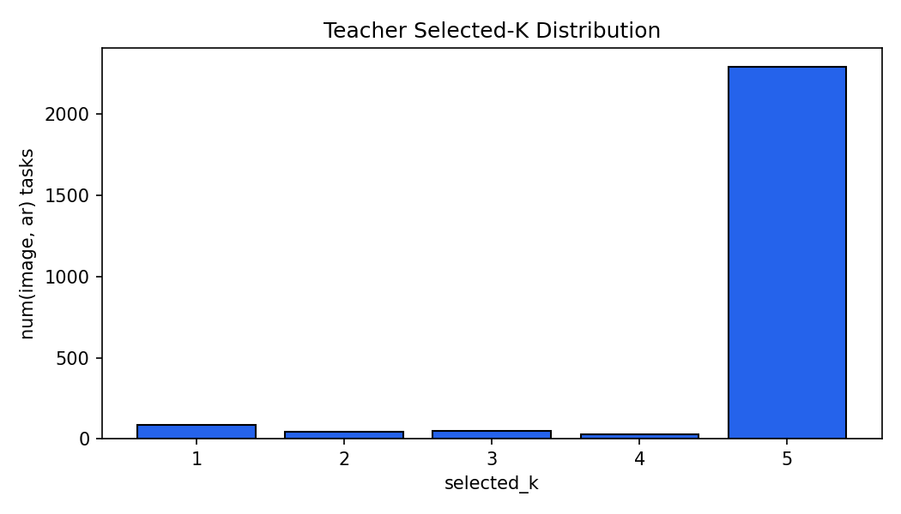
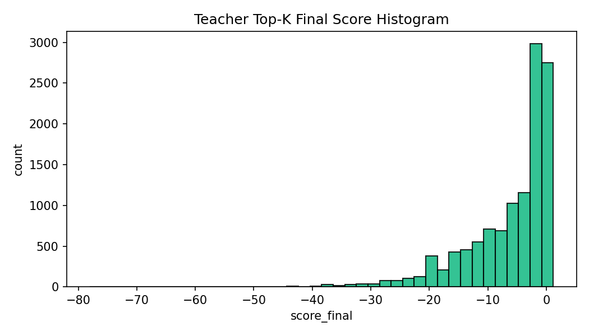
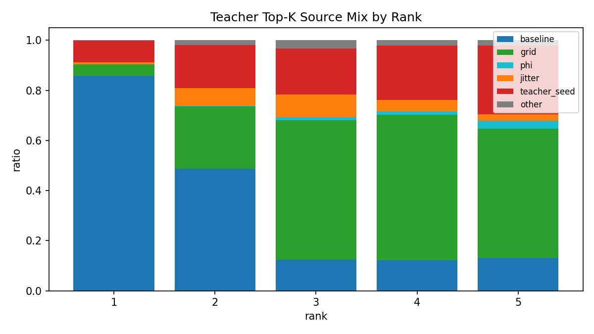
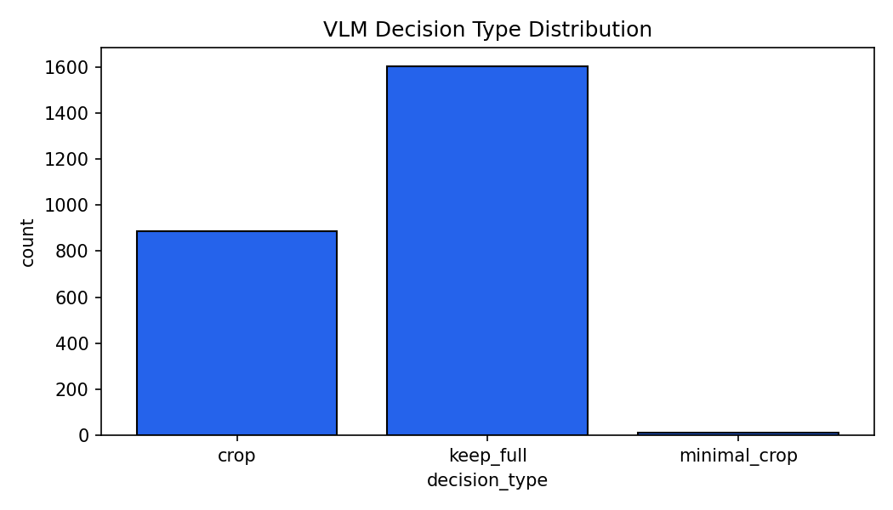
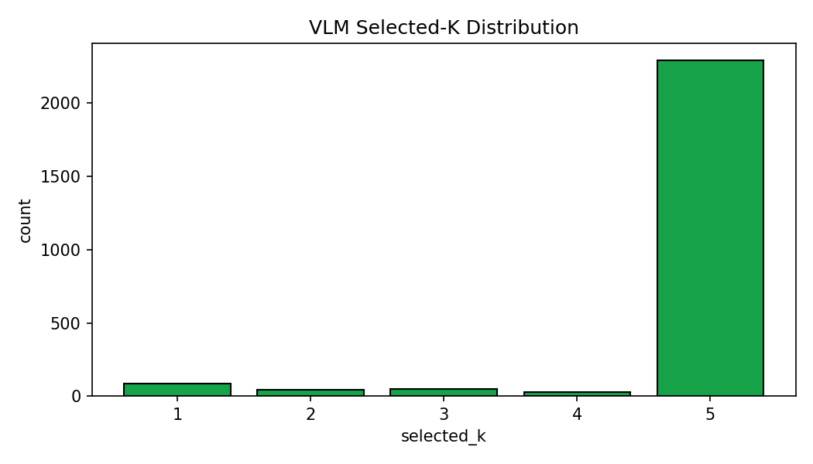
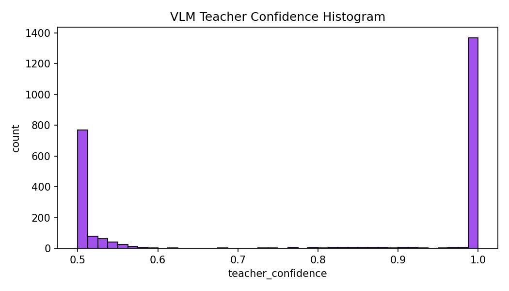
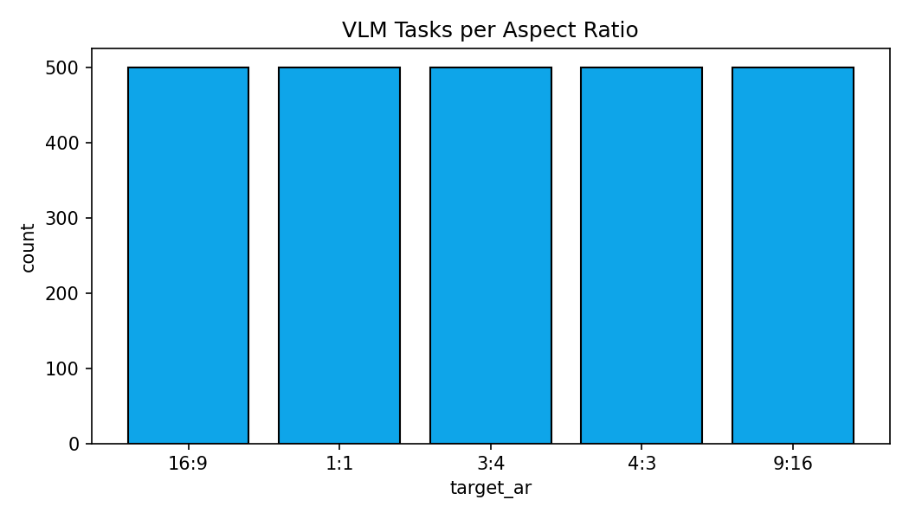
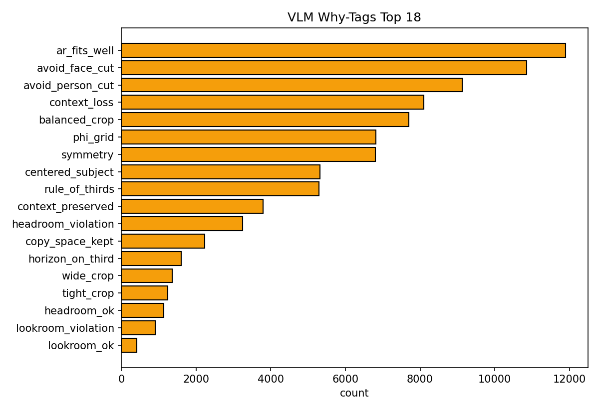
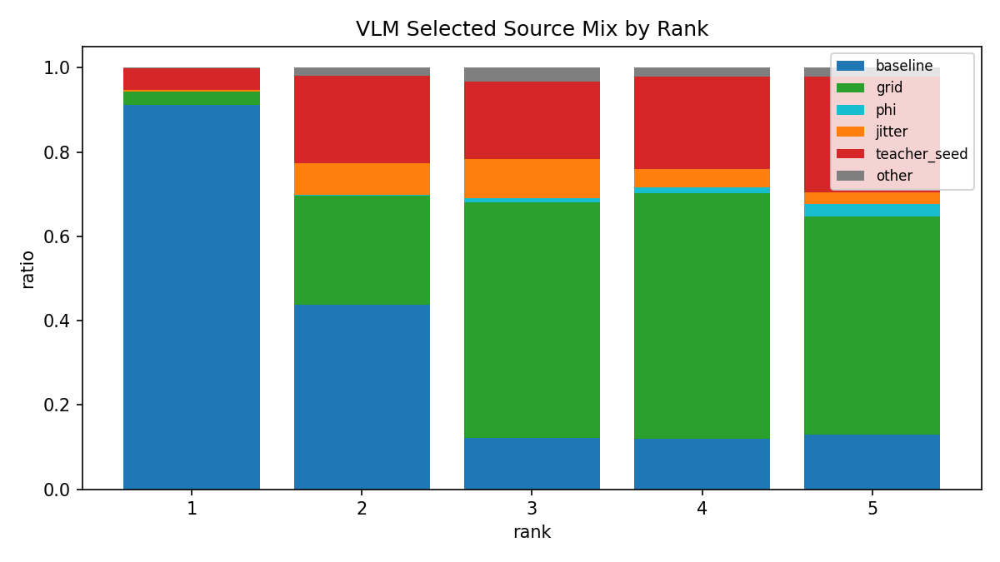

# SSTK 10K_local Cropping Pipeline 실무 보고서 + 논문 초안 (rerun1_public_e2e_260303)

## 0. 문서 목적
본 문서는 아래 4개 축을 교차 분석해, **처음 보는 사용자도 파이프라인 전체를 이해하고 재검증할 수 있도록** 작성한 통합 보고서다.

1. 구현/설계 문서
- `ImplementPlan_Docs/SSTK_Cropping_DataFactory_QwenLabeler_Reorganized_KO_v1_9.md`
- `ImplementPlan_Docs/SSTK_SubjectMode_Routing_Patch_Implementation_KO.md`

2. 현재 `src` 구현 코드
- Filter, Precompute(C1/C2/C3/C5), Subject Routing, Candidate, Teacher Scorer, VLM Labeler, QA/Visualization/Analytics 스크립트 전체

3. 실험 산출물
- run tag: `rerun1_public_e2e_260303`
- 경로: `data/SSTK/10K_local/artifacts/*`

4. 보고 자산
- 경로: `data/SSTK/10K_local/artifacts/reports/rerun1_public_e2e_260303`
- 샘플 12종, analytics 이미지/CSV/JSON 전체

---

## 1. 요약(Executive Summary)
- 데이터 500장(12 super-cat 균형 샘플링)을 대상으로, `Subject-mode routing + Public teacher proposal injection + Teacher real-expensive + VLM(Qwen3-VL-4B)`가 end-to-end로 완료됨.
- Candidate 평균 수는 `402.128 -> 533.332`로 증가했고, proposal 주입률은 `0.0 -> 1.0`으로 정상 동작함.
- Teacher 의사결정은 `minimal_crop 60.68% / crop 39.32%`, VLM은 `keep_full 64.16% / crop 35.44% / minimal_crop 0.40%`.
- Teacher-VLM decision 일치율은 `20.24% (506/2500)`로 낮고, VLM why_text fallback 템플릿 사용률은 `78.998%`로 높아 후속 개선이 필요함.
- 보고서 자산(샘플/통계/이미지)은 본 문서에 전부 링크/삽입했다.

---

## 2. 분석 근거 및 무결성 점검

### 2.1 Stage별 레코드 수 점검
- `filtered_sstk_100.parquet`: **500 rows**
- `feats_c2c3c5_v2_strict_raw.jsonl`: **500 rows**
- `feats_c2c3c5_v2_strict_enriched.jsonl`: **500 rows**
- `feats_c2c3c5_v2_strict_enriched_routed.jsonl`: **500 rows**
- `candidates_ar_rerun1_public_e2e_260303.jsonl`: **500 rows**
- `teacher_scores_ar_rerun1_public_e2e_260303.jsonl`: **500 rows**
- `crop_label_v1_rerun1_public_e2e_260303.jsonl`: **2500 rows (500x5AR)**
- `meta_norm_v1_rerun1_public_e2e_260303.jsonl`: **500 rows**

### 2.2 시각화 산출물 점검
- Precompute viz (`components_rerun1_public_e2e_260303/viz_overview.json`): `selected=12, rendered=12, missing=0`
- Teacher viz (`teacher_scorer_rerun1_public_e2e_260303/viz_overview.json`): `tasks_selected=60, rendered=60, missing=0`
- VLM viz (`vlm_teacher_rerun1_public_e2e_260303/viz_overview.json`): `render_tasks=60, rendered=60, missing=0`

### 2.3 검수 시 확인된 일관성 이슈(중요)
1. `sample_manifest_supercat12.json`의 `run_tag`는 `rerun1_public_e2e`로 기록되어 있고, 보고 폴더명은 `rerun1_public_e2e_260303`임.
2. `sample_summary_table.md`의 `total_candidates` 3건이 `assets/samples/json/*.json`과 불일치.
- `bigstock_image_112983323`: `464 vs 503`
- `bigstock_image_207940879`: `467 vs 462`
- `bigstock_image_134277740`: `578 vs 575`
3. Teacher viz 폴더에 이번 12샘플(60장) 외 과거 이미지가 함께 남아 있음(`177 jpg`).
- `viz_overview.json` 기준 공식 집계는 60 task가 맞음.

권고: 릴리즈 전 `manifest/sample_table/viz_dir`를 run_tag 기준으로 재정리하는 스크립트화 필요.

---

## 3. 파이프라인 상세(알고리즘 + 입출력 + 실행결과)

## 3.1 Phase A: Filter (`src/filter_sstk_dataset.py`)

### 로직
- 해상도/미학 점수/중복 제거/태그 기반 super-cat 매핑/카테고리별 percentile 컷/균형 샘플링 수행.
- 최종 curated pool을 parquet로 출력.

### 입력
- SDP/Train 메타와 tar 매핑 정보

### 출력
- `data/SSTK/10K_local/filtered_sstk_100.parquet`
- 주요 컬럼: `image_id,width,height,aesthetic_score_center,aesthetic_score_pad,tags,tar_name,super_cat,...`

### 결과
- 총 500장
- super-cat 분포(요약):
  - `food 44`, `people_multi 43`, `architecture_exterior 42`, `landscape_nature 42`, `other_ambiguous 42`, 기타 각 41 수준

---

## 3.2 Phase B0: Precompute (`src/extract_features/*`, `src/extract_features_single.py`, `src/extract_features_pipeline.py`)

### 구성
- C1: CLIP 임베딩 (`c1_clip.py`)
- C2: YOLO + SAM/EfficientViT-SAM 기반 segmentation + fallback (`c2_seg.py`)
- C3: MMPose + person prior verification + face/headpose proxy (`c3_pose.py`)
- C4: OCR (`c4_ocr.py`, 선택)
- C5: horizon/symmetry geometry (`c5_geom.py`)

### 핵심 알고리즘 포인트
- C2는 `preferred class(person)` 우선 + mask quality score(`det cover`, `inside ratio`, `area ratio`)로 마스크 선택.
- C2 fallback: saliency mask / AMG fallback.
- C3는 태그/사전 person box 기반으로 불필요한 pose 추론 억제.
- C5는 Hough line 기반 horizon/roll + 좌우 미러 L1로 symmetry 산출.

### 출력
- raw/enriched/merged feature jsonl(행=이미지)
- 이번 run 샘플 top-level key(merged): `image_id,c1_img_embed,c1_txt_embed,c2_seg,c2_det,c3_pose,c5_geom`

---

## 3.3 Phase B0.5: Subject-mode Routing 패치 (`src/routing/subject_mode_router.py`, `src/scripts/enrich_subject_mode_jsonl.py`)

### 목적
- 모드별 정책(`policy_id`)을 Candidate/Teacher 단계로 전달해 shot-type 편향(과한 crop, text/copyspace 오판)을 줄인다.
- 단순 태그 기반 분기 대신 C2/C3/C4/C5 신호를 합성해 `subject_mode`를 결정하고, Guard로 오분류를 차단한다.

### 3.3.1 입력 신호
`route_subject_mode()`는 아래 신호를 사용한다.
- 메타: `super_cat`, `tags_norm`
- 사람 신호: `c3_pose` (num_person, person union)
- 주체 신호: `c2_instances`, `c2_union_box_xyxy`, `c2_primary_idx`
- 텍스트 신호: `ocr_text_boxes_count`, `text_overlay_likely`
- copy-space 신호: `copy_space_flag`, `blank_ratio_est`
- 구도 보조 신호: `horizon_conf`, `symmetry_score`

핵심 파생 변수는 다음과 같다.
$$ \text{text\_signal}=\mathbb{I}[\text{has\_text\_hint} \vee \text{text\_overlay} \vee (\text{ocr\_boxes}>0) \vee (\text{super\_cat}\in\mathcal{T}_{text})] $$
$$ \text{copyspace\_allowed}=\mathbb{I}[\text{copyspace\_signal} \wedge (\text{blank\_ratio}\ge 0.28)] $$

### 3.3.2 1차 모드 추론 (`_infer_mode`)
모드 선택은 softmax 분류가 아니라 **우선순위 rule-chain**이다.
1. `text_document`: `super_cat in TEXT_SUPER_CATS` 또는 text hint
2. `portrait_group`: `num_person >= 2` 또는 group hint
3. `portrait_single`: `num_person == 1` 또는 people super_cat/portrait hint
4. `background_texture_copyspace`: copy-space hint
5. `scene_landscape`: scene super_cat/hint
6. `object_single`: object super_cat/hint
7. `other_ambiguous`: fallback

각 rule은 함께 `rule_id`와 base confidence를 낸다.
- 예: text=0.95, group=0.90, portrait=0.85, copyspace=0.80, scene=0.75, object=0.60, fallback=0.30

### 3.3.3 P0 Guard + Fallback
초기 mode에 대해 아래 guard를 적용한다.
1. `guard_no_person_for_portrait`:
- `mode.startswith("portrait")` 이면서 `num_person<=0`이면 portrait 금지
2. `guard_no_text_signal`:
- `mode==text_document`인데 명시적 text super-cat이 아니고 text signal이 없으면 금지
3. `guard_low_blank_ratio_for_copyspace`:
- `mode==background_texture_copyspace`인데 `blank_ratio < 0.28`이면 금지

guard 트리거 시 `_fallback_mode_after_guard()`를 실행한다.
- 우선순위: `text -> copyspace(허용 시) -> scene -> object -> ambiguous`
- `router_rule_id`는 `base_rule|fallback_rule` 형태로 기록된다.

### 3.3.4 Guard 이후 모드 보정 로직
- `portrait_group`: C3 person box union으로 `subject_set.union_box_xyxy` 재구성
- `object_multi` 자동 승격 조건:
$$ (s_1-s_2)<0.15 \ \wedge\ \text{IoU}(b_1,b_2)<0.75 $$
(상위 2개 C2 instance 중요도 차가 작고 서로 다른 객체일 때)
- `scene_landscape/background_texture_copyspace/text_document`: `primary_idx=-1`, `primary_source=none`

### 3.3.5 출력 필드와 downstream 전달
라우팅 출력 핵심 필드:
- `routing.subject_mode`, `routing.policy_id`, `routing.subject_mode_conf`
- `routing.subject_set` (`union_box_xyxy`, `primary_idx`, `multi_subject` 등)
- `routing.router_rule_id`, `routing.router_signals`

이 값은 이후 단계에서 직접 사용된다.
- Candidate: `resolve_subject_prior()`가 mode/union을 반영해 주체 prior를 결정
- Teacher: `apply_subject_policy_overrides()`가 `tau_improve`, `w_area`, `lambdas`를 mode별로 재설정
- QA: guard consistency, policy 분포 집계에 사용

### 3.3.6 결과(500 images)
- `subject_mode_counts`: copyspace 97, object_single 63, object_multi 15, scene 66, text 76, portrait_single 90, portrait_group 86, ambiguous 7
- `policy_id_counts`: 모드와 1:1 매핑
- `router_rule_id` 분포(상위): `rule_copyspace 97`, `rule_portrait 90`, `rule_group 86`, `rule_text 76`, `rule_scene 53`, `rule_object 42`
- global QA 기준 guard 위반률: `guard_no_person_for_portrait=0.0`, `guard_low_blank_ratio_copyspace=0.0`, `guard_no_text_signal=0.036`

---

## 3.4 Public Teacher Proposal Inference/Build
- 추론: `src/scripts/infer_public_cropping_teachers.py`
- 변환: `src/scripts/build_teacher_proposals_jsonl.py`
- gate: `src/scripts/check_candidate_injection_gate.py`

### 3.4.1 문제 정의
이미지 $I$에 대해 공개 teacher 집합 $\mathcal{T}=\{\text{GAIC},\text{CACNet},\text{CGS}\}$가 생성한 proposal을
$$ \mathcal{P}(I)=\{(t, b_{t,j}, s_{t,j})\} $$
형태로 수집한다. 여기서 $b_{t,j}$는 정규화 박스, $s_{t,j}$는 teacher 점수다.

### 3.4.2 구현 파이프라인
1. `infer_public_cropping_teachers.py`
- raw 저장 단위: **(image_id, teacher_id)** 1행
- 스키마: `image_id, teacher_id, num_proposals, proposals[], image_size, error`
- teacher별 기본 출력 개수:
  - GAIC: `--gaic_topk` 기본 4
  - CGS: `--cgs_topk` 기본 4
  - CACNet: 모델 자체가 단일 crop 예측(코드 주석: "One crop prediction from official demo")

2. `build_teacher_proposals_jsonl.py`
- raw -> canonical 변환
- teacher별 `free_form`를 score 내림차순 정렬 후 `topk_per_teacher`(기본 3)로 절단
$$ \texttt{teacher\_proposals} = \{t: \{\texttt{free\_form}: [...],\texttt{by\_ar}:\{\}\}\} $$
- 본 run에서는 `by_ar`는 비어 있고(`{}`), free-form만 사용

3. `check_candidate_injection_gate.py`
- `proposal_injected_rate \ge \tau_{inj}` 검사
- 기본값: $\tau_{inj}=0.95$

### 3.4.3 "이미지당 결과가 1개인가?"에 대한 코드/산출물 분석
결론: **단계별로 다르다.**
1. Raw 추론 단계(`teacher_raw...jsonl`): 이미지당 teacher별 proposal은 1개가 아님
- CACNet: 항상 1개
- GAIC/CGS: 대부분 4개 (일부 3개)

2. Canonical 단계(`teacher_proposals...jsonl`): `topk_per_teacher=3` 적용
- CACNet: 1개 유지
- GAIC/CGS: 4 -> 3으로 절단

3. Candidate 주입 단계(`generate_candidates.py`):
- `teacher_max_seeds_per_teacher=1`(현재 run 기본값)
- 즉 teacher마다 AR당 seed는 최대 1개만 사용하고, 나머지는 local jitter로 확장
$$ K_{use}(t,r)=\min\left(K_{seed},\ |\mathcal{P}^{ar}_{t,r}|+|\mathcal{P}^{free}_{t}|\right),\quad K_{seed}=1 $$

따라서 "결과가 하나만 나온다"는 현상은 **알고리즘의 본질적 제한**이 아니라, 현재 run의 **주입 예산 설정(`teacher_max_seeds_per_teacher=1`)**에 따른 동작이다.

### 3.4.4 run 결과 (`rerun1_public_e2e_260303`)
- raw: `teacher_raw_public_rerun1_public_e2e_260303.jsonl` = **1500행** (=500 이미지 x 3 teacher)
- canonical proposals: `teacher_proposals_public_rerun1_public_e2e_260303.jsonl` = **500행**
- teacher별 정상 추론: `gaic 500 / cacnet 500 / cgs 500`, error row=0
- raw proposal 개수 분포:
  - `cacnet`: 1개 고정(500/500)
  - `gaic`: 4개 498건, 3개 2건
  - `cgs`: 4개 498건, 3개 2건
- canonical free-form 개수 분포:
  - `cacnet`: 1개
  - `gaic`: 3개
  - `cgs`: 3개

---

## 3.5 Candidate Generator (AR-조건부 후보 생성)
대상 코드: `src/generate_candidates.py`

### 3.5.1 수학적 정의
목표 AR 집합 $\mathcal{R}=\{1\!:\!1,9\!:\!16,16\!:\!9,3\!:\!4,4\!:\!3\}$에 대해,
이미지 $I$마다 AR별 후보 집합
$$ \mathcal{B}_r = \{b_{r,i}\}_{i=1}^{N_r}, \quad b_{r,i}=(x_1,y_1,x_2,y_2)\in[0,1]^4 $$
을 생성한다.

정규화 영역에서의 후보 면적과 실제 AR 오차는
$$ a(b)=(x_2-x_1)(y_2-y_1), \quad \hat r(b)=\frac{(x_2-x_1)\cdot r_I}{(y_2-y_1)} $$
$$ |\hat r(b)-r_t| \le \epsilon_r $$
로 검사한다. 여기서 $r_I=W/H$는 원본 AR, $r_t$는 target AR다.

### 3.5.2 Baseline 후보 (must-keep)
코드상 baseline은 과도한 crop 방지를 위한 **안전 앵커**이며, 대부분 `must_keep=True`로 보호된다.

1. Full-frame baseline (`baseline_full`)
$$ |r_I-r_t|\le \epsilon_{full} \Rightarrow b_{full}=(0,0,1,1) $$
- 중요한 점: 이는 AR 무관 free-form 후보가 아니다.
- `eps_ar_full=0.01` 조건을 만족할 때만 추가되며, `add_candidate()`의 AR 검사(`ar_tol=0.02`)도 다시 통과해야 한다.

2. Max-area center baseline (`baseline_maxarea_center`)
- AR당 **정확히 1개** 생성된다.
- $r_I\ge r_t$이면 폭 제한($w=r_t/r_I, h=1$), $r_I<r_t$이면 높이 제한($h=r_I/r_t, w=1$).

3. Max-area slide baseline (`baseline_maxarea_slide`)
- center baseline을 subject centroid 쪽으로 sliding.
- 개수:
$$ N_{slide}=|\texttt{maxarea\_slide\_offsets}|= \begin{cases} 3 (\text{default}) 5 (\text{copyspace hint}) \end{cases} $$

4. Copy-space 정렬 후보 (`copyspace_align`)
- copyspace 힌트가 있을 때만 1개 추가(의도적 여백 확보).
- baseline 계열이지만 `must_keep=False`로 운영.

요약하면 baseline 총량은
$$ N_{base}=\mathbb{I}[\text{full-frame 허용}] + 1 + N_{slide} + \mathbb{I}[\text{copyspace hint}] $$
이다.

참고: scorer 코드에는 `baseline_maxarea_subject` 호환 분기가 있으나, 본 run의 generator는 해당 source를 생성하지 않는다.

### 3.5.3 Baseline 외 후보: Grid / Subject / Jitter / Phi
#### (A) Grid anchor + multi-scale (`grid`)
`add_center_area_box`는 중심 $(c_x,c_y)$와 목표 면적 $a_t$에서 박스를 만든다.
$$ w_n = \sqrt{\frac{a_t\, r_t}{r_I}}, \quad h_n = \sqrt{\frac{a_t\, r_I}{r_t}} $$
$$ b=(c_x-\tfrac{w_n}{2}, c_y-\tfrac{h_n}{2}, c_x+\tfrac{w_n}{2}, c_y+\tfrac{h_n}{2}) $$

raw 생성량(필터 전)은
$$ N_{grid,raw}=(M+1)(N+1)|\texttt{scale\_set}| $$
이며, 현재 기본값(`12x12`, `|scale_set|=8`)에서는 최대 $13\times13\times8=1352$다.

#### (B) Subject template (`object_template`)
subject prior box 크기 $(w_s,h_s)$에서 스케일 템플릿을 적용한다.
$$ a_t=\text{clip}(w_sh_s\cdot m^2, a_{min}, a_{max}),\quad m\in\texttt{object\_template\_scales} $$
기본 개수는 3개다.

#### (C) Saliency-guided jitter (`jitter`)
$$ \Delta x \in \{0,\pm f_1w_s,\pm f_2w_s, ...\},\quad \Delta y \in \{0,\pm f_1h_s,\pm f_2h_s, ...\} $$
기본값(`jitter_fracs={0.03,0.06}`, `jitter_scales=3`)에서 raw 최대 개수는
$$ N_{jitter,raw}=(1+2\cdot2)^2\cdot3=75 $$
이다.

#### (D) Phi/Thirds (`phi_thirds`)
중심점 집합
$$ \{1/3,2/3,0.382,0.618\}^2 $$
(총 16개)과 `phi_scales`를 조합한다. 기본 raw 개수는 $16\times3=48$.

### 3.5.4 Public teacher proposal 주입 (v1.9)
코드 경로: `inject_teacher_proposals()`

1. seed 선택
- AR-specific proposal이 있으면 우선 사용
- 없으면 free-form을 AR projection해서 seed로 사용

2. AR projection
$$ b' = \text{project\_box\_to\_ar}(b, r_t/r_I, \texttt{prefer\_expand}) $$

3. local jitter neighborhood
$$ b_{jit}=\text{Proj}_{AR}\big(\text{ShiftScale}(b',\Delta x,\Delta y,s)\big) $$
기본값(`shift_frac=0.03`, `scales={0.92,1.0,1.08}`)에서 seed 1개당 jitter raw 최대는
$$ ((2\cdot1+1)^2-1)\times3=24 $$
이다.

4. source 기록
- seed/proj: `teacher:<teacher_id>`
- 근방 jitter: `teacher:jitter`

현재 run은 `teacher_max_seeds_per_teacher=1`이므로 AR당 teacher별 seed는 최대 1개다.

### 3.5.5 Dedupe + NMS + Diversity
1. Dedupe: 좌표 6자리 라운딩 key로 중복 제거(`dedupe_by_rounded_box`)
2. Staged NMS:
- `must_keep` 우선 유지
- teacher 계열: `teacher_nms_iou`
- 일반 후보: `nms_iou`
3. Diversity sampling:
- feature $f(b)=[c_x,c_y,\log w,\log h]$
- farthest-point greedy
4. AR별 최종 cap:
- `max_candidates_per_ar`(기본 240) 내에서 must-keep을 먼저 보존 후 잔여 슬롯에 다양성 샘플 채움

### 3.5.6 후보 생성 품질지표
설계 레벨 PoC 지표:
$$ \text{Recall@GT}(\tau)=\Pr\Big[\max_{b\in\mathcal{B}_r}\text{IoU}(b,b_{GT})\ge \tau\Big] $$
$$ \text{OracleTop1IoU}=\max_{b\in\mathcal{B}_r}\text{IoU}(b,b_{GT}) $$

현재 run은 GT 박스가 없는 운영셋이라 proxy를 사용했다.
$$ \text{proposal\_injected\_rate}=\frac{\#\{I:\text{proposal injected}\}}{\#\{I\}} $$
$$ \text{teacher\_seed\_top1\_rate}=\frac{\#\{(I,r):\text{top1 source startswith teacher:}\}}{\#\{(I,r)\}} $$

### 3.5.7 run 결과
- 이미지 수: 500
- 후보 수/이미지: mean `533.332`, p50 `530`, p90 `612.1`, min `214`, max `713`
- proposal 주입률: `1.0`
- source mix 상위: `grid 153,695`, `teacher:jitter 64,004`, `jitter 21,576`, `phi_thirds 15,797`
- teacher 주입 stage: `seed 7,500`, `proj 7,492`, `jitter 194,470`

---

## 3.6 Teacher Scorer 설계 (Cheap -> Expensive -> Keep/Crop -> Top-K Diversity)
대상 코드: `src/score_teacher.py`

운영 원칙은 **Good Composition Closed-Loop**다.
$$ \text{Rule} \rightarrow \text{Feature} \rightarrow \text{Score} \rightarrow \text{QA} $$
즉, 구도 규칙이 feature 계산과 score 항으로 연결되고, 동일 항이 QA 지표로 재검증된다.

### 3.6.1 Hard constraints (즉시 reject)
후보 $b$에 대해 아래를 위반하면 `hard_reject=True`:
$$ a_{min} \le a(b) \le a_{max},\quad |\hat r(b)-r_t| \le \epsilon_r $$
- face cut: `hard_face_rule=1`이면 즉시 reject
- joint cut: severe joint count가 `hard_joint_reject_count` 이상이면 reject

코드 태그: `area_violation`, `ar_violation`, `face_cut`, `joint_cutoff`.

### 3.6.2 Cheap score: 항별 의미와 계산
Cheap 단계는 후보 축소($N\to M$)가 목적이며, 최종식은
$$ S_{cheap}=\lambda_{cov}C_{subj}-\lambda_{cut}P_{cut}-\lambda_{text}P_{text}+\lambda_{comp}R_{comp}+\lambda_{hr}R_{hr}+\lambda_{lr}R_{lr}+\lambda_{sym}R_{sym}+\lambda_{ctx}R_{ctx}+\lambda_{cs}R_{cs} $$
이다.

1. 주체 보존
$$ C_{subj}=\frac{|b\cap b_{subj}|}{|b_{subj}|} $$

2. Cut penalty
$$ P_{cut}=\alpha_f\mathbf{1}[\text{face\_cut}] + \alpha_j\cdot\text{joint\_cutoff\_score} + \alpha_b\mathbf{1}[\text{subj\_touch\_border}] $$

3. Composition reward
$$ R_{comp}=w_{third}R_{third}+w_{\phi}R_{\phi}+w_{center}R_{center}+w_{horizon}R_{horizon} $$
- $R_{third},R_{\phi},R_{center}$: subject centroid의 crop-local 거리 기반 보상
- $R_{horizon}$: horizon이 thirds 근처일수록 보상(`horizon_conf`가 임계 이상일 때만 활성)

4. Headroom / Lookroom
$$ R_{hr}=-\frac{|r_h-r_h^*|}{\sigma_h}-\gamma_h\,\text{overflow}_h $$
$$ R_{lr}=-\frac{|r_l-r_l^*|}{\sigma_l}-\gamma_l\,\text{overflow}_l $$
- lookroom은 gaze 방향이 left/right일 때만 활성

5. Context / Copy-space
$$ R_{ctx}=-\frac{|\text{subj\_area}-\text{ctx\_target}|}{\sigma_{ctx}},\quad R_{cs}=\max(0,1-\text{subj\_area}) $$
- `has_copy_space` route일 때 `R_cs` 가중치가 강화된다.

### 3.6.3 Route-aware 파라미터 오버라이드
`apply_subject_policy_overrides()`가 `subject_mode/policy_id`를 받아 다음을 재설정한다.
- `tau_improve`, `w_area`
- `lambdas` (`cov/cut/text/comp/hr/lr/sym/ctx/cs`)

예시:
- `portrait_*`: HR/LR, cut 가중치 강화
- `scene_landscape`: `tau_improve` 상향, `w_area` 하향, HR/LR 비활성
- `copyspace`: copy-space/context 강화, HR/LR 비활성
- `text_document`: text/cut 강화, HR/LR 비활성

### 3.6.4 Expensive score + Final score
`apply_expensive_score()` 기준:
$$ S_{exp}=w_a A_{norm}+w_{ca}\cos(E_I,E_T)+w_{cov}C_{subj}-w_{cut}P_{cut}-w_{text}P_{text}+w_{edge}R_{edge} $$
$$ S_{final}=S_{exp}+w_{area}\log(a(b)+\epsilon) $$

- real mode: aesthetic predictor + image-text cosine
- proxy mode: cheap 단계 proxy feature
- `R_edge`는 주체가 crop 경계에 가까울수록 음수 페널티가 커진다.

### 3.6.5 Cheap Top-M은 어디에 저장되는가?
`teacher_scores_ar_*.jsonl`의 AR별 결과에 저장된다.
- 경로: `teacher_scorer.results_by_ar[AR].cheap_top_m`
- 함께 저장: `num_cheap_kept`, `num_expensive_eval`, `selected_topk`, `hard_negatives`

즉, Top-M 자체가 보고 산출물에 남아 사후 재검증 가능하다.

### 3.6.6 Keep-vs-Crop decision 의미와 결정 규칙
baseline 후보 $b_{base}$와 최고점 후보 $b_{best}$의 점수 차를 사용한다.
$$ \Delta=S_{final}(b_{best})-S_{final}(b_{base}) $$

1. `crop`
- 조건: $\Delta\ge\tau_{improve}$
- 의미: baseline 대비 품질 개선이 임계치를 넘으므로 적극 crop

2. `keep_full`
- 조건: $\Delta<\tau_{improve}$ 이고 baseline source가 `baseline_full`
- 의미: 원본 프레임 유지가 최적

3. `minimal_crop`
- 조건: $\Delta<\tau_{improve}$ 이고 baseline이 full-frame이 아님
- 의미: AR 정합을 위한 최소 수준 crop만 허용

추가로, baseline이 hard-invalid면 non-hard 상위 후보로 `baseline_effective`를 대체해 의사결정을 안정화한다.

### 3.6.7 Top-K + Diversity
정렬된 후보에서 greedy 선택:
$$ \max_{b_k\in\mathcal{S}} \text{IoU}(b,b_k) < \tau_{div} $$

실구현 포인트:
- `force_ids=[chosen_candidate_id, baseline_candidate_id]`를 먼저 주입
- diversity 제약으로 K가 모자라면 tail에서 보충

### 3.6.8 설계 확장 항목(PICD/Teacher consensus)
문서 v1.7/v1.8의
- $R_{picd}$ (composition embedding)
- $R_{teach}$ (teacher consensus)
는 설계 확장 항목이며, 본 run의 `src/score_teacher.py` 실수식에는 직접 포함되지 않는다.

설계 문서식:
$$ R_{picd\text{-}preserve}(b)=\cos(e(I),e(I_b))-\eta \cdot KL\!\left(p(I)\parallel p(I_b)\right) $$
$$ R_{picd\text{-}target}(b)=p(I_b)[c^*] $$
$$ R_{teach}(b)=\sigma\!\left(\frac{\rho(b)-\tau}{\beta}\right)\cdot\mathbf{1}[\text{consensus}] $$

### 3.6.9 run 결과 (AR-task=2500)
- decision: `minimal_crop 1517`, `crop 983`
- rate: `minimal_crop 0.6068`, `crop 0.3932`
- 위험 지표: `face_cut 0.0832`, `joint_cut 0.1708`, `subject_coverage_fail 0.4316`
- proposal KPI: `teacher_seed_top1_rate_all 0.0872`, `teacher_seed_selected_any_rate_all 0.4560`
- guard KPI: `guard_no_person_for_portrait 0.0`, `guard_no_text_signal 0.036`, `guard_low_blank_ratio_copyspace 0.0`

---

## 3.7 VLM/MLLM Teacher 라벨 생성기 (기본: Qwen, 플러그인 구조)
대상 코드: `src/vlm_teacher_labeler.py`

### 3.7.1 기본 원칙
- VLM은 **좌표를 직접 생성하지 않고**, 시스템이 만든 candidate pool에서 `selected_topk`를 고른다.
- 즉, 좌표 생성 문제를 `candidate-pick + explanation` 문제로 변환한다.

### 3.7.2 입력 task 구조
각 `(image_id, target_ar)` task에 대해:
- `candidates` (topM)
- `numeric_topk` (teacher score 기반 fallback 후보)
- `baseline_candidate`, `decision(delta, tau)`
- `composition_checks_top1`, `meta_norm_v1`

정리하면 VLM 입력은
$$ \mathcal{X}_{vlm}(I,r)=\{C_{topM}(I,r), C_{num}(I,r), b_{base}, \Delta, \tau, \text{meta\_norm}, \text{checks}\} $$
이며, VLM의 역할은
$$ \mathcal{X}_{vlm}(I,r)\rightarrow \{(\text{candidate\_id}_k,\text{why}_k)\}_{k=1}^{K} $$
로 정의된다.

### 3.7.3 정규화/검증 파이프라인
`normalize_backend_output()` 기준:
1. 모델 출력에서 `selected_topk` 파싱
2. `candidate_id`가 유효한 항목만 채택
3. 부족한 rank는 `numeric_topk`로 채움
4. `why_tags/why_text` sanitize
5. `also_considered`를 모델 출력 또는 hard negatives에서 구성

즉, 최종 `selected_topk`는
$$ \text{Selected} = \text{ValidModelPick} \oplus \text{NumericFill} $$
구조이며, 비정상 출력으로 인한 공백 rank를 deterministic하게 메운다.

또한 모델이 `decision_type`을 부정확하게 내놓더라도, 파서가 허용 집합
$$ \{\text{crop},\text{minimal\_crop},\text{keep\_full}\} $$
에 없는 값을 걸러 baseline decision으로 복구한다.

### 3.7.4 confidence 산식
코드에서 teacher confidence는
$$ \text{conf}=\text{clip}\big(0.5+\max(0, S_{final}^{(1)}-S_{final}^{(2)}),\,0,1\big) $$
로 계산된다.

여기서 $S_{final}^{(1)}, S_{final}^{(2)}$는 `selected_topk` 상위 2개 후보의 teacher final score다.

### 3.7.5 fallback 전략
- JSON 파싱/정규화 실패 시 heuristic backend로 fallback
- fallback why text 템플릿:
  - `final`, `subject_coverage`, `face_cut` 기반 문장
- OOM 시 CPU backend 재시도 옵션 제공

fallback label의 핵심은 좌표 생성이 아니라 이미 존재하는 `numeric_topk` 기반 재구성이다.
$$ \text{FallbackTopK} = \text{TopK}\big(\text{numeric\_topk}\big) $$
따라서 모델 실패 시에도 구조적 일관성은 유지된다.

실제 run에서 summary상 fallback backend 사용 task는 0이지만, `why_text`의 rank2~5가 template에 수렴한 점은 별도 개선 포인트다.

### 3.7.6 rationale tags / prompt template
- 허용 why tag 어휘(`ALLOWED_WHY_TAGS`) 내에서만 출력하도록 강제
- 프롬프트는 다음 정책을 명시한다.
1. 후보 id를 입력 pool에서만 선택
2. `selected_topk` JSON schema 준수
3. `why_tags`는 허용 vocab만 사용
4. `composition_checks`는 수치 기반 근거를 유지

즉 VLM은 좌표 예측기가 아니라 **설명 가능한 selector/verifier**로 동작한다.

### 3.7.7 모델/백엔드
- 현재 run: `qwen25_vl` + `Qwen/Qwen3-VL-4B-Instruct`
- 플러그인 구조로 heuristic 등 다른 backend 교체 가능
- 설계 문서(v1.8) 관점의 확장 후보: InternVL2.5, Molmo, MiniCPM-V, Idefics3
- 운영 권장안: Primary Teacher + Adjudicator Teacher의 2-Teacher 합의 구조

### 3.7.8 run 결과
- decision: `keep_full 1604`, `crop 886`, `minimal_crop 10`
- selected_k: `{1:86,2:44,3:49,4:27,5:2294}`
- task match(teacher vs vlm): `506/2500 = 0.2024`
- why_text fallback 템플릿 비율: `9400/11899 = 0.78998`
  - rank1 `0.0004`, rank2~5 `1.0`

---

## 3.8 Phase C: Verify/QA (자동 + 샘플링 QC)
대상 코드: `src/scripts/qa_teacher_report.py`, `src/scripts/build_teacher_topk_analytics.py`, `src/visualize_vlm_teacher_labels.py`

### 3.8.1 QA의 역할(Release Gate 관점)
QA는 단순 통계 출력이 아니라, **라벨 릴리즈 전 품질 게이트**다.
- Structural 유효성: 포맷/AR/면적/Top-K 구조 파손 방지
- Semantic 유효성: 사람/얼굴/관절/텍스트/맥락 품질 감시
- Routing 일관성: mode guard 위반 여부 감시
- Proposal 효과 검증: 주입이 실제 선택으로 연결되는지 측정

즉, 생성(Phase B) 결과를 운영 가능한 품질지표로 재투영하는 단계다.

### 3.8.2 Structural checks
운영 체크 항목:
1. row cardinality 일치
- candidate=500, teacher=500, vlm=2500
2. 박스/AR/면적 유효성
$$ a_{min}\le a(b)\le a_{max},\quad |\hat r(b)-r_t|\le\epsilon_r $$
3. Top-K 형식/스키마 검사

### 3.8.3 Semantic checks
QA 집계식(코드 구현):
$$ \text{face\_cut\_rate}=\frac{\#\{\text{top1 face\_cut}=1\}}{N} $$
$$ \text{joint\_cut\_rate}=\frac{\#\{\text{top1 joint\_cutoff}>0.35\}}{N} $$
$$ \text{subject\_coverage\_fail\_rate}=\frac{\#\{\text{top1 coverage}<\tau_{cov}\}}{N},\quad \tau_{cov}=0.9 $$
$$ \text{copyspace\_preserve\_rate}=\frac{\#\{1-\text{subj\_area}\ge \tau_{cs}\}}{\#\{\text{copyspace subset}\}},\quad \tau_{cs}=0.25 $$

### 3.8.4 Proposal 주입 효과 지표
$$ \text{proposal\_injected\_rate}=\frac{\#\{\text{proposal injected}\}}{N} $$
$$ \text{teacher\_seed\_top1\_rate\_all}=\frac{\#\{\text{top1 source is teacher:*}\}}{N} $$
$$ \text{proposal\_rescue\_rate\_proxy}=\frac{\#\{\text{proposal injected and top1 is teacher:*}\}}{\#\{\text{proposal injected}\}} $$

### 3.8.5 Router guard consistency
$$ \text{guard\_no\_person\_for\_portrait\_rate}=\frac{\#\{\text{portrait mode with num\_person}=0\}}{N} $$
$$ \text{guard\_no\_text\_signal\_rate}=\frac{\#\{\text{text\_document with no OCR/text signal}\}}{N} $$
$$ \text{guard\_low\_blank\_ratio\_copyspace\_rate}=\frac{\#\{\text{copyspace mode and blank ratio<thr}\}}{N} $$

### 3.8.6 Human spot-check / Golden gate / Composition regression
설계 문서(v1.9) 기준 운영 권장:
1. Human spot-check: category x difficulty strata 샘플링 검수
2. Golden gate: 고정 benchmark 통과 후 release
3. Composition regression (PICD CDA):
$$ \text{CDA}=\frac{1}{N}\sum_{i=1}^{N}\mathbf{1}[\hat{neg}_i=neg_i] $$

주의: 본 run(`rerun1_public_e2e_260303`) 보고 산출물은 자동 QA 중심이며, Golden/CDA 결과 파일은 포함되지 않았다.

### 3.8.7 run 결과 핵심
- proposal_injected_rate: `1.0`
- guard: `no_person_for_portrait=0.0`, `low_blank_ratio_copyspace=0.0`, `no_text_signal=0.036`
- teacher-vlm decision match: `0.2024`
- VLM fallback why_text 비율: `0.78998`

---

## 4. 정량 결과

### 4.1 전체 파이프라인 지표 요약
|구간|핵심 지표|
|---|---|
|Filter|500 images curated|
|Candidate|mean 533.332/img, proposal injected 1.0|
|Teacher|minimal 60.68%, crop 39.32%|
|VLM|keep_full 64.16%, crop 35.44%, minimal 0.40%|
|Teacher↔VLM|decision match 20.24%|
|VLM 설명|fallback why_text 78.998%|

해석:
- `Candidate` 행은 탐색 공간 크기와 proposal 주입 정상 동작 여부를 함께 보여준다.
- `Teacher` 행은 rule/score 기반 정책 결정의 보수성(현재 minimal_crop 우세)을 나타낸다.
- `VLM` 행은 최종 라벨러의 결정 분포다. Teacher 대비 keep_full 비중이 더 높다.
- `Teacher↔VLM`은 정책 정합도 지표이며, 낮으면 프롬프트/validator/decision alignment 개선이 필요하다.
- `VLM 설명`은 자연어 품질 지표다. 현재 fallback template 의존도가 높다.

### 4.2 Teacher by-AR (QA CSV)
|AR|minimal_crop|crop|delta_mean|face_cut|joint_cut|subject_cov_fail|fallback_rate|
|---|---:|---:|---:|---:|---:|---:|---:|
|16:9|0.650|0.350|0.7894|0.084|0.214|0.400|0.226|
|1:1|0.588|0.412|1.0117|0.058|0.150|0.394|0.138|
|3:4|0.582|0.418|1.3385|0.084|0.152|0.454|0.126|
|4:3|0.664|0.336|0.5686|0.038|0.124|0.278|0.114|
|9:16|0.550|0.450|1.8922|0.152|0.214|0.632|0.206|

컬럼 설명:
- `minimal_crop`, `crop`: 해당 AR에서 keep/crop 의사결정 비율
- `delta_mean`: $\Delta=S_{final}(best)-S_{final}(baseline)$ 평균
- `face_cut`, `joint_cut`, `subject_cov_fail`: top1 위험률
- `fallback_rate`: strict valid 부재 시 fallback branch가 켜진 비율

해석 포인트:
- `9:16`은 `crop`와 `delta_mean`이 가장 높고(`0.450`, `1.8922`) 동시에 위험률도 높다.
- `4:3`은 상대적으로 보수적이며 위험률이 낮다(`face_cut 0.038`, `subject_cov_fail 0.278`).
- narrow AR(특히 `9:16`)에서 주체 보존/절단 trade-off가 가장 크게 나타난다.

### 4.3 이전 run 대비 (`rerun1_public_e2e_subject_mode`)
|항목|이전|현재|변화|
|---|---:|---:|---|
|Candidate avg/img|402.128|533.332|+131.204|
|Proposal injected rate|0.000|1.000|정상 활성화|
|Teacher crop rate|0.3976|0.3932|유사|
|Teacher minimal_crop rate|0.6024|0.6068|유사|
|VLM crop count|765|886|증가|
|VLM keep_full count|1733|1604|감소(keep 편향 완화)|
|VLM minimal_crop count|2|10|소폭 증가|

해석:
- 핵심 구조 변화는 `proposal injection`의 활성화와 후보 공간 확장(+131.204/img)이다.
- Teacher 의사결정률은 거의 유지되어, candidate space 확장이 policy 붕괴 없이 흡수되었음을 시사한다.
- VLM은 keep 편향이 일부 완화되었지만, Teacher와의 decision 정합은 여전히 낮아(20.24%) 별도 정렬 작업이 필요하다.

---

## 5. 샘플(12 super-cat) 분석

### 5.1 샘플 subset 요약 (`samples_stage_summary.json`)
- 샘플 수: 12
- teacher decision counts(12x5=60 tasks): `crop 30`, `minimal_crop 30`
- vlm decision counts: `keep_full 39`, `crop 21`
- teacher-vlm match rate: `14/60 = 0.2333`

### 5.2 샘플별 수치 요약(샘플 JSON 기준)
|super_cat|image_id|cand_total|teacher(crop/minimal/keep)|vlm(crop/minimal/keep)|t-v match(5AR)|
|---|---|---:|---|---|---:|
|transportation|bigstock_image_109682993|559|1/4/0|1/0/4|1/5 (0.20)|
|indoor_interior|bigstock_image_112983323|503|5/0/0|1/0/4|1/5 (0.20)|
|people_multi|bigstock_image_122199020|545|1/4/0|3/0/2|1/5 (0.20)|
|documents_text|bigstock_image_129575693|535|5/0/0|2/0/3|2/5 (0.40)|
|sports|bigstock_image_134277740|575|1/4/0|4/0/1|1/5 (0.20)|
|product_object|bigstock_image_141430643|534|2/3/0|2/0/3|2/5 (0.40)|
|animals|bigstock_image_149147297|492|5/0/0|0/0/5|0/5 (0.00)|
|architecture_exterior|bigstock_image_163220822|476|3/2/0|1/0/4|1/5 (0.20)|
|food|bigstock_image_165044747|533|1/4/0|0/0/5|0/5 (0.00)|
|other_ambiguous|bigstock_image_207940879|462|0/5/0|1/0/4|0/5 (0.00)|
|landscape_nature|bigstock_image_218991439|480|3/2/0|2/0/3|2/5 (0.40)|
|people_single|sstk_image_1772011034|527|3/2/0|4/0/1|3/5 (0.60)|

### 5.3 12샘플 이미지(원본+단계별 결과)
|super_cat|image_id|원본|Precompute Combined|Teacher(1:1)|VLM(1:1)|샘플 JSON|
|---|---|---|---|---|---|---|
|animals|bigstock_image_149147297|||||[json](assets/samples/json/bigstock_image_149147297.json)|
|architecture_exterior|bigstock_image_163220822|||||[json](assets/samples/json/bigstock_image_163220822.json)|
|documents_text|bigstock_image_129575693|||||[json](assets/samples/json/bigstock_image_129575693.json)|
|food|bigstock_image_165044747|||||[json](assets/samples/json/bigstock_image_165044747.json)|
|indoor_interior|bigstock_image_112983323|||||[json](assets/samples/json/bigstock_image_112983323.json)|
|landscape_nature|bigstock_image_218991439|||||[json](assets/samples/json/bigstock_image_218991439.json)|
|other_ambiguous|bigstock_image_207940879|||||[json](assets/samples/json/bigstock_image_207940879.json)|
|people_multi|bigstock_image_122199020|||||[json](assets/samples/json/bigstock_image_122199020.json)|
|people_single|sstk_image_1772011034|||||[json](assets/samples/json/sstk_image_1772011034.json)|
|product_object|bigstock_image_141430643|||||[json](assets/samples/json/bigstock_image_141430643.json)|
|sports|bigstock_image_134277740|||||[json](assets/samples/json/bigstock_image_134277740.json)|
|transportation|bigstock_image_109682993|||||[json](assets/samples/json/bigstock_image_109682993.json)|

---

## 6. 통계/이미지 자산 전체 사용 목록

### 6.1 Candidate 시각화(5)

- `hist_total_candidates`: 파란 막대(`#3b82f6`), x축=이미지별 전체 후보 수, y축=이미지 수.
- 우측 꼬리가 길수록 특정 이미지에서 후보 생성량이 급증(복잡 장면/teacher jitter 영향)했음을 뜻한다.


- `bar_avg_candidates_by_ar`: 초록 막대(`#10b981`), AR별 평균 후보 수.
- AR별 난이도/기하 제약으로 인해 후보 밀도가 다르게 형성되는지 확인한다.


- `stacked_source_mix_by_ar`: source별 비율 스택 막대.
- 색상은 matplotlib 기본 팔레트로 동적 할당되며, **해석 기준은 범례(source 이름)**이다.
- AR마다 `grid/teacher:jitter/baseline/...` 비중이 어떻게 달라지는지 본다.


- `scatter_subject_centroids`: 빨간 점(`#ef4444`), 각 이미지 subject centroid 분포.
- y축은 이미지 좌표계(top->bottom)로 뒤집혀 있으며, 중앙 집중/편향 여부를 점검한다.


- `sample_candidate_boxes` 색상 의미:
- 빨강 박스: `must_keep=True` (baseline 계열 안전 후보)
- 파랑 박스: 일반 후보(`must_keep=False`)
- 초록 박스: `subject_prior.bbox_norm_xyxy`
- 검정 외곽선: 정규화 이미지 프레임([0,1]x[0,1])

### 6.2 Teacher analytics 이미지(3, report 자산)

- 파란 막대(`#2563eb`): task별 `selected_k` 분포(Top-K가 실제 몇 개 채워졌는지).


- 초록 히스토그램(`#10b981`): 선택된 모든 rank 후보의 `score_final` 분포.
- 검정 외곽선은 bin 경계를 명확히 하기 위한 스타일이다.


- rank별 source mix 스택 비율.
- 색상 매핑(고정):
- `baseline` 파랑 `#1f77b4`
- `grid` 초록 `#2ca02c`
- `phi` 청록 `#17becf`
- `jitter` 주황 `#ff7f0e`
- `teacher_seed` 빨강 `#d62728`
- `other` 회색 `#7f7f7f`

### 6.3 Teacher score가 음수로 치우치는 이유(핵심 설명)
본 run에서 `teacher_topk_final_score_hist`의 평균은 `-5.9198`이고, QA top1 기준 `neg_rate=0.7404`다.

음수 편향은 버그라기보다 현재 점수식의 설계 특성 때문이다.
$$ S_{final}=\underbrace{w_aA_{norm}+w_{ca}\cos(E_I,E_T)+w_{cov}C_{subj}}_{\text{bounded positive}} -\underbrace{w_{cut}P_{cut}}_{\text{strong penalty}} +\underbrace{w_{edge}R_{edge}}_{R_{edge}\le 0} +\underbrace{w_{area}\log(a)}_{\le 0} $$

실측(top1, 2500 task)에서 음수 편향을 만드는 항은 다음이다.
- `R_edge` 평균 약 `-5.964` (경계 근접 페널티)
- `P_cut` 평균 약 `0.898` (감산항)
- `w_area*log(area)` 평균 약 `-0.048` (항상 0 이하)

반면 양의 항(`aesthetic_norm`, `cosine`, `coverage`)은 범위가 제한적이라 전체 합이 음수로 내려가기 쉽다.
중요한 점은 절대값 부호가 아니라 **후보 간 상대 순위와 baseline 대비 개선량 $\Delta$**이며, 실제 의사결정도 $\Delta$로 수행한다.

### 6.4 VLM analytics 이미지(6, report 자산)

- 파란 막대(`#2563eb`): `decision_type` 분포(`keep_full/minimal_crop/crop`).


- 초록 막대(`#16a34a`): VLM 출력의 `selected_k` 분포.


- 보라 히스토그램(`#9333ea`): teacher confidence 분포.


- 하늘색 막대(`#0ea5e9`): AR별 task 수.


- 주황 수평 막대(`#f59e0b`): 빈도 상위 why_tag.


- rank별 source mix 스택 비율.
- 색상 매핑은 Teacher source mix와 동일(`baseline/grid/phi/jitter/teacher_seed/other`).

### 6.5 오버레이 박스 색상 범례(샘플 이미지 해석용)
`5.3`의 Teacher/VLM 시각화 이미지는 다음 색상 규칙을 쓴다.
- Baseline: 주황 계열 (`BASELINE_COLOR`)
- Top-K rank 박스:
- `#1` 빨강, `#2` 초록, `#3` 주황, `#4` 마젠타, `#5` 노랑
- Teacher 시각화의 subject box: 노랑 계열 (`SUBJECT_COLOR`)
- VLM의 `also_considered`: 회색 박스 (`ALSO_CONSIDERED_COLOR`)

### 6.6 CSV/JSON 원본 링크
- Teacher topk: `assets/analytics/teacher_topk/teacher_selected_topk_rows.csv`, `teacher_task_level_summary.csv`, `teacher_topk_distribution_summary.json`
- VLM analytics: `assets/analytics/vlm_teacher/vlm_task_summary.csv`, `vlm_selected_rows.csv`, `vlm_why_tags_top.csv`, `vlm_analytics_summary.json`
- 샘플 요약: `sample_summary_table.md`, `sample_manifest_supercat12.csv`, `sample_manifest_supercat12.json`, `assets/samples/json/samples_stage_summary.json`

---

## 7. 실무 검수 체크리스트

### 7.1 데이터/스키마
- [ ] parquet row=500, 후보/teacher row=500, VLM row=2500 확인
- [ ] candidate의 `routing.subject_mode/policy_id/router_rule_id/router_signals` 존재 여부 확인
- [ ] teacher `results_by_ar[*].selected_topk`가 max 5인지 확인

### 7.2 정책/가드
- [ ] `guard_no_person_for_portrait_rate == 0`
- [ ] `guard_low_blank_ratio_copyspace_rate == 0`
- [ ] `guard_no_text_signal_rate` 추적(현재 0.036)

### 7.3 proposal 주입
- [ ] `proposal_injected_rate >= 0.95` (현재 1.0)
- [ ] `teacher_seed_top1_rate_all`, `proposal_rescue_rate_proxy` run간 추세 확인

### 7.4 Stage-10 품질
- [ ] teacher-vlm decision match율 추적(현재 0.2024)
- [ ] fallback why_text 비율 추적(현재 0.78998)
- [ ] rank2~5 fallback 편중 완화(현재 1.0)

---

## 8. 재현/검증 커맨드(요약)
```bash
# 1) E2E 실행(예시)
bash src/scripts/run_phaseA_to_teacher_e2e.sh \
  --bucket 10K_local \
  --run_filter 0 \
  --enable_public_teacher_proposals 1 \
  --use_real_expensive 1 \
  --run_vlm_teacher 1 \
  --vlm_backend qwen25_vl \
  --vlm_model_id Qwen/Qwen3-VL-4B-Instruct \
  --vlm_multi_gpu 1 \
  --run_tag rerun1_public_e2e_260303

# 2) proposal injection gate 단독 확인
python3 src/scripts/check_candidate_injection_gate.py \
  --candidate_overview_json data/SSTK/10K_local/artifacts/candidates/candidates_ar_rerun1_public_e2e_260303_overview.json \
  --expected_enabled 1 --min_injected_rate 0.95 --strict 1

# 3) teacher QA 재생성
python3 src/scripts/qa_teacher_report.py \
  --input_jsonl data/SSTK/10K_local/artifacts/teacher/scores/teacher_scores_ar_rerun1_public_e2e_260303.jsonl \
  --output_json data/SSTK/10K_local/artifacts/teacher/qa/teacher_scores_qa_report_rerun1_public_e2e_260303.json \
  --output_csv data/SSTK/10K_local/artifacts/teacher/qa/teacher_scores_qa_report_by_ar_rerun1_public_e2e_260303.csv
```

---

## 9. 논문 초안(바로 확장 가능한 골격)

### 9.1 제안 제목
**Subject-Mode-Aware Candidate Routing and Hybrid Teacher Labeling for Large-Scale AR-Conditioned Image Cropping**

### 9.2 핵심 기여(현재 구현 기반)
1. Subject-mode routing + hard guard로 모드 오판을 줄이고 정책 파라미터를 route별로 제어.
2. Public teacher proposal 주입(seed/proj/jitter)으로 후보 공간을 구조적으로 확장.
3. Deterministic scorer(cheap+expensive)와 VLM selector를 분리해 설명성과 운영 안정성 동시 확보.
4. QA 체계(guard/proposal/fallback/match)를 run 단위 게이트로 정량화.

### 9.3 실험 설정(현재 run)
- Dataset: SSTK 10K_local curated subset 500 images
- AR tasks: 5 ratios x 500 = 2500
- Public teacher: GAIC/CACNet/CGS
- VLM: Qwen3-VL-4B (8 shards)

### 9.4 주요 결과(표로 바로 사용 가능)
- Candidate avg: 533.332, injection rate 1.0
- Teacher: minimal 60.68%, crop 39.32%
- VLM: keep 64.16%, crop 35.44%
- Teacher-VLM match: 20.24%
- VLM fallback why_text: 78.998%

### 9.5 한계/향후 과제
- VLM 설명 diversity 부족(rank2~5 fallback 고착)
- teacher-vlm policy mismatch 큼
- report artifact versioning/cleanup 자동화 필요

---

## 10. 코드 분석 대상 인덱스(핵심 파일)
|파일|LOC|역할|
|---|---:|---|
|`src/scripts/run_phaseA_to_teacher_e2e.sh`|1453|E2E 오케스트레이션|
|`src/filter_sstk_dataset.py`|831|Filter/curation|
|`src/extract_features/c1_clip.py`|76|C1 CLIP 임베딩|
|`src/extract_features/c2_seg.py`|830|C2 seg/det|
|`src/extract_features/c3_pose.py`|555|C3 pose/face/gaze|
|`src/extract_features/c4_ocr.py`|79|C4 OCR|
|`src/extract_features/c5_geom.py`|187|C5 horizon/symmetry|
|`src/extract_features/worker_core.py`|279|컴포넌트 worker 통합|
|`src/extract_features_single.py`|182|single-gpu precompute entry|
|`src/routing/subject_mode_router.py`|708|subject-mode rule/guard/policy|
|`src/scripts/enrich_subject_mode_jsonl.py`|223|routing enrich 파이프라인|
|`src/generate_candidates.py`|2403|AR 후보 생성 + proposal 주입|
|`src/score_teacher.py`|3147|teacher scoring/decision/top-k|
|`src/vlm_teacher_labeler.py`|1899|VLM label 생성/정규화/fallback|
|`src/scripts/qa_teacher_report.py`|542|teacher QA 집계|
|`src/scripts/build_teacher_topk_analytics.py`|207|teacher topk analytics|
|`src/visualize_vlm_teacher_labels.py`|813|VLM 시각화+analytics|
|`src/scripts/infer_public_cropping_teachers.py`|902|public teacher 추론|
|`src/scripts/build_teacher_proposals_jsonl.py`|147|proposal canonical 변환|
|`src/scripts/check_candidate_injection_gate.py`|79|proposal gate QA|
|`src/scripts/build_subject_mode_stress_set.py`|160|stress-set 샘플링|

---

## 11. 결론
`rerun1_public_e2e_260303`는 구현/산출물 관점에서 E2E가 정상 완료되었고, Subject-mode 라우팅과 public teacher proposal 주입이 실제로 downstream에 반영되었다. 다만 운영 관점에서 다음 두 지표는 다음 릴리즈의 핵심 개선 항목이다.

1. Teacher-VLM decision 정합(현재 20.24%)
2. VLM why_text fallback 비율(현재 78.998%)

위 두 지표를 gate로 포함해 run-to-run 회귀를 관리하면, 실무 배포 안정성과 논문 재현성을 동시에 확보할 수 있다.
